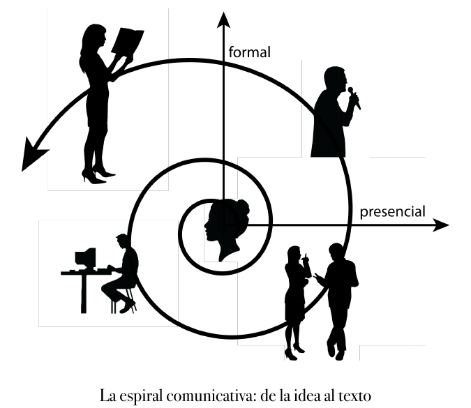
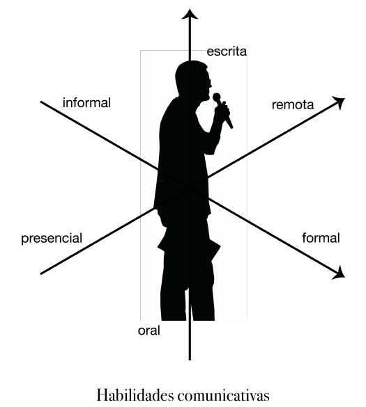
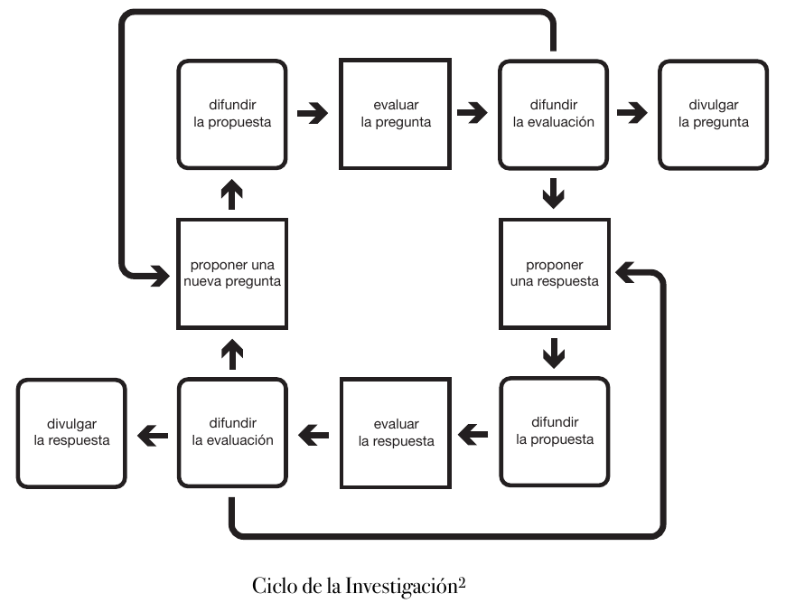

# 03 · I. Conocimiento e Investigación en Filosofía (pp. 8–18)

Fuente: Barceló, *Introducción a la Investigación Filosófica*, borrador sep-2026, pp. 8–18. Transcripción literal; erratas del original conservadas.
Métodos clave: conocimiento objetivo vs. subjetivo: razones y evidencia comunicables (8-10); objetivo de la investigación filosófica: generar entendimiento (explicaciones) y conocimiento (teorías) (10); carácter comunal, dialógico, revisado, abierto y público de la investigación (10-12); espiral comunicativa: de la idea al texto, ejes formal/presencial (13); habilidades comunicativas: escrita/oral, formal/informal, presencial/remota (14); 4 razones para leer y escuchar: (i) aprender, (ii) avanzar, (iii) corregir, (iv) señalar (15); investigación, educación y divulgación (15-16); ciclo de la investigación (16); aplicaciones de la filosofía y trabajo interdisciplinario (16-18); Referencias (18)

---

[p.8]

## I. Conocimiento e Investigación en Filosofía

La filosofía es, entre otras cosas, una actitud, una actividad, una tradición y una profesión, entre otras cosas. La actitud filosófica comúnmente se caracteriza como una actitud crítica, inquisitiva, anti-dogmática, abierta al asombro, etc. Una actitud que se manifiesta tanto en el ser, como en el saber. Pero no es lo mismo ser filósofo que hacer filosofía; y así como hay muchas maneras de ser filósofo también hay muchas actividades que llamamos filosofía. Entre estas, en este libro nos interesa la investigación filosófica.

Para entender qué es la investigación en general, y la investigación filosófica en particular, vale la pena empezar con un poco de epistemología básica: Cuando hablamos del mundo, algunas cosas que decimos son verdaderas y otras nos; cuando pensamos sobre el mundo, algunas veces pensamos cosas que son verdaderas y a veces no. Lo interesante es preguntarse ¿por qué pensamos que el mundo es de cierta manera y no de otra? y ¿por qué decimos que el mundo es de cierta manera y no de otra? En otras palabras, lo interesante no es sólo lo que pensamos, sino porqué lo pensamos, es decir, qué razones tenemos para pensar lo que pensamos sobre el mundo, en qué evidencia nos basamos. Igualmente para lo que decimos. A veces tenemos buenas razones o evidencia de lo que decimos o pensamos y a veces no. Esto afecta como nos relacionamos con otros porque, afortunadamente, mucha de nuestra evidencia y muchas de nuestras razones son comunicables y gracias a eso podemos compartir nuestra visión del mundo. Cuando las razones y evidencia en las que basamos nuestra visión del mundo son completamente comunicables, no solamente en el sentido en el que los demás pueden ver que son nuestras evidencias y razones, sino en el sentido de que otros pueden hacerlas suyas, entonces es que hablamos de objetividad. El conocimiento basado en este tipo de razones y evidencia es conocimiento objetivo y es valioso, especialmente por que es comunicable y lo podemos compartir.

[p.9]

Pongamos dos ejemplos sencillos. A mí me cae muy bien mi amiga Julieta. Desde que la conocí me pareció una persona muy agradable y aunque no pasamos mucho tiempo juntos, valoro mucho el tiempo que compartimos. Si me preguntaran porqué pienso así de ella, me costaría mucho tiempo explicarlo. Debo tener mis razones, pero me costaría mucho trabajo comunicarlas. Tal vez hasta sean incomunicables. Sin embargo, no por ello deja de ser cierto lo que pienso, y siento. Simplemente que no es conocimiento objetivo. Mas no por eso no es importante. Por el contrario, este tipo de conocimiento cotidiano que tenemos unos de los otros y de nuestros sentimientos propios es fundamental en nuestra vida, aunque no sea objetivo, sino subjetivo.

En contraste, el conocimiento que buscamos cuando hacemos investigación, filosófica o de otro tipo, sí debe ser objetivo. Debemos buscar razones que no no seas subjetivas, sino que podamos comunicar y compartir. Especialmente si lo que buscamos es respuestas a preguntas que tienen consecuencias o interés para otras personas. Imaginen a alguien que, tras pensar detalladamente sobre el tema, llegué a la conclusión de que una política social particular ha sido exitosa en disminuir la pobreza en ciertas circunstancias restringidas, pero si se le preguntara ¿por qué? respondiera simplemente encogiendo los hombros o diciendo que no sé cómo explicarlo, en vez de ser capaz de presentar evidencia incontrovertible y articular mis razones de manera clara. En este caso, debemos concluir que lo que hizo esta persona no fue investigación. Lo que tiene es una opinión personal al respecto, pero dicha opinión tiene poco valor si lo que queremos es una respuesta objetiva a la pregunta de si dicha política pública efectivamente sirve o no para disminuir la pobreza y en qué circunstancias. ¿De qué sirve haber llegado a una conclusión si no podemos difundirla, es decir, si no podemos compartir la evidencia y las razones que nos llevaron a ella? En otras palabras, ¿de qué sirve el conocimiento que no es objetivo? ¿Cómo puede llegar a quienes

[p.10]

más podrían sacar ventaja de él, como por ejemplo, los responsables de políticas públicas? La objetividad es valiosa porque nos permite construir consensos con bases firmes.

Una de las razones, y tal vez la razón principal por la cual se le da a la investigación un lugar tan central dentro de la educación universitaria de los filósofos es porque es parte fundamental de la formación de filósofos profesionales cuyas contribuciones pedan resultar válidas y de valor para el mayor número de personas. Por supuesto que podemos encontrar en la filosofía verdades que no podamos llamar conocimiento ni sean objetivas, pero el conocimiento objetivo es mas valioso porque nos trasciende. Por eso, la genuina investigación filosófica no puede sino buscar el conocimiento y la explicación objetiva. En esta tarea, la ciencia es nuestra práctica humana de mayor éxito y es por eso que nos sirve de paradigma del cual podemos aprender mucho (y vice versa) tanto al nivel de contenidos como el de procedimientos, es decir, principios y técnicas de investigación.

Al igual que la investigación científica, la investigación filosófica tiene como origen el asombro frente al mundo, y al igual que ella busca darle explicación y sentido. Por ello, la investigación filosófica se plantea como objetivo GENERAR ENTENDIMIENTO (a través de explicaciones) Y CONOCIMIENTO (a través de teorías); sólo que en vez de explicaciones y teorías científicas, el objetivo es generar explicaciones y teorías filosóficas. Como todo quehacer humano, la investigación filosófica es un proceso falible, pero al igual que toda investigación está guiado por la búsqueda de la verdad en sus respuestas (para diferentes preguntas filosóficas), explicaciones (para diferentes fenómenos filosóficos) y soluciones (para diferentes problemas filosóficos).

Metodológicamente, la filosofía académica profesional actual se constituye en un diálogo continúo entre investigadores, de manera tal que el objetivo de la investigación – la generación de

[p.11]

conocimiento filosófico –, además de ser el objetivo y la responsabilidad personal de cada investigador, es el objetivo y responsabilidad de la comunidad de investigadores. En este diálogo continuo, los investigadores proponen y revisan nuevas preguntas y nuevas respuestas, buscando llegar a un consenso razonado respecto a su calidad y originalidad. En este proceso, cada investigador tiene la responsabilidad y tarea de elaborar nuevas propuestas y revisar las de sus colegas. Este proceso de propuestas y revisiones es continuo y permanente.

Dado que todos somos falibles (podemos equivocarnos) y limitados en nuestras capacidades cognitivas (es decir, podemos no darnos cuenta de todo lo relevante para resolver un problema, o darnos cuenta y luego olvidarlo etc.), es importante colaborar con otros para suplir nuestras limitaciones y resarcir nuestros errores. Sólo si contamos con la aportación de otros, igualmente interesados en dar respuesta a la misma pregunta, o resolver el mismo problema, podemos ampliar nuestra perspectiva de las cosas y así encontrar una mejor solución o respuesta. Entre más personas estén involucradas en la revisión de un trabajo, mayor confianza podemos tener en que eventualmente se descubrirán sus errores y podrán corregirse. Por ello, la revisión es un proceso necesario en la generación de conocimiento. Nadie es perfecto, pero trabajando juntos podemos obtener mejores resultados.

La investigación filosófica no termina el momento que el o la investigadora logran (o, por lo menos, tienen buenas razones para pensar que logran) dar respuesta a una pregunta filosófica. Es necesario que el resto de la comunidad de investigadores revise y eventualmente publica los resultados del investigador. Para que el resultado de una investigación pueda ser publicado, debe pasar por un riguroso proceso de dictaminación en el cual otros expertos investigadores verifican los resultados de dicha investigación. Sin embargo, el proceso no termina ahí, ya que – al igual que todo tipo de conocimiento – los resultados publicados siguen en constante proceso de revisión

[p.12]

(por si acaso había errores en el resultado inicial) y de desarrollo. Es por ello que se dice que el conocimiento filosófico es abierto: cualquier resultado está abierto a continua revisión y desarrollo y con cada revisión y desarrollo se busca mejorarlos.

Dado el carácter comunal de la investigación científico, las teorías filosóficas (o, por lo menos las más importantes, aquellas que mejor han dado respuesta a los problemas que se plantea la filosofía) no suelen ser el producto de una mente genial, sino que, por el contrario, son el resultado del trabajo colectivo de muchos investigadores, cuyas contribuciones pequeñas o grandes han ido dando forma al acervo teórico de la filosofía. La teoría semántica de mundos posibles, por ejemplo, una de las teorías más exitosas en filosofía del lenguaje, no es sino el resultado del trabajo de muchos filósofos, a lo largo de varias décadas y distribuidos en varias universidades a lo largo del mundo. Algunos de ellos son famosos como David Lewis, Saul Kripke o Robert Stalnaker, pero la gran mayoría no lo son.

Además de comunal, la investigación filosófica es un proceso público. Es público porque, por lo menos en principio, está abierto a la participación (responsable e informada) de cualquiera. Lo que importan son las razones y se presupone que éstas son independientes de quiénes la sostienen. No se apela a la autoridad de nadie, sino a la fuerza de los argumentos. La comunidad filosófica tampoco es una sociedad secreta, sino pública. No hay secretos en filosofía.[^1] Todo sucede de manera abierta, pública y transparente. Por eso se puede enseñar y aprender a hacer filosofía. Así se busca garantizar la objetividad de sus resultados.

[p.13]

> Descripción de la figura: espiral que nace en una cabeza de perfil (la idea) en el centro y se abre hacia fuera cruzando dos ejes, el vertical "formal" (hacia arriba) y el horizontal "presencial" (hacia la derecha); en los cuadrantes hay siluetas: dos personas conversando (abajo derecha: presencial e informal), una persona hablando con micrófono (arriba derecha: presencial y formal), una persona ante un ordenador (abajo izquierda: remoto e informal) y una persona leyendo (arriba izquierda: remoto y formal); la flecha de la espiral sale por arriba a la izquierda.

*La espiral comunicativa: de la idea al texto*

Dado su carácter comunal y público, la comunicación es un aspecto fundamental de la investigación filosófica. En otras palabras, dado que necesitamos involucrar a otros en nuestro proceso de investigación, es fundamental que podamos comunicarnos con ellos. En este sentido, podemos ver al proceso de comunicación involucrado en la investigación como una gran espiral que va de las ideas en nuestra mente hacia afuera, hacia la gran discusión filosófica. Muchas veces, empezamos poniendo nuestras ideas a consideración de aquellos que se encuentran más cerca de nosotros – nuestros amigos y colegas – pero siempre será necesario involucrar más y más gente, alguna de la cual no podremos contactar de manera presencial. Dado lo extenso de la comunidad filosófica (involucra a tanta gente, separada tanto en el tiempo como en el espacio), mucha de esta comunicación es escrita (después de todo, siempre será necesario involucrar investigadores a los que no podamos presentar nuestras propuestas en persona), pero también hay una gran parte oral. Asimismo, mucha de esta comunicación será informal – pláticas de pasillo, por ejemplo – pero

[p.14]

también llegará un momento en que participemos en encuentros más formales como seminarios, coloquios, libros, etc. Es por ello que es fundamental para un investigador saber comunicarse tanto de manera escrita como oral, tanto en contextos formales como informales. Un aspirante a investigador que no sepa, por ejemplo, atender una conferencia y poder captar lo que en ella se dice o no sepa articular sus comentarios, preguntas o contribuciones durante la sesión de discusión, tendrá problemas para integrarse a la comunidad de investigadores y, por lo tanto, alcanzar su objetivo de generar conocimiento novedoso y objetivo. Recuerden que gran parte del tiempo de la investigación no la realiza uno solo con sus ideas, sino en contacto con las ideas de otros: leyendo, escribiendo, hablando y escuchando; en seminarios, coloquios, revistas y libros.

> Descripción de la figura: silueta de una persona con micrófono en el centro y tres ejes que la atraviesan: vertical "escrita" (arriba) / "oral" (abajo); diagonal "informal" (arriba izquierda) / "formal" (abajo derecha); diagonal "presencial" (abajo izquierda) / "remota" (arriba derecha).

*Habilidades comunicativas*

Se ha dicho mucho que la filosofía y la literatura son disciplinas hermanas y que en el fondo, los grandes filósofos son también grandes escritores. Y si bien es fácil encontrar excepciones a esta última afirmación, la importancia de la comunicación para la filosofía profesional es innegable. Es

[p.15]

muy importante para el filósofo desarrollar su dominio del lenguaje, tanto oral como escrito. Sin embargo, también es cierto que, por lo menos desde Platón (Griswold 2009) se nos ha advertido no dejarnos embaucar con la sofistería de quienes hablan o escriben bonito, pero no tienen nada que decir. Dominar el arte de la palabra es esencial para el investigador en filosofía, pero sirve de poco si no tenemos propuestas originales que comunicar, si no tenemos nuevas hipótesis, críticas o comentarios que compartir y poner a consideración de los otros. Aun más, poner demasiado acento en la importancia del hablar y el escribir, también podría hacernos olvidar que también son importantes el saber leer y escuchar. Sin ellos, tampoco hay comunicación, y sin comunicación no hay investigación filosófica.

¿Porqué es importante, entonces, leer y escuchar lo que dicen o escriben otros filósofos? Porqué, si lo que escriben es correcto, podemos (i) aprender de ello y (ii) avanzar sobre lo que ya hallaron otros. Es una pérdida de tiempo re-descrubrir lo que ya se había descubierto, o reproponer lo que ya se había propuesto. Por otro lado, si encontramos algún error o imperfección en lo que otros han propuesto, podemos contribuir (iii) corrigiendo dicho error o imperfección (o, por lo menos, si no podemos corregirlo nosotros, (iv) señalarlo a otros para que ayuden a su revisión). El paso previo a la investigación es la educación o formación filosófica.

En este sentido, la investigación se complementa con la educación (en el cual el estudiante adquiere el conocimiento creado por el investigador y verificado por su comunidad) y la divulgación (en la cual el público no-filosófico aprende sobre los resultados del trabajo de investigación de los filósofos). Si bien la investigación tiene como objetivo crear conocimiento, es importante reconocer que dicho conocimiento es prácticamente inútil si se queda al interior de la comunidad de investigadores. Es necesario que los resultados de la investigación, una vez que han

[p.16]

sido verificados por la comunidad filosófica, se divulgen al resto del público. Solamente así, puede dársele aplicación al conocimiento filosófico.

> Descripción de la figura: diagrama de doce cajas unidas por flechas. Fila superior, de izquierda a derecha: "difundir la propuesta" → "evaluar la pregunta" → "difundir la evaluación" → "divulgar la pregunta". Desde "difundir la evaluación" (superior) una flecha baja a "proponer una respuesta" → "difundir la propuesta" (fila inferior derecha) → "evaluar la respuesta" → "difundir la evaluación" (inferior) → "divulgar la respuesta" (extremo izquierdo). Desde "difundir la evaluación" (inferior) una flecha sube a "proponer una nueva pregunta" → sube a "difundir la propuesta" (superior), cerrando el ciclo. Dos bucles de retorno: de "difundir la evaluación" (superior) de vuelta a "proponer una nueva pregunta", y de "difundir la evaluación" (inferior) de vuelta a "proponer una respuesta".

*Ciclo de la Investigación*[^2]

Algunas personas piensan que la filosofía es una disciplina tan abstracta, que sus propuestas y teorías sólo son de interés para los propios filósofos y uno que otro curioso. Si bien es cierto que mucha de la divulgación de la filosofía está dirigida al público curioso en general (después de todo, la curiosidad es una razón tan buena como cualquier otra para acercarse a la filosofía), también es cierto que la filosofía tiene muchas aplicaciones. Basta recordar que la computadora no es otra cosa sino la implementación de un modelo filosófico de la mente humana (Hodges 2012). En el área en el que yo trabajo, por ejemplo, lingüistas, matemáticos, psicólogos y científicos de la computación trabajan mano a mano con los filósofos, buscando aplicar a sus áreas

[p.17]

los desarrollos de investigación de nosotros, los filósofos. En la política y la jurisprudencia también es común encontrar aplicaciones para los resultados de la investigación filosófica. En nuestra universidad, por ejemplo, se dan cursos de filosofía a legisladores, jueces y otro tipo de abogados; y en Estados Unidos, por poner otro ejemplo, no es raro encontrar abogados que hayan cursado la carrera de filosofía antes que la de Leyes. Tampoco es raro encontrar entre activistas y políticos, uno que otro egresado de nuestra carrera. Filósofos como Rudolf Carnap (Feigl 1970, Wolters 2004), Jen Lukaciewicz o Michael Dummett (Pataut 2001) han compaginado su profesión filosófica con una activa vida política. La iniciativa privada también suele contratar filósofos para consultoría a empresas. En fin, son múltiples las áreas de actividad humana en las que los resultados de la investigación filosófica tiene aplicación.

Si bien no es raro que la aplicación la realicen no-filósofos, cuyo conocimiento filosófico se haya obtenido a través de la divulgación de la filosofía, es más común que la aplicación se haga en colaboración con algún filósofo. Esta es otra de las ventajas del trabajo interdisciplinario (Fuller & Collier 2003). Sin embargo, para la mayoría de los filósofos, aplicación e investigación se conciben como actividades separadas (Aunque también es posible concebir a la aplicación como parte de la investigación; por ejemplo, si adoptamos una postura pragmatista y pensamos que tratar de aplicar una teoría filosófica es también una manera de tratar de ponerla a prueba en la práctica. Así, la aplicación puede concebirse como una manera más de verificar y poner a prueba una propuesta filosófica).

Finalmente, así cómo es importante que los no-filósofos se enteren de los resultados del trabajo de investigación del filósofo, también es importante que el investigador en filosofía sepa de otras cosas además de filosofía, que conozca cómo piensa la gente en su sentido común, o cómo piensan y actúan aquellos cuya actividad nos interesa, como artistas (si estamos haciendo estética o

[p.18]

filosofía del arte, etc.), políticos (si estamos haciendo filosofía política o algo similar), científicos (si estamos haciendo filosofía de la ciencia, epistemología, etc.), etc., además de conocer lo que otros especialistas o científicos han investigado sobre nuestra área de interés. No todo lo que hay que saber para saber filosofía es filosofía.

### Referencias

Björk, B-C. (2007). "A model of scientific communication as a global distributed information system" Information Research, 12(2) paper 307, URL = <http://InformationR.net/ir/12-2/paper307.html>.

Feigl, Herbert, (1970), “Memorial Minute: Rudolf Carnap”, en Proceedings and Address of the American Philosophical Association 44, pp. 204-205.

Fuller, S. and Collier, J. (2003). Philosophy, Rhetoric and the End of Knowledge: A New Beginning for Science and Technology Studies. (Orig. 1993). Hillsdale NJ: Lawrence Erlbaum Associates.

Griswold, Charles, (2009), "Plato on Rhetoric and Poetry", The Stanford Encyclopedia of Philosophy (Fall 2009 Edition), Edward N. Zalta (ed.), URL = <http://plato.stanford.edu/archives/fall2009/entries/plato-rhetoric/>.

Hodges, Andrew, (2012) Alan Turing: The Enigma; The Centenary Edition, Princeton University Press.

Pataut, F. (2001), “Una Perspectiva Anti-Realista sobre: Lenguaje, Pensamiento, Lógica e Historia de la Filosofía Analítica (Entrevista con Michael Dummett)”, Tópicos, 8/9, 129-162.

Wolters, G. (2004). “Styles in Philosophy: The Case of Carnap”. Steve Awodey & Carsten Klein (eds.), Carnap Brought Home: The View from Jena. Full Circle: Publications of the Archive of Scientific Philosophy. Volume 2. Chicago: Open Court. Pp. 25-40.

## Notas

[^1]: Lo más cercano a “secretos” en la investigación filosófica es la práctica común de esconder la identidad del autor de un texto de investigación (proyecto o similar) durante el proceso de dictaminación, para asegurar la objetividad de dicho proceso.

[^2]: En (2007), Bo-Christer Björk ofrece un modelo gráfico-formal más detallado de la dinámica investigación/comunicación.
