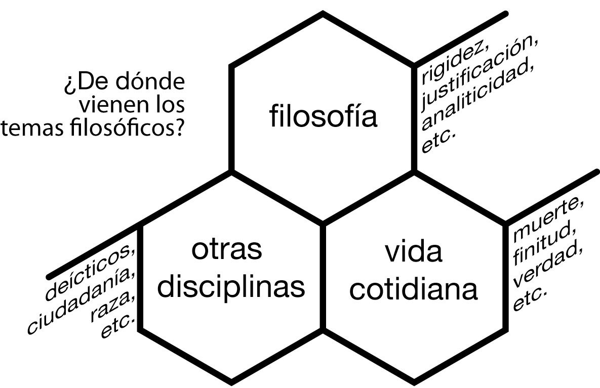
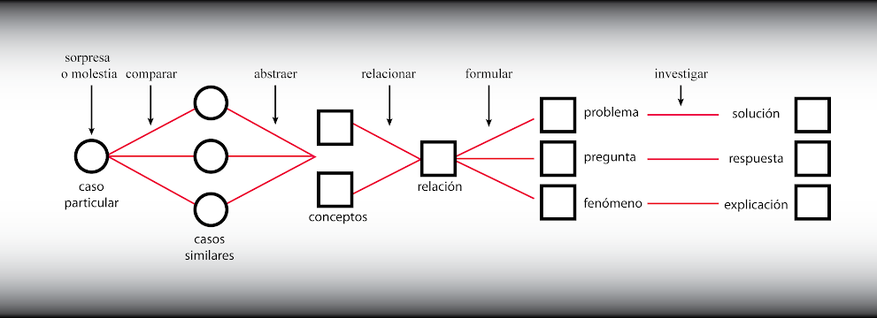

# 06 · I. Elementos de la Investigación Filosófica — I. ¿De qué trata tu (artículo, ensayo, plática, tesis, proyecto de) investigación? (pp. 25–42)

Fuente: Barceló, *Introducción a la Investigación Filosófica*, borrador sep-2026, pp. 25–42. Transcripción literal; erratas del original conservadas.
Métodos clave: dos partes de la investigación: análisis (qué decir) y síntesis (cómo decirlo) (25-26); niveles de refinamiento del objetivo: tema de interés (26-28), aspecto (28-29), cuestión, pregunta o problema específico (29); distinción explanandum/explanans y primacía del primero (28); 3 criterios de la cuestión: relevancia y motivación (30-37), claridad (38-39), tractabilidad (39-42); dos preguntas previas de relevancia: si hay debate y qué se arriesga (30-31); del caso particular a la pregunta: comparar, abstraer, relacionar, formular, investigar (32-33); chiste del borracho y el farol (33-34); relevancia restringida: normas del programa, concurso o financiamiento (36-37); 3 preguntas de tractabilidad: quiénes somos, qué recursos, qué disponibilidad (39-40); 7 tipos de recursos: conocimiento, información, materiales, tiempo, atención, interés, humanos (39, 42); presupuesto según Muñoz-Alonso (41); resumen: preguntas de viabilidad (42)

---

[p.25 · cont.]

## I. Elementos de la Investigación Filosófica

Uno de los objetivos centrales de este curso es ayudarte, como estudiante de filosofía, a desarrollar las habilidades y aptitudes necesarias para llevar a cabo investigación filosófica de una manera efectiva y eficiente. Para ello, hemos dividido el material en dos partes complementarias: el análisis y la síntesis. Como hemos insistido a todo lo largo de la sección anterior, desarrollar buenos habilidades comunicativas es parte fundamental en la formación de todo investigador en filosofía. Sin embargo, como también hemos ya señalado, poco sirve haber desarrollado dichas habilidades, si no tenemos algo que decir, es decir, algo que proponer y contribuir al diálogo filosófico. El análisis y la síntesis se pueden entender, entonces, como correspondiendo a estas dos partes fundamentales de la investigación: en el análisis buscamos qué decir y en la síntesis aprenderemos cómo decirlo. El análisis es el proceso que lleva al investigador, o equipo de investigación, de tener un conocimiento general de filosofía, a tener una propuesta novedosa, bien definida y sustentada, que poner a consideración de la comunidad filosófica. La síntesis, en contraste, es el proceso que lleva al mismo investigador o equipo de investigación, de tener una propuesta

[p.26]

novedosa, digamos, en la mente, a tenerla en forma de texto, lista para publicación o presentación, ya sea oral o escrita.

## I. ¿De qué trata tu (artículo, ensayo, plática, tesis, proyecto de) investigación?

Una vez que hemos decidido embarcarnos en una investigación, no importa cuál sea su envergadura, desde un trabajo final para algún curso hasta un proyecto colectivo de varios años, la pregunta más importante siempre será ¿qué vamos a investigar? Esta pregunta puede – y debe – responderse a diferentes niveles de generalidad. A decir verdad, esta pregunta es la primera que debemos hacernos aunque probablemente sea también de las últimas que terminemos de responder. Al principio de nuestra investigación, lo más probable es que solamente tengamos un tema de interés, el cual hemos de ir refinando y enfocando conforma va avanzando nuestra investigación y conocemos más sobre él. El primer paso de este refinamiento es reducir el foco a un sólo aspecto del tema. Luego, plantearnos una cuestión específica. Sin embargo, aún dentro de una cuestión podemos ser más precisos especificando las posibles respuestas que consideraremos y, finalmente, dentro de estas, cuál es la que defenderemos.

### a) Tema de Interés

En un primer nivel de generalidad, lo que nos interesa son los temas filosóficos. Es fácil reconocer cuándo estamos hablando de un tema filosófico en vez de una cuestión o una hipótesis más específica, ya que comúnmente nos referimos a ellos usando algún término sustantivo (es decir, un nombre en vez de, por ejemplo, un enunciado). Comúnmente, dicho nombre es un término técnico-filosófico, como “rigidez” o “la distinción analítico/sintético”, o “el Begriffschrilt”, etc. En este caso, dichos términos nombran conceptos u obras eminentemente filosóficas, ya que

[p.27]

surgieron y se han definido al interior de nuestra tradición filosófica. Sin embargo, no todos los temas filosóficos llevan un nombre técnico propio. Muchas veces, sustantivos ordinarios como “pobreza” o “verdad” pueden nombrar también temas de interés filosófico. Algunos de estos temas pueden ser tan viejos como la filosofía misma, como el conocimiento o la vida; mientras que otros pueden tener una historia corta dentro de nuestra disciplina, como el chisme o el deporte, por mencionar sólo dos temas que apenas han empezado a ser estudiados de manera sistemática en la filosofía contemporánea. Finalmente, también hay temas a los que nos referimos usando términos técnicos de otras disciplinas, como el derecho, la lingüística, etc. y que a veces también tienen una dimensión filosófica, por ejemplo: los deícticos, la democracia deliberativa, etc.

> Descripción de la figura: tres hexágonos encajados con la pregunta “¿De dónde vienen los temas filosóficos?” a la izquierda; el hexágono superior dice “filosofía” y lleva al lado los ejemplos “rigidez, justificación, analiticidad, etc.”; el inferior izquierdo dice “otras disciplinas” con los ejemplos “deícticos, ciudadanía, raza, etc.”; el inferior derecho dice “vida cotidiana” con los ejemplos “muerte, finitud, verdad, etc.”.

Algunos temas son más generales, y otros más específicos. Los grandes temas de la filosofía como el lenguaje, la ciencia, la justificación, Dios o la realidad, son muy generales y comúnmente pueden expresarse en una sola palabra, mientras que temas más específicos como la retórica aristotélica, la teoría de la Justicia de Rawls o el status ontológico de las sombras requieren de frases nominales más complejas. En ellas sigue habiendo un sustantivo central que corresponde al tema general como “retórica”, “justicia” o “sombras”, pero el resto de la frase precisa más qué aspecto del tema

[p.28]

nos interesa. Muchas veces, el tema con el que empezamos nuestro trabajo es demasiado general y es necesario especificar un aspecto del mismo.

A la hora de pensar los temas, es fundamental distinguir los temas filosóficos genuinos de los conceptos técnicos de la jerga filosófica. Para ello basta distinguir los fenómenos que se quieren explicar, los así-llamado explanandum o explicandum de la filosofía, como el conocimiento, el deseo, la justicia, el perdón, la verdad, etc de cómo se ha tratado de explicarlos, el así-llamado explanans. Para hablar de ambos usamos conceptos. Usamos unos conceptos para describir los fenómenos que nos interesan (como los ya mencionados conocimiento, deseo, justicia, perdón, verdad, etc.) , y otros para hacer nuestras explicaciones, teorías, hipótesis, etc. y organizarlas. Por ejemplo: justificación epistémica, deontología, transhumanismo, existencialismo, filosofía, etc. Esta distinción es muy importante, pues hay una primacía conceptual del explanandum sobre el explanans. Los conceptos del segundo tipo son importantes tan solo porque nos sirven para explicar los conceptos del primer tipo. Por lo tanto, su importancia deriva de ellos. Los conceptos del explanandum son mas fundamentales que los conceptos artificiales que desarrollamos para los explanans.

### b) Aspecto

Una vez definido el tema, la primera especificación es al nivel del aspecto. Al hablar de aspectos de un tema, hacemos una cualificación del sustantivo que refiere al tema. Por ejemplo, si nuestro tema es el significado, podemos enfocarnos en diferentes aspectos de él: su normatividad, su conocimiento, etc. Pensemos en el arte como ejemplo de un tema filosófico profundo y complejo. En filosofía suele pensarse que el aspecto central del arte es su dimensión estética; sin embargo no es el único. Hay también importantes aspectos políticos del fenómeno artísticos, por ejemplo,

[p.29]

aquellos que tienen que ver con la propaganda, el canon, las artes nacionales, o las imágenes que refuerzan estereotipos discriminantes, etc. También hay importantes cuestiones metafísicas relacionadas con el arte, por ejemplo, qué es una obra de arte, cuál es la relación de una obra material con la materia de la que está construida, si es necesario que se ejecute una obra musical, dancística o teatral para que esta exista o no, si es posible o no que animales no humanos sean artistas, etc. En resumen, el tema del arte, por ejemplo, involucra importantes aspectos estéticos, éticos, políticos, ontológicos, etc.

### c) Cuestión, pregunta o problema específico

Una vez que hemos refinado el aspecto del tema que nos interesa, es fundamental que nos concentremos en una cuestión o pregunta específica. Mucha de la calidad de nuestra investigación dependerá de la calidad de la cuestión, pregunta o problema específico que la guíe. Desafortunadamente, pasar del aspecto o tema a la pregunta es uno de los pasos que mas trabajo les cuesta tomar a los estudiantes y, desafortunadamente, no conozco una receta sencilla para darlo. Pero puedo dar algunos consejos. Tienes que preguntarte honestamente qué te interesa del tema, qué quisieras saber sobre él que no sabes. En este momento probablemente sean un sinnúmero de preguntas las que te llaman la atención y es por eso escogiste ese tema, pero debe haber alguna que te llame más la atención y te parezca lo suficientemente importante como para dedicarle el tiempo y la atención necesarias para llevar tu investigación a buen fin – y en algunos casos, como el de tesis de doctorado, por ejemplo, esto puede significar darle un lugar central en tu vida durante los siguientes varios años. Pregúntate porqué quieres estudiar el tema que has elegido y trata de responderlo en un solo enunciado de pocas palabras. Ahí estará la semilla de tu pregunta o hipótesis.

[p.30]

Para elegir y construir una buena pregunta filosófica es fundamental considerar por los menos tres tipos de criterios: de relevancia, claridad y tractabilidad. De nada sirve una investigación guiada por una pregunta irrelevante, oscura o irresoluble. Más de una investigación se han descarrilado por perseguir una pregunta sin relevancia, o por no haber tenido clara la pregunta qué buscaban responder o por haberse planteado una pregunta de la que carecían de recursos para responder. Es esencial, por lo tanto, tratar de garantizar que la pregunte que guíe nuestra investigación sea relevante, clara y que contemos con recursos suficientes para contribuir de manera sustancial a darle respuesta.

#### i. Relevancia y Motivación.

Es difícil tomar una pregunta filosófica en abstracto y sentir su motivación. ¿Son ambiguos los nombres propios? ¿Hay más de una negación? ¿Podemos aprender por suerte? Estos son tres ejemplos de preguntas filosóficas que están atrayendo mucha atención dentro de la discusión contemporánea, pero ¿por qué? ¿Qué nos motiva a plantearnos estas preguntas tan esotéricas y abstractas? ¿Qué diferencia hace si la respuesta es sí o no? ¿Qué está en juego? Si éstas preguntas permanecen sin respuesta, es muy difícil sentirse lo suficientemente motivado como para dedicarle al problema la suficiente atención y el trabajo necesario para poder entenderlo y, mucho menos, para poder contribuir a su solución. De la misma manera, cuando presentamos un proyecto de investigación, escribimos un artículo o damos una plática de investigación, es muy difícil atraer la atención de nuestra audiencia si no le hemos comunicado claramente qué está en juego y porqué sería valioso que nos escucharan o leyeran con atención. Es por ello fundamental, antes de decidir investigar sobre un tema o cuestión, preguntarnos dos cosas: En primer lugar, si efectivamente hay un debate, o no estamos diciendo algo que no es, en realidad, controvertido. Responder esta

[p.31]

pregunta requeriría entender porque no es obvio quien tiene la razón en el debate al que queremos contribuir. Requerirá ser justo y hasta generosos con quienes estamos en desacuerdo. No se puede defender cabalmente, el empirismo, por ejemplo, si no se entiende y valora bien las razones detrás del racionalismo. Igualmente, quien busque defender el liberalismo de las críticas comunitarias, necesita saber y poder presentar claramente porqué a alguien sensato, bien informado y bien intencionado le han convencido este tipo de críticas. Entender en qué se basan qué razón tienen para sostener lo que sostienen, pese a que nos parezcan y defenderemos que están equivocados. También requiere preguntarnos qué se arriesga con una respuesta, es decir, qué consecuencias tendría el responder correctamente o no la pregunta que nos planteamos: qué podemos ganar, pero también qué podemos perder; qué puede salir mal, pero también qué puede salir bien.

Es fundamental, por lo tanto, que la pregunta a la que dediques tu investigación tenga un mínimo de relevancia filosófica, es decir, que esté bien motivada: que sea interesante e importante para la filosofía y para quienes nos interesa la filosofía (y no sólo para nosotros, si es posible) además de los involucrados directamente en la investigación –– y en especial, que sea interesante para ti. Idealmente, la pregunta que escojas deberá capturar lo interesante, lo importante o eminentemente filosófico del (aspecto que has escogido de tu) tema de interés. Se ha dicho mucho que lo que nos atrae a los filósofos de nuestras temas de estudio, es cierto asombro frente al mundo y nuestra relación con él. Desde esta perspectiva, una buena cuestión deberá capturar aquello que nos sorprende o molesta y que en principio de cuentas nos atrajo al tema filosófico de nuestro interés.

Debemos recordar que la mayoría de los problemas fundamentales de la filosofía no surgen en abstracto, sino en situaciones y experiencias muy concretas. Comúnmente surgen de la sorpresa o de la molestia que nos asaltan en circunstancias muy particulares. Surgen de la indignación de ver

[p.32]

la salvaje represión a un movimiento social, de la sorpresiva facilidad con la que podemos comunicarnos con alguien a quien apenas conocimos, de la alegría que sentimos al pasar tiempo con nuestras familias, de la curiosidad por entender cómo funciona cierta convención que seguimos todos los días, de la duda que nos asalta frente a las urnas, de la frustración de no poder llegar a un acuerdo aun con las personas mas cercanas a nosotros, de la maravilla de encontrar la solución a un problema matemático o la palabra correcta para expresar laque sentimos, etc. Pero para convertir dichas experiencias particulares en genuinas preguntas de interés y valor filosófico, es necesario, convertir esa molestia o esa sorpresa en algo más universal y abstracto. Es necesario, en otras palabras, abstraer del caso particular aquellas características que le son meramente accidentales y quedarnos solamente con las que son realmente relevantes, es decir, aquellas de las que emerge la molestia o sorpresa en cuestión. Sólo así tendremos los ingredientes para formular una genuina pregunta filosófica que capture no solo ese caso particular sino también otros casos similares.

Una de nuestras alumnas recién tuvo la horrible experiencia camino a clase de ser testigo de un acto violento hacia un niño. ¿Cómo podemos convertir una experiencia dolorosa como ésta en filosofía? Es necesario salir de lo concreto de dicha experiencia para buscar aquellos factores que den cuenta de la fuente de dicho malestar. Uno puede empezar comparando este caso con otros similares, y así ver qué factores contribuyeron al desasosiego que sufrió nuestra colega y cuales solo fueron circunstanciales. Por ejemplo, si uno compara cómo habría sido la experiencia de presenciar un acto similar, pero cometido contra un adulto, podría determinar si el que haya sido un menor la víctima del acto violento fue un factor determinante o no. Igualmente, si uno compara cómo habría sido la experiencia de presenciar un acto similar, pero cometido contra una niña en vez de un niño, podría detectar si acaso el género es también otro factor a considerar, etc.

[p.33]

Cada uno de estos ejercicios de comparación gira alrededor de un concepto y una vez que hayamos identificado por lo menos dos de ellos podemos preguntarnos cómo se relación y así generar una pregunta, problema o fenómeno genuinamente filosófico.

> Descripción de la figura: diagrama de flujo de izquierda a derecha: un “caso particular” (rotulado “sorpresa o molestia”) se conecta mediante “comparar” con tres “casos similares”; de ellos, mediante “abstraer”, se obtienen dos “conceptos”; mediante “relacionar” se llega a una “relación”; mediante “formular” se abren tres salidas: “problema”, “pregunta” y “fenómeno”; y mediante “investigar” cada una desemboca respectivamente en “solución”, “respuesta” y “explicación”.

Mucha mala filosofía ha sido el resultado de plantearse preguntas irrelevantes o inexistentes, preguntas cuya respuesta a nadie le interesa porque no contribuyen en absoluto al desarrollo de la filosofía. A veces, los filósofos somos como aquel borracho del chiste. Un policía le encuentra tanteando el piso a la luz de un farol a altas horas de la noche, y le pregunta qué hace. “Tengo extraviadas mis llaves” responde, y el policía vuelve a preguntar: “¿Y en qué parte se le extraviaron, caballero?” A lo que el borracho contesta: “Abajo de aquel árbol”. Sorprendido, el policía le dice: “¿Y por qué las está buscando aquí?” y el borracho le contesta: “Porque aquí hay más luz.” Así como el borracho pierde el tiempo buscando sus llaves lejos de donde cayeron, así también perdemos el tiempo investigando dónde no hay ningún problema genuino. Como el borracho del chiste que ignora dónde (sabe que) está su llave por buscar dónde le es más cómodo, muchos filósofos cometemos el error de ponernos a investigar, no dónde sabemos se encuentran los problemas relevantes, sino donde nos sentimos más cómodos trabajando. En vez de partir de una pregunta o problema bien definido, y adaptar la metodología y las herramientas a dicho problema o pregunta, nos aferramos a nuestra metodología y herramientas favoritas (llámense éstas

[p.34]

fenomenología, modelos lógicos formales, datos empíricos, o lo que sea) y rogamos al cielo que salga algo productivo.

Hace unos días, recibí un proyecto de investigación que se planteaba la siguiente pregunta: “¿Qué puede aportar la teoría de la argumentación a la comprensión de la filosofía?” En este proyecto, el estudiante buscaba tomar ciertas teorías de la argumentación, aplicarlas al análisis de algunos debates filosóficos y “extraer las conclusiones de dicho análisis”, o sea, tomar un marco metodológico, un área de aplicación y mezclarlas a ver qué salía. En este ejemplo, aunque el proyecto se plantea una pregunta (por lo menos nominalmente), dicha pregunta no es una pregunta genuina o bien motivada, es decir, falla en el criterio de relevancia. En vez de partir de una pregunta o problema bien definido, y adaptar la metodología y las herramientas a dicho problema o pregunta, como debe ser, el estudiante se planteó las cosas al revés. Como el borracho del chiste que ignora dónde (sabe que) está el problema por buscar dónde le es más cómodo, el estudiante planea lanzarse a la exploración de una herramienta (las teorías de la argumentación) que finalmente puede o no servir para algo en filosofía. Este es un claro ejemplo de un proyecto mal planteado por no cuidar la relevancia de la pregunta.

Pero no vayan a creer que es un error que solamente cometen los estudiantes. Por ejemplo, desde hace muchos años me ha molestado que en la la teoría de conjuntos tradicional (es decir, la que comúnmente usan los filósofos) existen conjuntos cuyos miembros no son ellos mismos conjuntos), así que busque la manera de desarrollar una nueva teoría que no se desviara demasiado de la tradicional pero evitara aceptar dicho tipo de conjuntos. Sin embargo, poco antes de presentar los primeros avances de mi investigación (en un Congreso internacional), me di cuenta de que el proyecto no tenía el menor sentido: lo que tenía era una solución, a la que le faltaba el problema. El problema fundamental con mi trabajo, y así me lo señalaron los asistentes al congreso,

[p.35]

era que no había mostrado que efectivamente era necesario, o por lo menos servía de algo, proponer una nueva teoría que evitara la existencia de este tipo de conjuntos cuyos miembros no son ellos mismos conjuntos. Dichos conjuntos no causan ningún problema filosófico ni dañan la teoría, la cual funciona perfectamente tal y como está. Por lo tanto, no hay la mínima razón para evitarlos. El que me no me gusten, por supuesto, no es razón suficiente (a menos que hubiera una buena razón filosófica detrás de mi disgusto a la cual pudiera apelar para justificar mi proyecto. Sin ella, mi trabajo no tenía la menor relevancia.)

Determinar la relevancia filosófica general de una pregunta filosófica es una tarea harto difícil. Para filósofos principiantes, es recomendable estar al tanto de las tendencias dentro de su área de especialidad, para saber qué temas y cuestiones han probado su relevancia. A estas alturas de la historia de la filosofía, es muy difícil que a un estudiante se le ocurra un tema de relevancia filosófica que no se le haya ocurrido a nadie antes. Por lo tanto, es mejor escoger un tema de reconocida relevancia del que ya se haya escrito y exista ya un canon de textos y posiciones a discutir Las enciclopedia y revistas como el Philosophical Compass son muy útiles para esto. Como bien escribe Rachel Fraser (2022):

> "Que la filosofía haya guardado silencio sobre algún tema no necesariamente habla mal de la filosofía (o del tema, en todo caso). Algunos temas no merecen la atención filosófica; sobre otros, los filósofos son demasiado ingenuos para tener algo que valga la pena decir. Quienes escriben sobre cuestiones inexploradas tienen, entonces, un doble obstáculo que superar. No necesitan simplemente persuadirnos de que su respuesta tiene algo que ofrecer. Necesitan , en primer lugar, persuadirnos de que vale la pena formular su pregunta o, al menos, que vale la pena formularla en tono filosófico.”

Además de una relevancia filosófica general, a veces será necesario también buscar que nuestro tema sea relevante para los objetivos específicos de nuestra investigación. Muchas veces,

[p.36]

nuestras investigaciones tienen como objetivo, además de la búsqueda de conocimiento novedoso, objetivo y valioso en sí mismo, otros fines más mundanos, como pasar un curso o demostrar nuestras habilidades de investigación. En estos casos, debemos asegurarnos de que el tema que escojamos sea acorde a dichos objetivos. Si necesitamos hacer un trabajo de investigación para pasar un curso de ética contemporánea, no tiene mucho sentido explorar temas como el status ontológico de los agujeros o la contribución semántica de las comillas. Igualmente, a veces somos invitados a presentar trabajos orales o escritos en coloquios o volúmenes colectivos dentro un área específica. En estos casos, debemos respetar las restricciones temáticas del evento o volumen al que vamos a contribuir para que el tema que escojamos sea relevante para nuestros lectores o escuchas. Si se nos invita a participar en un homenaje a cierto filósofo, lo mínimo que podemos hacer es escoger un tema dentro de un área en el que haya trabajo o al que haya contribuido significativamente y, luego, discutir su trabajo en dicha área.

En algunos casos, por ejemplo cuando hacemos el trabajo final para obtener un grado, sometemos un trabajo a un concurso o inscribimos nuestro proyecto en un programa de investigación, nuestro trabajo debe contemplar ciertas normas o satisfacer ciertas condiciones extra, además de las propias de todo trabajo de investigación (estar bien argumentado, ser claro, novedoso, etc.). Antes de elegir el tema, es necesario enterarse de las normas que debe satisfacer nuestro trabajo para ser admitido y bajo las cuales será juzgado. Si vamos a hacer un trabajo final para un curso, es importante solicitarle al profesor que sea claro y explícito sobre estas normas. La mayoría de los programas de estudios o investigación suelen tener un reglamento que uno debe solicitar y leer antes de registrarse. Recuerden que, por ejemplo, diferentes programas de estudio tienen diferentes concepciones y requisitos de tesis, tesinas y disertaciones. Por eso es importante documentare sobre toda normatividad a la que está sujeta nuestro trabajo. Acude a la coordinación

[p.37]

académica de tu programa de estudio o busca en su sitio oficial de internet. En el caso en que recibamos fondos de investigación de alguna organización a través de un programa de apoyo a la investigación, debemos también documentarnos sobre qué tipo de resultados debemos obtener y cómo hemos de reportarlos. Todo esto afecta y restringe el tipo de tema que hemos de abordar, y por lo tanto, debemos tomarlo en cuenta a la hora de elegir tema. Sin embargo, nunca debemos sacrificar la integridad de nuestra investigación por satisfacer las fuentes de nuestro financiamiento. Nuestro compromiso inalienable debe ser siempre con la verdad y el conocimiento objetivo primero.

Ejemplos:

Modalidades de titulación de la carrera de filosofía (Facultad de Filosofía, UNAM), contiene las características generales de las tesis, tesinas, etc.: http://colegiodefilosofia.unam.mx/?page_id=65

Convocatoria al XIV Encuentro Internacional de Didáctica de la Lógica: http://es.scribd.com/doc/59016251/EIDLXIV2011Convocatoria-1-280611

Normas de entrega de originales para la revista de filosofía Dianoia (IIFs, UNAM/FCE): http://dianoia.filosoficas.unam.mx/info/normas.html

#### Referencia:

Rachel Fraser (2022) “You Owe Me an Argument”, a review of Epiphanies: An Ethics of Experience by Sophie Grace Chappell, Boston Review.

#### Resumen Parcial

- Toda investigación debe ser guiada por una pregunta bien definida, clara, relevante y tratable.
- Busca que tu pregunta sea relevante para la filosofía en general y para los objetivos específicos de el medio en el cual presentarás tus resultados.
- Respeta las restricciones temáticas.

[p.38]

- Entérate y sigue las normas.

#### ii. Claridad

Casi desde los inicios de la filosofía occidental se ha dicho que muchas de “las dificultades y desacuerdos de los que está llena la historia de la filosofía se deben a una simple causa principal: lanzarse a responder preguntas, sin haber descubierto antes precisamente qué pregunta busca uno responder.” (Moore 1903, vii, citado por Westphal 1998, 1) Sócrates mismo solía criticar a sofistas y filósofos por la oscuridad de sus preguntas (cf. los diálogos aporéticos de Platón). A principios del siglo pasado, filósofos como Moore (1903), Carnap (1928) y Wittgenstein (1921) acuñaron el término “pseudo-problema” para referirse a este tipo de situaciones en las cuales los filósofos se dedican a tratar de responder problemas tales que, si uno se detuviera a darles una formulación clara se daría cuenta que, o bien no tienen sentido, o su respuesta es mas simple de lo que se pensaba (Sorensen 1993).

#### Referencias:

Carnap, Rudolf, (1928), Scheinprobleme in der Philosophie: Das Fremdpsychische und der Realismusstreit, Berlin-Schlachtensee: Weltkreis-Verlag.

Moore, G.E., (1903), Principia Ethica, Cambridge.

Sorensen, Roy, (1993), Pseudo-problems: how analytic philosophy gets done, Routledge.

Westphal, Jonathan, (1998), Philosophical propositions: an introduction to philosophy, Routledge.

[p.39]

Wittgenstein, Ludwig, (1921), Tractatus Logico-Philosophicus. Edición Bilingüe (Español y Alemán). Traducida por Jacobo Muñoz e Isidoro Reguera. Madrid: Alianza Editorial, 1997.

#### iii. Tractabilidad

Además de relevante y clara, también es fundamental el plantearse una pregunta viable o tractable, es decir, una pregunta que se pueda responder o, mas bien que si no podemos responder nosotros, por lo menos podamos contribuir a su eventual respuesta. En este respecto, la pregunta fundamental que nos debemos hacer es si tenemos los recursos necesarios disponibles para responder (o contribuir a responder) la pregunta. La respuesta que demos a esta pregunta, por supuesto, dependerá de conocer bien (i) ¿quiénes somos nosotros?, (ii) ¿qué recursos necesitamos?, y (iii) ¿qué disposición tenemos de ellos? Respecto a la primera pregunta (i), es importante distinguir dos sentidos en los que podemos hablar de los recursos con los que contamos. Si por “nosotros” queremos decir la humanidad o una colectividad más grande que la de los miembros de nuestro equipo de investigación, entonces la pregunta es por los recursos disponibles en un sentido muy general. Si los “nosotros” de los que hablamos son solamente los que directamente harán la investigación (es decir sólo tú si la investigación es individual), entonces la pregunta es mas específica.

Para responder la pregunta (ii), debemos tomar en cuenta diferentes tipos de recursos posiblemente involucrados en una investigación filosófica: conocimiento, información, recursos materiales, tiempo, atención e interés y recursos humanos. Es claro que no es lo mismo plantearse una investigación individual a corto plazo que una en equipo y a largo plazo. Es importante, por lo tanto, conocer exactamente cuales son los recursos con los que se contarán durante la elaboración de la investigación. ¿Cuánto y qué sabemos (o podemos aprender) sobre el tema? ¿Con qué

[p.40]

información contamos o podemos obtener? ¿Tenemos los materiales necesarios, desde un lápiz hasta tal vez un lugar donde sentarse simplemente a discutir con nuestros colegas? ¿Podemos conseguir, si es necesario, transporte para visitar nuestros asesores o un lugar para organizar algún evento académico? Además, ¿cuánto tiempo tenemos o podemos tomarnos para realizar la investigación? ¿Hay una fecha límite o es abierta? ¿Qué tanto interés tienen los miembros del equipo en la investigación? ¿Qué tanto interés tiene nuestro asesor u otros colegas? ¿Quién más está también interesado o podríamos interesar en nuestra investigación? Finalmente, ¿con quién contamos? Además de los autores de la investigación, ¿a quién se le puede pedir una consulta o asesoría?

Todos estos recursos son siempre limitados. Nunca se tiene todo el tiempo, ni todo el material, ni siquiera un interés ilimitado en una investigación. Es fundamental, por lo tanto, conocer de manera realista con qué recursos se cuenta y administrarlos de una manera eficaz (es decir que efectivamente sirvan su propósito) y eficiente (es decir, sacándole máximo provecho a los recursos disponibles, reduciendo al mínimo el desperdicio).

Finalmente, es importante tener en cuenta la disponibilidad de los recursos necesarios para llevar a cabo nuestra investigación. No es necesario contar con todos los recursos desde el inicio de la investigación. Mas bien es importante poder conseguirlos y saber cómo hacerlo (otra vez, de una manera eficiente y eficaz). Si es necesario gestionar el acceso a alguno de ellos, es importante conocer los mecanismos de dicha gestión. Si no tenemos los recursos materiales, es importante conseguirlos, por ejemplo a través de becas u otras formas de financiamiento. Si necesitamos cierta información o algún libro o estudio que no tenemos aún, por ejemplo, es importante preguntarse si efectivamente existe, dónde se encuentra y cómo podemos conseguirlo, por o menos durante el tiempo necesario para consultarlo sobre lo que necesitamos. Si no se

[p.41]

encuentra en ninguna biblioteca de tu institución, por ejemplo, investiga en qué otra biblioteca se encuentra y si es posible obtenerlo de ellas, tal vez por préstamo interbibliotecario. Si no es caro y es fácil de comprar, cómpralo. Si hay suficiente tiempo, puedes pedirlo a tu biblioteca. Si es necesario viajar a dónde se encuentra, considera tales gastos en tu presupuesto, etc.

En su “Anatomía de la Investigación Filosófica” (2007), Gemma Muñoz-Alonso enumera entre los recursos materiales que debemos tomar en cuenta al presupuestar una investigación: gastos de transporte, inscripción a cursos, papeleria, costos de acceso a instituciones o individuos, compra o alquiler de equipo, libros y publicaciones, fotocopias, impresiones, gastos de comunicación (telefónica, por ejemplo), posibles multas de biblioteca, consulta de bancos de datos y traducciones (Muñoz-Alonzo 2007, 262). Sin embargo, si estás organizando proyectos colectivos o de mayor envergadura hay que tomar en cuenta otros gastos, como gastos de intercambio y de organización de eventos (desde el diseño e impresión del cartel, hasta los alimentos para los invitados, entre otros rubros), de elaboración de publicaciones (no solamente los gastos de diseño e impresión, sino también de promoción y otros), etc.

Cómo se puede ver, las diferentes disponibilidades de los diferentes recursos involucrados están interrelacionadas. Aunque algunos recursos no son materiales, como el tiempo, la atención y el interés,, la falta de adecuados recursos materiales puede afectar también nuestro interés, hacernos perder el tiempo o distraernos. A veces uno tiene que usar parte de sus recursos de un tipo para obtener acceso a recursos de otro tipo. Usar tiempo para aprender lo que no se sabe, por ejemplo, o sacrificar interés personal para interesar a otros en nuestro proyecto y ganar así nuevos recursos humanos. En otras palabras, detrás de toda investigación hay una economía de conocimientos, información, tiempo, etc. que debe administrarse de manera responsable y eficiente.

[p.42]

#### Resumen:

Preguntas que hacerse para determinar qué tan viable es tu proyecto de investigación:

1. ¿Tenemos disponibles los recursos necesarios para llevar a cabo esta investigación, es decir, para avanzar en la búsqueda de respuesta a esta pregunta?
   - a. ¿Quiénes somos nosotros?
     - i. La humanidad: ¿Cuenta la humanidad con los recursos necesarios para llevar a cabo esta investigación, es decir, para avanzar en la búsqueda de respuesta a esta pregunta?
     - ii. Los autores/miembros del proyecto: ¿Cuentan los miembros del equipo de investigación con los recursos necesarios para llevar a cabo esta investigación, es decir, para avanzar en la búsqueda de respuesta a esta pregunta?
   - b. ¿Que recursos se necesitan?
     - i. Conocimiento
     - ii. Información
     - iii. Materiales
     - iv. Tiempo
     - v. Atención
     - vi. Interés
     - vii. Humanos, etc.
   - c. ¿Qué disponibilidad tienen?

#### Referencia:

Muñoz-Alonso López, Gemma (2007), “Anatomía de la Investigación Filosófica: Claves prácticas para la elección del tema”, Contrastes, vol. 12, pp. 251-278.
