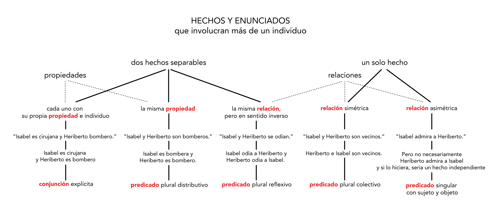

# 10 · 4. Cuestiones Filosóficas (pp. 59–72)

Fuente: Barceló, *Introducción a la Investigación Filosófica*, borrador sep-2026, pp. 59–72. Transcripción literal; erratas del original conservadas.
Métodos clave: consejos 8-11 de Martín Young para dominar un área (59); tipos de preguntas filosóficas: centrales (60), sustantivas — sustantivos (60-61), adjetivos (61-64), verbos (64-65), adverbios y complementos (66-67), determinados y determinables (67-68); distinción quintupartita a-e de posibilidad/necesidad para adjetivos (63-64) y cuatripartita a-d para verbos (65); principio del contexto de Frege (68-69); 5 criterios del enunciado ejemplo: gramatical, completo, natural, concreto, uso propio (69-70); ejemplo "conozco la zona" 1-4 (70-71); dominio de un concepto y errores categoriales de Ryle (71-72).

---

[p.59]

8.- Presenta cada argumento en tus propias palabras, escribiendo como si creyeras que tuviera razón.

9.- Trata de encontrar otras posibles posiciones dentro del mismo aspecto.

10.- Encuentra tu propia manera de abordar el tema.

11.- Repite cuantas veces sea necesario.

## 4. Cuestiones Filosóficas

La formulación clara y definida de la cuestión a cuya respuesta nos proponemos contribuir es esencial para la realización de toda investigación filosófica. Su papel es fundamental tanto para guiar nuestra investigación, como para guiar a nuestros lectores a un mejor entendimiento de la misma. Sin embargo, los requisitos que debe satisfacer una pregunta para estar bien formulada son distintos para cada una de las funciones. En consecuencia, la forma en que formulamos nuestra cuestión para guiar nuestra investigación ha de ser distinta de la forma en que formulamos la misma cuestión para presentarla en el trabajo escrito que resulte de tal investigación. En estas sesiones, nos centraremos en el primer objetivo: cómo formular la cuestión de la manera mas definida y explícita para facilitar el diseño de una estrategia de investigación. En este sentido, una pregunta mal formulada puede confundirnos y desviarnos en nuestra investigación, resultando en una pérdida de tiempo, trabajo y recursos en general. Por el contrario, una pregunta bien formulada, puede guiar nuestra investigación en un camino directo hacia su respuesta, señalando claramente cuales son los asuntos relevantes y las opciones que se deben considerar.

### A. Tipos de Preguntas Filosóficas

#### a. Preguntas Centrales

[p.60]

En toda discusión, hay preguntas centrales y preguntas secundarias (alrededor e las cuales hay otras sub-discusiones). La gran mayoría de las disciplinas filosóficas (Epistemología, Lógica, Ética, Estética, Filosofía de la Mente, etc.) se organizan alrededor de una o una serie de preguntas centrales. Las preguntas centrales de la metafísica, por ejemplo, son ¿qué existe?, ¿de qué depende que algo exista o no? y ¿porque existen cosas en vez de no existir nada? En Filosofía de la Mente, por dar otro ejemplo, entre las preguntas centrales se encuentran ¿cómo se relacionan mente y cuerpo?, ¿qué papel juegan los pensamientos en la estructura causal de la realidad?, ¿cómo funciona la mente? y ¿cómo conocemos los pensamientos de los demás? Para identificar la pregunta central a una discusión, uno debe buscar la conexión que tiene dicha pregunta con TODO (o casi todo) lo que se discute a su alrededor. Por ejemplo, todas las discusiones en lógica están ligadas, de manera directa o indirecta, al fenómeno de la consecuencia, es decir, con la pregunta ¿qué se sigue de qué? Todas las discusiones en ética tienen que ver de una u otra manera con lo que debemos o no hacer. En discusiones largas y complejas, esto no siempre es obvio, ya que la conexión puede ser larga y compleja. (Pappas et. al. 1990)

#### b. Preguntas Sustantivas

##### 1. Sustantivos

Cuando pensamos en algunos de los conceptos claves de la filosofía – como belleza, justicia, verdad, realidad, existencia, etc. –, parecen hablar de cosas radicalmente diferentes de las cosas cotidianas con las que nos encontramos a diario, como sillas, focos y perros. Comúnmente, para referirse a esta diferencia, se dice que las primeras son abstractas, mientras que las segundas son concretas. Sin embargo, si bien algunos de los conceptos centrales de la filosofía son efectivamente muy abstractos, su alcance actualmente llega a cubrir entidades más cotidianas como

[p.61]

el futbol, el chisme y los juegos de niños. Enfrentado a cualquiera de estos conceptos, tal parecería que la primera pregunta que debe responder el filósofo frente a estas abstracciones es ¿qué son? ¿Qué es la belleza?, ¿Qué es la justicia?, etc. Aunque capturan la fascinación que surge de cuestionar lo más básicos de nuestros conceptos, estas preguntas filosóficas sirven de poco para empezar un trabajo de investigación. En otras palabras, nos dicen poco de por donde siquiera empezar a buscar una respuesta. ¿Qué tipo de respuesta espera quién se pregunta qué es la realidad, por ejemplo?

Si ponemos más atención a estos conceptos, nos daremos cuenta de que, aunque son sustantivos, su sentido es derivado de algún adjetivo: el sustantivo belleza viene del adjetivo bello, así como justicia viene de justo y verdad de verdadero. Cuando pensamos en sustantivos, pensamos en cosas, pero cuando pensamos en adjetivos, pensamos en algo distinto: en propiedades o cualidades. Pasar de pensar en sustantivos a pensar en adjetivos es el primer paso para hacer sustantivas nuestras preguntas filosóficas.

##### 2. Adjetivos

Pongan atención a qué diferencia hay entre usar un adjetivo y su correspondiente sustantivo. Piensen en un enunciado que use un adjetivo. Se darán cuenta que el adjetivo necesita estar unido a algún sustantivo o similar al que califique. Pero no se puede juntar con cualquier tipo de sustantivo. Por ejemplo, el sustantivo “manzana” puede unirse con el adjetivo “rojo” para formar “manzana roja”, pero “idiotez”, pese a ser un sustantivo, no va con “rojo”, ya que hablar de “idiotez roja” es un sinsentido. Igualmente con los adjetivos que nos interesan a los filósofos. Van con sustantivos, pero no con cualquier sustantivo. Pongamos por ejemplo justicia. Se puede hablar de personas justas, actos justos o decisiones justas, pero no de portafolios justos o pasto justo. Tal vez, se pueda

[p.62]

hablar de países justos o sistemas de gobierno, pero ya hemos empezado a tener preguntas filosóficas con un sentido más claro. Hemos empezado ya a hacer análisis filosófico. Tomemos como ejemplo la pregunta ¿Qué tipo de cosas pueden ser justas (o injustas)? La misma pregunta se puede hacer respecto al resto de los adjetivos de interés filosófico: ¿Qué tipo de cosas pueden ser verdaderas (o falsas)? ¿Qué tipo de cosas pueden ser bellas (o feas)? ¿Qué tipo de cosas pueden ser justas (o injustas)? ¿Qué tipo de cosas pueden ser reales (o irreales)?... Y a las respuestas que se les dan se les llaman analíticas porque son el fruto del análisis filosófico. Por ejemplo, dar a la pregunta ¿Qué tipo de cosas pueden ser justas (o injustas)? la respuesta personas es ya afirmar una tesis filosófica.

Decir que las personas, y sólo ellas pueden ser justas (o injustas), aunque muy primitiva es ya una tesis filosófica. Es una tesis filosófica porque relaciona dos conceptos: en este caso, el de persona y el de justicia (e injusticia). A decir verdad, podemos distinguir en ella dos tesis filosóficas:

1. Las personas pueden ser justas (o injustas).
2. Sólo las personas pueden ser justas (o injustas).

Sin embargo, para que éstas sean tesis filosóficas interesantes, debemos entender “las personas” de manera bastante fuerte, es decir, cubriendo a todas las personas, incluso las imaginarias o meramente posibles donde “meramente posibles” debe entenderse también de una manera lo más fuerte posible (algunos filósofos llaman a este tipo de posibilidad posibilidad metafísica, otros le llamamos posibilidad conceptual o lógica). De esta manera, podemos especificar más nuestras tesis filosóficas de la siguiente manera:

1. Sólo las personas (incluso las imaginarias o meramente posibles) pueden ser justas (o injustas).

[p.63]

2. Todas las personas (incluso las imaginarias o meramente posibles) pueden ser justas (o injustas).

Cada una de estas tesis afirma una relación filosófica entre los conceptos de persona y justicia. El primero dice que es necesario que algo sea una persona para poder ser justo o injusto. El segundo dice que es suficiente que algo sea una persona para poder ser justo o injusto.

Además, debemos aclarar qué significa decir que algo ‘puede ser justo o injusto’. Una vez más, nos interesa la posibilidad amplia, es decir, aquella que no cae en el sinsentido. Para explicar esto, regresemos a nuestro ejemplo sencillo del adjetivo rojo:

a) Hay cosas que de hecho son rojas, aunque pudieron haber sido de otro color, como el coche Grand Torino que aparecía en el programa "Starsky and Hutch” (podemos imaginar al mismo coche pintado de negro).

b) Hay cosas que pudieron ser rojas, pero de hecho no lo son, sino que son de otro color, como mi coche o el encendedor que está enfrente de mí (mi coche es gris, pero era posible que en NISSAN lo hubieran pintado de rojo, igualmente con el encendedor).

c) También hay cosas que necesariamente son rojas, porque además de ser rojas de hecho, no pudieron haber sido de otro color, como la bandera de China (uno podría imaginar una bandera de otro color, pero entonces ya no sería la bandera de China, aunque tuviera la hoz y el martillo en la esquina).

d) Finalmente, hay cosas que no podrían ser rojas, porque necesariamente son de otro color (como la bandera de Argentina).

e) Y cosas que no podrían ser rojas porque no pueden ser de ningún color (como la suerte, el número 17 o el miedo que le tengo a las ratas). Para estas últimas, no tiene sentido siquiera

[p.64]

preguntarse si son rojas o de que color son. No tiene sentido preguntas ¿De qué color es la suerte? o ¿Es el número 17 rojo?

A la filosofía no le interesa qué cosas son de hecho rojas o de otro color, es decir, no le interesa distinguir entre (a) y (b). Sin embargo, sí le interesa qué cosas pueden ser rojas. Es decir, le interesa dibujar la línea entre (a), (b) y (c) de un lado, y (d) y (e) del otro. También le interesa que cosas podrían ser rojas o de otro color, es decir, distinguir entre (a), (b), (c) y (d) de un lado, y (e) del otro. Lo mismo sucede con los ejemplos más complejos de belleza, valentía, verdad, etc. No nos interesa tanto qué cosas son de hecho bellas, valientes o verdaderas, sino qué cosas podrían serlo (o su contrario).

Tomemos ahora otro ejemplo: la verdad. Una vez más, podemos distinguir entre:

a) Cosas que de hecho son verdaderas, aunque pudieron ser falsas.

b) Cosas que pudieron ser verdaderas, pero de hecho son falsas.

c) Cosas que necesariamente son verdaderas, y por lo tanto, no pueden ser falsas.

d) Cosas que no podrían ser verdaderas porque necesariamente son falsas.

e) Cosas que no podrían ser verdaderas ni falsas.

Una vez más, no nos interesa la distinción entre (a) y (b), pero sí la diferencia entre todas las demás (La diferencia entre (a) y (b) será ocasión de la pregunta del Martes).

##### 3. Verbos

El caso de los verbos es muy similar al de los adjetivos. Algunos sustantivos centrales en filosofía como pensamiento, conocimiento, amor, etc. son derivados de verbos: pensar, conocer, amar, etc. Y al igual que los adjetivos, necesitan acompañarse de otras palabras para tener sentido. En primer lugar, necesitan de un sujeto. En este sentido, nos preguntamos no ¿Qué tipo de cosas pueden ser

[p.65]

…?, sino ¿Qué tipo de cosas pueden ….? Por ejemplo, ¿Qué tipo de cosas pueden pensar?, ¿Qué tipo de cosas pueden conocer? o ¿Qué tipo de cosas pueden amar? Y una vez más, las respuestas que propongamos a estas preguntas nos dan condiciones necesarias y suficientes del concepto en cuestión. Por ejemplo, si a la pregunta ¿Qué tipo de cosas pueden conocer? respondo con los humanos, estoy afirmando que

1” Todos los humanos (aún los imaginarios o meramente posibles) pueden conocer

2” Solamente los humanos (aún los imaginarios o meramente posibles) pueden conocer.

Siguiendo con este ejemplo, podemos distinguir entre:

a. Cosas que de hecho piensan, aunque pudieron no hacerlo.

b. Cosas que pudieron pensar, pero de hecho no lo hacen.

c. Cosas que necesariamente piensan.

d. Cosas que no podrían pensar.

Nótese que esta vez no usamos un opuesto para establecer las distinciones, ya que muchos de este tipo de verbos suelen no tener opuestos (¿cuál sería el opuesto de pensar, conocer o amar?) Si tuvieran opuestos, haríamos la misma distinción quintupartita de los adjetivos.

Una vez más, a este nivel de especificidad, no interesa la distinción entre (a) y (b), pero sí la diferencia entre todas las demás (La diferencia entre (a) y (b) será importante mas adelante).

*HECHOS Y ENUNCIADOS que involucran más de un individuo*

> Descripción de la figura: árbol titulado "HECHOS Y ENUNCIADOS que involucran más de un individuo" con dos ramas. Rama "dos hechos separables" (propiedades): (a) "cada uno con su propia propiedad e individuo" → «Isabel es cirujana y Heriberto bombero.» → Isabel es cirujana y Heriberto es bombero → conjunción explícita; (b) "la misma propiedad" → «Isabel y Heriberto son bomberos.» → Isabel es bombera y Heriberto es bombero → predicado plural distributivo; (c) "la misma relación, pero en sentido inverso" → «Isabel y Heriberto se odian.» → Isabel odia a Heriberto y Heriberto odia a Isabel → predicado plural reflexivo. Rama "un solo hecho" (relaciones): (d) "relación simétrica" → «Isabel y Heriberto son vecinos.» → Heriberto e Isabel son vecinos → predicado plural colectivo; (e) "relación asimétrica" → «Isabel admira a Heriberto.» → pero no necesariamente Heriberto admira a Isabel, y si lo hiciera sería un hecho independiente → predicado singular con sujeto y objeto.

[p.66]

##### 4. Adverbios y Complementos

Una diferencia fundamental entre adjetivos y verbos es que muchos verbos necesitan complementarse, no solamente con un sujeto, sino también con un objeto. Por ejemplo, en el caso del pensar, no solamente hay algo que piensa, sino también algo que se piensa. En este sentido, hay otro tipo de preguntas para los verbos, preguntas del tipo ¿Qué se puede …?. Por ejemplo, ¿Qué se puede pensar?, ¿Qué se puede conocer? o ¿Qué se puede amar? En algunos de estos casos, sí tenemos opuestos. Por ejemplo, el opuesto de conocer es ignorar y, por lo tanto, se puede distinguir entre:

e. Cosas que de hecho se piensan, aunque pudieran ignorarse.

f. Cosas que pudieron pensarse, pero de hecho se ignoran.

g. Cosas que necesariamente se piensan, porque no pueden ignorarse.

h. Cosas que no podrían pensarse, porque necesariamente se ignoran.

i. Cosas que no podrían pensarse ni ignorarse.

Si el verbo también recibe otro tipo de complemento, este nuevo complemento da pie a una nueva seria de preguntas y una nueva división de objetos. Si añadimos un adverbio, por ejemplo, cualificando el modo en que se da el verbo, obtenemos un nuevo predicado para analizar. Tomemos por ejemplo, el verbo creer, fundamental para la epistemología y la teoría de la acción. Además de preguntarse qué tipo de cosas pueden creer y qué tipo de cosas se pueden creer, podemos también preguntar lo mismo sobre diferentes maneras o modos de creer: creer a-priori, creer empíricamente, creer justificadamente, creer dogmáticamente, etc. Así, podemos preguntarnos también qué cosas que se pueden creer sólo podemos creer a-priori, o si es posible creer algo

[p.67]

justificadamente y a-priori, etc. Así, las preguntas asociadas a verbos pueden volverse muy complejas.

Algunos conceptos fundamentales para la filosofía se expresan de manera fundamental de manera adverbial. En filosofía política, por ejemplo, nos interesa no solo la justicia – es decir, lo justo – sino también diferentes tipos de justicia: distributiva, retributiva o procedimental, por ejemplo. En estos casos, la justicia no se expresa sólo en forma de adjetivo, sino (y de manera más fundamental) en forma de adverbio. Cuando hablamos, por ejemplo, de castigos justos, distribuciones justas de recursos, procesos justos, etc., aunque usamos el adjetivo “justo” estamos hablando no de tipos de cosas sino de maneras de hacer las cosas: cómo castigar (verbo) de manera justa (adverbio), cómo proceder (verbo) de manera justa (adverbio), cómo distribuir (verbo) los recursos de una sociedad (complemento) de manera justa (adverbio), etc.

Al igual que los adverbios pueden modificar verbos, también pueden modificar adjetivos y su comportamiento es completamente análogo al de los adverbios que modifican verbos.

##### 5. Determinados y Determinables

Tiempo y Color, por ejemplo, son sustantivos que son muy abstractos y, sin embargo y a diferencia de todos los ejemplos anteriores, no parecen derivarse de expresiones mas simples de otro tipo. Otras palabras relacionadas morfológicamente, como “temporal”, “incoloro”, etc. no parecen ser mas básicas, sino por el contrario, parecen derivarse en su sentido del de “color” y “tiempo”. En otras palabras, desde la perspectiva lingüística son muy simples, pero no así desde el punto de vista lógico. Para hacer el análisis de estos conceptos lo que tenemos que hacer mas bien es buscar casos específicos. Por ejemplo, detrás del problema filosófico del tiempo, que suena muy abstracto, hay hechos concretos mucho más cotidianos como, por ejemplo, que ya se nos hizo tarde, que apenas llevamos diez minutos hablando, o que son las cinco y media. Estos adjetivos y

[p.68]

sustantivos sí son mas simples y concretos que tiempo y las preguntas filosóficas que nos hacemos sobre este último deben derivarse de lo que sabemos sobre cómo usamos los primeros. Así, por ejemplo, si nos preguntamos si el tiempo es real o no, debemos preguntarnos mas bien si es un hecho objetivo el que entre dos sucesos dados hayan pasado un lapso de tiempo u otro.

### Referencias:

Pappas, G. S., J. W. Cornman y K. Leherer, (1990), Introducción a los problemas y argumentos filosóficos, Instituto de Investigaciones Filosóficas, UNAM.

##### 5. El Principio de Frege

Si bien suele hablarse de analizar un concepto cómo simplemente descomponerlo en sus componentes lógicos, tal vez la mejor manera de pensar el análisis es cómo la búsqueda de entender qué papel juega un concepto en nuestra vida. Para ello, metodológicamente es preferible no concentrarse tanto en el concepto aislado, sino mejor contextualizarse en su uso. Por ello se recomienda usar un principio metodológico conocido, precisamente, como “principio del contexto” y atribuido a Frege (1884).

Por ejemplo, si nuestro interés es analizar un concepto, lo que se recomienda para empezar el análisis es pensar en un enunciado completo en el que ocurra el concepto, lo más simple, completo y natural posible y preguntarnos en qué circunstancia sería completamente normal emitir tal enunciado. Esto comúnmente va a requerir que usemos, no el sustantivo con el cual comúnmente nos referimos al concepto – a decir verdad, parte del objetivo de Frege al presentar su principio era evitar la mala costumbre entre los filósofos de pensar a los conceptos a través de sustantivos – en vez de sus usos mas cotidianos expresados en adjetivos, verbos, adverbios, etc. como veremos en

[p.69]

las siguiente secciones; pensar a la justicia como lo justo, por ejemplo, en vez de la justicia, hace que la pensemos, ya no como un ente abstracto, sino cómo una propiedad (que deberían perseguir poseer nuestras instituciones sociales).

Es útil pensar a estos enunciados cómo ejemplificando el concepto en cuestión. En general, Los ejemplos sirven para aterrizar nuestro análisis para que no sea demasiado abstracto, es decir, para aclarar nuestros conceptos (o teorías o hipótesis) poniéndolos en un contexto más natural, familiar y, por lo tanto, más claro. Idealmente, el enunciado que usemos como ejemplo para aterrizar nuestros análisis conceptuales debería ser:

- Gramaticalmente correcto (pues la gramática es una muy buena guía, aunque falible, a la estructura de nuestros hechos y conceptos)
- Completo (es decir, que no tenga partes implícitas o que requieran información contextual extra), pero tampoco incluya demasiados elementos innecesarios.
- Natural, en el sentido de que sea fácil imaginar un contexto de conversación donde sería natural usarlo. Este contexto de conversación no tiene que ser cotidiano; dependiendo del concepto, como ya señalamos unas páginas atrás, puede ser necesario ubicarlo en un contexto técnico, científico, artístico, etc. Por ejemplo, si nuestro concepto es la verdad, buscaremos un enunciado que pueda fácilmente ocurrir en una conversación cotidiana, pero si nuestro concepto es el de especie, entonces lo mas apropiado será buscar un enunciado que se usaría naturalmente en biología .
- Concretos. No queremos enunciados muy abstractos, que digan algo sobre el concepto mismo que queremos analizar, sino que se use para hablar de casos concreto en el mundo. En otras palabras, no buscamos el tipo de enunciados que usaría un filósofo para hablar del concepto bajo análisis. Al no usar sustantivos, podemos evitar cierto tipo de enunciados abstractos, pero

[p.70]

no todos. Otra señal falible de que tal vez nos encontremos con un enunciado de este tipo es que su sujeto u objeto es general, es decir, el enunciado habla sobre “todos los…” o “los…” de manera total o genérica. Por ejemplo, si nuestro concepto es el sufrimiento. Enunciados como “el sufrimiento es inevitable” o “todos sufrimos nuestro propio calvario” son demasiado abstractos y generales para servir de buenos ejemplos; mientras que un enunciado como “ayer sufrí un accidente de camino a clase” es mucho mas concreto.
- Se esté usando para lo que sirve el concepto (no metafórico, ni sarcástico, ni un caso límite, etc.)

Para entender mejor lo que queremos decir aquí por completo, pongamos un ejemplo. Supongamos que nuestro concepto de interés es el conocimiento. Comparemos ahora los siguientes cuatro enunciados como posibles casos ilustrativos:

1. “Yo conozco”
2. “Yo conozco la zona”
3. “Yo conozco la zona muy bien”
4. “Conozco la zona”

El enunciado (1) está incompleto pues deja implícito algo necesario al fenómeno del conocimiento, a saber, qué es lo que se conoce. Es gramaticalmente correcto, pero sólo se pude usar si su objeto está implícito, es decir, si puede dejarse implícito qué es lo que conozco. En contraste, el enunciado (2) está completo pues todas las partes necesarias del fenómeno aparecen de manera explícita en el enunciado. Por otro lado, el enunciado (3) también está completo pero añade algo innecesario: se hace explícito el como conozco yo la zona. Finalmente, el enunciado (4) también está incompleto pues le falta algo necesario. Una vez mas, es gramaticalmente correcto, pero sólo se puede usar si está implícito quien conoce. Por ello, estamos buscando enunciados

[p.71]

cómo (2)más que como (4), pero definitivamente no como (1) o (3). Esto se debe a que estamos buscando enunciados que develen la estructura de los fenómenos, y enunciados como (2) son los que mejor ilustran esto. En este ejemplo, el enunciado (2) nos muestra que cuando hay conocimiento, por lo menos, debe haber un alguien que conozca y un algo que se conoce.

Este principio obtiene mas sentido como parte de una método general de análisis, por ejemplo, si lo que queremos determinar es el dominio de un concepto. Tradicionalmente se piensa que todo concepto tiene un dominio de aplicación, es decir, que no se aplica a cualquier cosa sino sólo a algunas que le son apropiadas. Consideremos los siguientes ejemplos:

1. Me gusta respirar.
2. Te apuesto a que mañana llega antes que ayer.
3. Olvidé meter la mirada y se me secó.
4. Había olvidado que soy el presidente de México.

Todos estos enunciados no sólo son falsos, sino que ni tienen sentido.[^3] No tiene sentido decir que nos gusta respirar, por ejemplo, porque respirar no esa algo que nos puede gustar o no, es una necesidad, no tenemos elección ni hay nada estético que podamos apreciar en el respirar. Igualmente, aunque hablamos de “mover” la mirada, no es que la mirada sea algo que tengo ubicación espacial y en este sentido se mueva; ergo, tampoco podemos meterla o sacarla a o de ningún lado. Tampoco tiene sentido apostar por algo necesario u obvio como que mañana llegue antes que pasado mañana, es necesario que haya algo de azar o ignorancia involucrado. Finalmente, el que soy presidente de México no es algo que pueda o no olvidar, porque es falso y lo sé. En general, el problema con todos estos enunciados es que predican de un objeto algo que no le

[p.72]

corresponde, es decir, se aplica un predicado a algo que no cae dentro de su dominio. En (1), por ejemplo, aplicamos el predicado “Me gusta…” a algo que no cae bajo su dominio: el respirar.

El ejemplo clásico, se lo debemos a Ryle (1938), quien bautizo este tipo de errores como “errores categoriales” (aunque la idea es casi tan vieja como la filosofía occidental misma (Thomasson 2019). Su ejemplo era el siguiente

> “Para explicarnos en qué consiste un error categorial, [Ryle] nos invita a pensar en una persona que viaja hasta Oxford a visitar a un amigo y le pide que le enseñe la universidad. El amigo le lleva a la biblioteca, le presenta a los profesores y a los alumnos, le acompaña por los jardines y le enseña los laboratorios y las aulas. Cuando el día termina, el viajero se vuelve a su amigo y le dice: “Todos los edificios que hemos visto son preciosos, pero ¿cuándo veremos la universidad?”. (Vadillo 2013)

Otros ejemplos famosos de errores categoriales en la literatura filosófica son:

- “Julio César es el número cero” (Frege 1884)
- “Esta piedra piensa en Viena.” (Carnap 1937)
- “El sábado descansa en su cama.” (Ryle 1938)
- “La cuadruplicidad bebe procrastinación.” (Russell 1940),
- “Las ideas verdes incoloras duermen furiosamente” (Chomsky 1957)
- “Mi mesa es recursivamente enumerable” (Lappin 2011)

Estos enunciados claramente no expresan literalmente algo verdadero; sin embargo, tampoco es claro que lo que expresan sea falso. Mas bien, parecen ser sin-sentidos. Si bien podemos encontrar y dar sentido a estos enunciados, tendríamos que hacerlo o bien de manera no literal (metafórica, metonímica, hiperbólica, etc.), o bien añadiendo elementos implícitos. Por ejemplo, en un contexto en el que soy actor, puedo perfectamente decir (4) “Olvidé que soy el presidente de

## Notas

[^3]: Hay un largo debate sobre si esto significa que, en sentido estricto, no son falsos. Para nuestros objetivos, este debate no es importante.
