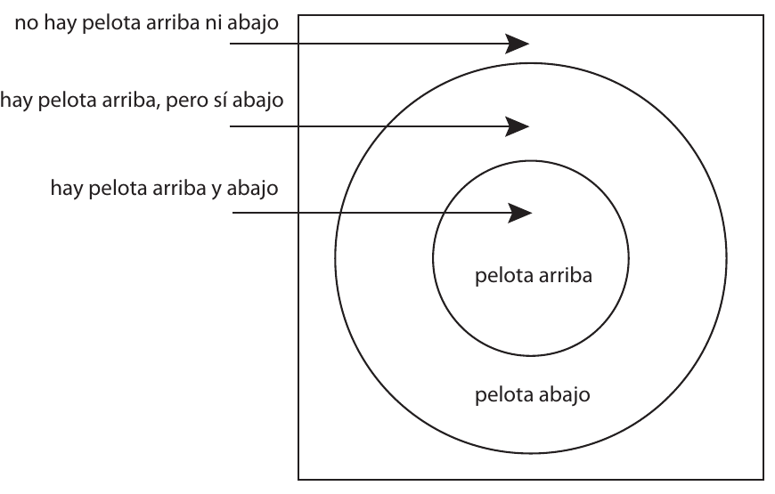

# 11 · Análisis de conceptos: dominio, hipótesis y contraejemplos (pp. 73–84)

Fuente: Barceló, *Introducción a la Investigación Filosófica*, borrador sep-2026, pp. 73–84. Transcripción literal; erratas del original conservadas.
Métodos clave: dominio de un predicado (73); procedimiento de 10 pasos para determinar el dominio de un concepto, con bucle 9-10 (73-74); taller "vivir" / "me hace sentir vivo": 8 enunciados, sustituciones con y sin sentido, hipótesis de dominio (74-76); esquema "Es necesario X para Y": ejemplos que motivan (X y Y; ni X ni Y) y contra-ejemplos (no X pero sí Y) (77-78); responder a los contra-ejemplos: cuestionar su corrección o refinar la hipótesis (78-79); ida y venida particular/general (80); dos observaciones (conceptos vs palabras; no-X cercanos) (81); TAREA con el ejemplo de las computadoras (81-82); Condiciones Necesarias y Suficientes: relaciones lógicas como posibilidades (i)-(iv) y respuestas equivalentes (a)-(i) (82-84).

---

[p.73]

México” para comunicar metonímicamente que he olvidado que mi papel es el de presidente de México. Literalmente, que soy el Presidente de México es algo que no puedo olvidar, ya que sé que es falso; aun así, en algunos contextos especiales puedo usar este enunciado para expresar algo verdadero.

El dominio de un predicado es el conjunto de entidades a las que se le puede aplicar con sentido. El dominio del predicado “Sé que…”, por ejemplo, son las verdades, ya que de cualquier verdad puedo decir que la sé, aun cuando algunas veces lo que diré será falso y otras verdadero. Si, en contraste, digo de algo falso que lo sé, lo que estaré diciendo será un sinsentido. Sólo lo verdadero puede ser conocido. Sólo lo verdadero es conocido o no conocido. Si conozco algo, ese algo es verdadero. Si desconozco algo, ese algo también es verdadero.

Dado que esta noción es central al análisis filosófico, la filosofía occidental ha desarrollado ya toda una estrategia para determinar el dominio de los conceptos y esta estrategia empieza con el principio del contexto. Viendo mas en detalle, los pasos para determinar el dominio de un concepto son:

1. Buscar la (o las) expresiones fundamentales que expresen el concepto a analizar
2. Proveer un ejemplo paradigmático de uso de un enunciado en el que se use dicha palabra (que presumiblemente denote su función)
3. Contextualizar dicho ejemplo
4. Esquematizar el ejemplo
5. Variación Positiva
6. Variación Negativa
7. Hipotetizar cuál es el dominio del concepto y por qué
8. Buscar contra ejemplos a la hipótesis generada en el paso 7

[p.74]

9. Si se encuentran contra-ejemplos, generar una nueva hipótesis y buscarle contra ejemplos
10. Si no se encuentran contraejemplos, tenemos una hipótesis correcta y hemos terminado el análisis

Déjame ilustrar esta técnica con otro ejemplo: el concepto “vida”. Una vez más, nombramos el concepto con un sustantivo, pero sabemos que debemos buscar qué otra expresión se esconde detrás de este sustantivo. En este caso, ésta es el verbo “vivir”. Este verbo y sus derivados ocurre en enunciados de todo tipo como

1. “Yo vivo para estudiar”
2. “Yo vivo al máximo”
3. “Roberto vive en la ciudad de México”
4. “Los árboles están vivos”
5. “Vivo para sobrevivir”
6. “Yo no sé vivir”
7. “Él vive muy lejos (de mí)”
8. “Escuchar música me hace sentir vivo”[^4]

Aunque en todos usamos el verbo, “vivir”, éste no expresa el mismo concepto no en todos ellos o, por lo menos, no revela el mismo aspecto del concepto, y pensar en diferentes ejemplos nos puede servir para definir mejor qué aspecto o qué concepto de vida nos interesa. Por ejemplo, cuando hablamos de dónde vivimos (ejemplos 3 o 7),“vivir” significa algo distinto que cuando lo usamos para distinguir seres vivos de no vivos (4). El resto de los ejemplos, en contraste, hablan de la vida en términos normativos, como algo que se puede hacer bien o mal y que tiene algún fin o sentido.

[p.75]

Si este es el sentido de vida que nos interesa, es mejor optar por usar uno de estos enunciados. Por ejemplo, analicemos mas a fondo el enunciado (8).

El siguiente paso en el método de variación es abstraer otro componente del enunciado, diferente al de vida y luego ver qué sustituciones no resultan en sinsentidos, es decir, errores categoriales de los que ya hablamos. Por ejemplo:

“_______________ me hace sentir vivo”

Podemos completar este enunciado de diferentes maneras, sustituyendo “escuchar música” en (8) por otros sustantivos como:

1. “Leer me hace sentir vivo”
2. “Estar con mis amigos me hace sentir vivo”
3. “Estar con alguien que amo me hace sentir vivo”
4. “Estar al aire libre me hace sentir vivo”
5. “Convivir con la naturaleza me hace sentir vivo”
6. “Ella me hace sentir vivo”

y contrastarlas con aquellas sustituciones que no tienen sentido, como:

1. “Morir me hace sentir vivo”
2. “Treinta y tres me hace sentir vivo”
3. “El cobalto me hace sentir vivo”
4. “Dormir me hace sentir vivo” (?) caso límite
5. “La fórmula general me hace sentir vivo”

Ahora bien, ¿cuál es la diferencia entre las sustituciones de un tipo y las del otro? ¿Qué tienen en común las cosas de las que tiene sentido siquiera preguntarse si nos pueden hacer sentir vivos o no (y que los distinguen de las que no)? Verlas juntas nos puede ayudar a sugerir hipótesis de cual

[p.76]

es el dominio del concepto en cuestión. Tal vez para que algo nos pueda hacer sentir vivos sea necesario:

- Tener una relación emocional con eso
- Requieren algún esfuerzo
- Ser acciones o personas (en vez de objetos inanimados y abstractos)
- Ser agradable, quee genera una sensación positiva
- Valioso pero no cualquier valor, no valor material, sino emocional o moral
- Tener un recuerdo de ello

Hipótesis de cual sera el Dominio :

- Es necesario tener una relación emocional con algo para que nos pueda hacer sentir vivo
- Es necesario requerir algún esfuerzo para que algo nos pueda hacer sentir vivo
- Es necesario ser una acción o una persona para que algo nos pueda hacer sentir vivo
- Es necesario que no sea un objeto inanimado o abstracto para que algo nos pueda hacer sentir vivo
- Es necesario que no sea un objeto inanimado o abstracto para que algo nos pueda hacer sentir vivo
- Es necesario que nos podemos relacionar con algo para que nos pueda hacer sentir vivo
- Es necesario que tengamos un vínculo íntimo con algo para que nos pueda hacer sentir vivo
- etc.

¿Cómo reforzamos una hipótesis de este tipo? Es necesario requerir algún esfuerzo para que algo nos pueda hacer sentir vivo

Ejemplos:

1. Cosas que nos pueden hacer sentir vivos y que requieren esfuerzo

[p.77]

- A un arquitecto, le puede hacer sentir vivo diseñar un edificio.
- Practicar un deporte puede hacer sentir vivo a otros.
- Tocar el violín
- Levantarse todos los días (caso límite)
- Cantar en público

2. Cosas que no requieren esfuerzo y no tiene sentido siquiera preguntar si nos pueden hacer sentir vivos o no

- Abrocharse las agujetas.
- Respirar
- Rascarse cuando se tiene comezón
- Levantarse del sofá

###### Cómo reforzamos una hipótesis de este tipo Es necesario X para Y

Ejemplos que motivan la hipótesis:

1. Cosas que X y Y
2. Cosas que no X y tampoco sean Y

Reforzar y motivar la hipótesis como algo plausible que se debe explorar. No demuestran que la hipótesis es correcta.

Fenómenos de los que la hipótesis puede dar cuenta, es decir la hipótesis (de ser correcta) nos podría explicar el porque de los ejemplos (de ser correctos).

###### Cómo críticamos una hipótesis de este tipo Es necesario X para Y

Contra-ejemplos que cuestionan o refutan la hipótesis:

1. Cosas que no X pero sí son Y

###### Hipótesis y Contraejemplos

Es necesario que algo te genere una sensación positiva para que te pueda hacer sentir vivo

Buscar un contra-ejemplo

[p.78]

Para toda hipótesis que te diga que es necesario X para Y, un contra-ejemplo sería algo que fuera Y pero no X.

Un contra-ejemplo para esta hipótesis sería algo que pudiera hacerte sentir vivo pero no te genere una sensación positiva. Por ejemplo:

- El box
- Un temblor
- El terror de una casa de terror

###### Cómo criticamos una hipótesis de este tipo Es necesario requerir algún esfuerzo para que algo nos pueda hacer sentir vivo

Contra-ejemplos:

1. Cosas que nos pueden hacer sentir vivos y, sin embargo, NO requieren esfuerzo

- Bañarse
- Consumir droga
- Escuchar música
- Mirar por la ventana
- Comer
- Ser besado
- Ver una película
- Oler

###### Responder a los ejemplos La discusión continua

1. Cuestionar su corrección.

Tal vez los ejemplos no son tales:

Tal vez ‘respirar’no sea algo que no requiera esfuerzo ni nos pueda hacer sentir vivos

[p.79]

Sino que es un contra-ejemplo:

Tal vez ‘respirar’ sea algo que no requiera esfuerzo pero sí nos pueda hacer sentir vivos.

###### Responder a los contra-ejemplos La discusión continua

1. Cuestionar su corrección.

Tal vez los contra-ejemplos no son tales:

Tal vez ‘Comer’ no sea (algo que no requiera esfuerzo pero sí nos pueda hacer sentir vivos).

Entonces ya no es un contra-ejemplo sino que es un ejemplo:

Tal vez ‘Comer’ sea algo que sí requiera esfuerzo y nos pueda hacer sentir vivos o sea algo que no requiera esfuerzo pero tampoco nos pueda hacer sentir vivos.

###### Responder a los contra-ejemplos La discusión continua

Si la hipótesis es que X es necesaria para Y

1. Cuestionar su corrección.

Tal vez los contra-ejemplos no son tales:

Tal vez el presunto contra-ejemplo no sea (Y y no X). Entonces ya no es un contra-ejemplo sino que es un ejemplo: Tal vez el presunto contra-ejemplo sea X y Y o ni X ni Y.

###### Responder a los contra-ejemplos La discusión continua

2. Refinar la hipótesis

- Buscar qué tienen en común los contra-ejemplos que hacen que la hipótesis no se les aplique y añadirlo a la hipótesis.
- Añadimos como segunda condición necesaria la sensación

Nueva hipótesis:

Es necesario requerir esfuerzo y producir una sensación para que algo nos pueda hacer sentir vivos

[p.80]

###### Argumentación Filosófica

Ida y venida entre lo particular y concreto y lo general y abstracto

- Interés general y abstracto: el sentido de la vida
- Casos paradigmáticos particulares y concretos
- Generamos hipótesis generales y abstractas
- Buscamos ejemplos y contra-ejemplos particulares y concretos
- Respondimos con nuevas hipótesis refinadas generales y abstractas
- Buscamos ejemplos y contra-ejemplos particulares y concretos para la nueva hipótesis

... y así se sigue...

###### Otras hipótesis filosóficas Para ejercicios

- Es necesario que algo sea falso para que quien lo diga mienta.
- Es necesario tener mente para creer algo.
- Sólo los actos pueden ser buenos.
- Sólo las cosas que hacen los humanos pueden ser bellas.

Es necesario que algo sea falso para que quien lo diga mienta. Ejemplos y Contraejemplos: Es necesario X para Y

X: ser falso

Y: quien lo dice, miente

EJEMPLOS

1. Cosas que X y Y: falsa y mentira
2. Cosas que ni X ni Y: ni falsas ni mentira

CONTRA-EJEMPLOS

3. Cosas que no X pero sí Y: no son falsas pero sí mentira

[p.81]

###### Dos observaciones importantes a la hora de generar y evaluar ejemplos y contra-ejemplos

1. No confundir conceptos con palabras

Por ejemplo, la palabra “falso” es ambigüa entre falso como lo contrario de verdadero y falso como lo contrario de auténtico: una sola palabra, pero dos conceptos distintos.

2. Cuando se buscan ejemplos de no-X o no-Y, es preferible buscarlos lo mas cercanos a X y Y.

Por ejemplo, ni lo inexistente ni lo hecho por animales es hecho por humanos, pero ser algo hecho por animales es más cercano a ser hecho por humanos que ser inexistente.

###### TAREA

A partir de lo que hicieron en su grupo

Tomen un ejemplo o contra-ejemplo y traten de mostrar que no es tal

o, tomen un contra-ejemplo y traten de generar una nueva hipótesis que lo contemple

Por ejemplo

Es necesario tener mente para creer algo.

Supongamos que eligen como presunto contra-ejemplo a LAS COMPUTADORAS como algo que NO tiene mente (es decir, NO cumple con la condición necesaria de la hipótesis), pero SÍ cree cosas (es decir, SÍ cumple con la condición suficiente de la hipótesis).

Paar responder a este contra-ejemplo, se pueden hacer una de dos cosas:

1. Pueden tratar de mostrar que LAS COMPUTADORAS en realidad SÍ tienen mente (es decir, en realidad SÍ cumple con la condición necesaria de la hipótesis) o que LAS COMPUTADORAS en

[p.82]

realidad NO creen nada (es decir, en realidad NO cumple con la condición suficiente de la hipótesis) y, por lo tanto, no son contra-ejemplos de la hipótesis

2. Pueden buscar otra condición para generar una nueva hipótesis que sí funcione. Por ejemplo: es necesario tener o simular una mente, para tener creencias. A esta nueva hipótesis, las computadoras no son ya contrajeemplo.

### Referencias:

Frege, G. [1884] (1996). Die Grundlagen der Arithmetik. Breslau: W. Koebner. (Versión en español: Los fundamentos de la aritmética. En Gottlob Frege. Escritos filosóficos. C. U. Moulines (trad.). Barcelona: Crítica).

Ryle, Gilbert [1949] (2005) El concepto de lo mental, Introducción de Daniel C. Dennett, Ediciones Paidós

Thomasson, Amie, "Categories", The Stanford Encyclopedia of Philosophy (Summer 2019 Edition), Edward N. Zalta (ed.), URL = <https://plato.stanford.edu/archives/sum2019/entries/categories/>.

###### Condiciones Necesarias y Suficientes

Conocer relaciones lógicas es, a fin de cuentas, saber qué cosas son posibles e imposibles.

por ejemplo

[p.83]

¿Cuál es la relación lógica entre haber una pelota en la cámara de arriba y haber una pelota en la cámara de arriba?

(i) Es posible que haya una pelota arriba y una abajo.

(ii) Es posible que no haya una pelota arriba, pero sí haya una abajo.

(iii) Es posible que no haya una pelota arriba, ni una abajo.

(iv) Pero es imposible que no haya una pelota arriba, pero no una abajo.

por lo tanto (respuestas equivalentes):

(a) Si hay una pelota arriba, debe haber una pelota abajo.

(b) Si no hay una pelota abajo, no puede haber una pelota arriba tampoco.

(c) No puede haber una pelota arriba, sin una pelota abajo.

(d) No puede faltar la pelota de abajo, sin que falte la pelota de arriba también.

(e) Basta saber que hay una pelota arriba, para saber que hay una abajo.

(f) Basta saber que no hay una pelota arriba, para saber que no hay una abajo.

(g) El que haya una pelota arriba es incompatible con que no haya una pelota abajo.

(h) El que haya una pelota arriba es una condición suficiente para que haya una abajo

(i) El que haya una pelota abajo es una condición necesaria para que haya una arriba.

[p.84]

> Descripción de la figura: dentro de un rectángulo hay dos círculos concéntricos; el interior se rotula "pelota arriba" y la corona exterior "pelota abajo". Tres flechas entran desde la izquierda: "no hay pelota arriba ni abajo" apunta a la zona del rectángulo fuera de ambos círculos; "no hay pelota arriba, pero sí abajo" apunta a la corona exterior; "hay pelota arriba y abajo" apunta al círculo interior. No hay región para "pelota arriba sin pelota abajo": haber pelota abajo es condición necesaria de haber pelota arriba.

Ejemplos filosóficos:

¿Cuál es la relación lógica entre que alguien crea algo y que ese algo sea cierto?

(i) Es posible que alguien crea algo y que ese algo sea cierto.

(ii) Es posible que alguien crea algo y que ese algo no sea cierto.

(iii) Es posible que algo sea cierto y que nadie lo crea.

(iv) Es posible que algo no sea cierto y que nadie lo crea.

¿Cuál es la relación lógica entre que alguien sepa algo y que ese algo sea cierto?

(i) Es posible que alguien sepa algo y que ese algo sea cierto.

(ii) No es posible que alguien sepa algo y que ese algo no sea cierto.

(iii) Es posible que algo sea cierto y que nadie lo sepa.

(iv) Es posible que algo no sea cierto y que nadie lo sepa.

por lo tanto (respuestas equivalentes):

(a) Si alguien sabe algo, debe ser cierto.

(b) Si algo no es cierto, no puede saberlo nadie.

(c) No puede saberse algo, sin que sea cierto.

(d) Basta saber que alguien sabe algo, para saber que es cierto.

(e) El que algo no sea cierto es incompatible con que sea conocido.

## Notas

[^4]: Los ejemplos fueron ofrecidos por mis alumnos en clase.
