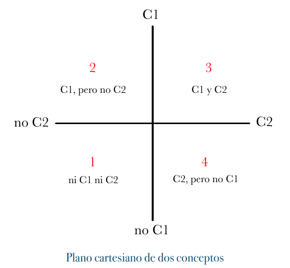
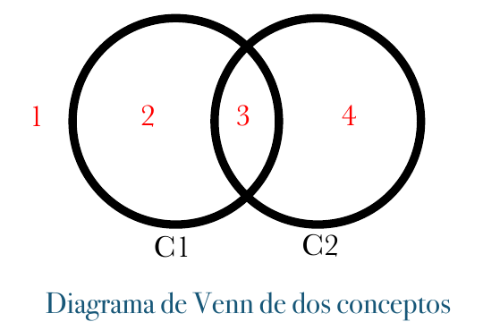
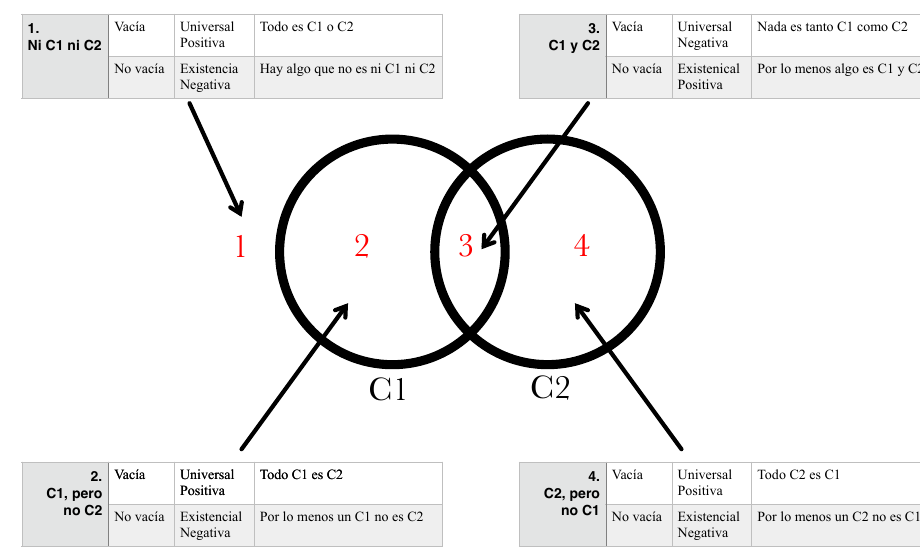
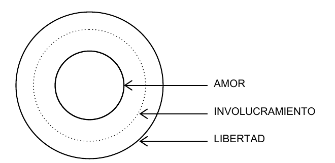

# 14 · 5. La Argumentación Filosófica — A. Cómo evaluar un Universal Necesario (pp. 99–107)

Fuente: Barceló, *Introducción a la Investigación Filosófica*, borrador sep-2026, pp. 99–107. Transcripción literal; erratas del original conservadas.
Métodos clave: generación de argumentos como técnica, no inspiración (99); universal necesario vs. existencial negativo, refutación por contra-ejemplo y experimentos pensados (100-101); Tarea: cinco debates tesis universal/existencial (101); espacio lógico de dos conceptos: plano cartesiano, diagrama de Venn, 4 regiones y tabla región/contenido/forma/enunciado (101-103); anclaje psicológico y hábito de desanclar la imaginación (103); 3 requisitos para verificar un contra-ejemplo y 3 para refutarlo (104); descomposición del contra-ejemplo en 5 partes d-h mediante análisis conceptual (104-105); refutación de contra-ejemplos con condiciones necesarias de X y suficientes de Y; concepto puente (105-106); ejemplo hegeliano amor–involucramiento–libertad, argumento con 2 premisas y conclusión (106-107).

---

[p.99]

## 5. La Argumentación Filosófica

Si bien la teoría de la argumentación ha dedicado mucho trabajo a la evaluación y análisis de argumentos, es poco en comparación lo que ha dedicado a la generación de argumentos. Tenemos un sinnúmero de teorías y técnicas para distinguir buenos de malos argumentos, pero son pocas las propuestas que tratan de enseñarnos de dónde sacar nuevos (y buenos) argumentos. Dejar la generación de argumentos al genio o la inspiración no debe ser la única opción, y definitivamente, no puede ser la más eficiente. Es preferible des-mitificar la generación de argumentos y mostrar que los argumentos no surgen misteriosamente sino que se pueden producir con un poco de técnica y trabajo.

En las siguientes secciones me propongo exactamente eso: sugerir algunas estrategias generales que, de seguir metódica y rigurosamente, pueden ayudarnos a ver los problemas desde nuevas perspectivas y así generar argumentos nóveles. El primer paso, sin embargo, como he señalado en las secciones anteriores, es adquirir cierto dominio sobre el tema del que queremos investigar. Esto involucra, como ya mencioné, tanto conocer lo mas importante que se sabe sobre el tema, como identificar bien la discusión a la que queremos contribuir con nuestra investigación. Además, dado el carácter interdisciplinario de mucho del trabajo filosófico actual, esto requiere a veces también recopilar información sobre dicho tema. Sólo entonces podemos realizar un buen análisis del problema que nos permita explorar bien el espacio conceptual dentro del cual trabajaremos.

[p.100]

### A. Cómo evaluar un Universal Necesario

Las hipótesis que hemos visto hasta ahora en esta sección son lo que llamamos universales necesarios, es decir dicen que todo lo que es de un tipo necesariamente también es de otro. A decir verdad, en un gran número de debates filosóficos, en las posiciones en conflicto una de ellas suele ser un universal necesario y la otra un existencial negativo. Si la pregunta es, por ejemplo, si el conocimiento es creencia verdadera justificada, las posiciones en conflicto son la que defiende que sí lo es, es decir, que todo conocimiento es creencia verdadera justificada, y la que defiende su contrario, a saber, que no toda creencia verdadera y justificada es conocimiento, es decir, hay casos de creencias verdaderas y justificada que no son conocimiento. Esta última es una tesis existencial negativa, mientras que la primera es un universal negativo.

Aunque este tipo de tesis son más fáciles de refutar que de verificar, los procesos de buscar verificación y refutación forman una sola dialéctica, es decir, se complementan. La manera estándar de refutar este tipo de tesis es buscando contra-ejemplos, es decir casos que sean de un tipo, pero no del otro.

Dada una tesis universal necesaria que diga que

Todos los X (aún los imaginarios o meramente posibles) necesariamente son Y

un contra-ejemplo sería un Y(aunque sea imaginario o meramente posible) que no sea (o pueda no ser) X.

Por ejemplo, si alguien dice que

(A). Todos los seres pensantes (aún los imaginarios o meramente posibles) son necesariamente humanos.

Un contra-ejemplo que refutara (A) sería un ser pensante que no sea (o pueda no ser) humano (por ejemplo, un robot). No es necesario, reitero, encontrar un ser pensante que de hecho no sea

[p.101]

humano, basta con concebir la mera posibilidad, es decir, construir un escenario imaginario consistente y posible donde haya un ser pensante no humano. A estos escenarios imaginarios se les llama experimentos pensados o del pensamiento.

#### Tarea:

1. Presenta cinco debates entre una tesis fuerte, universal y otra débil, existencial.

Como hemos visto, una forma muy común, tal vez la más común, de debate filosófico, suele girar alrededor de la relación entre dos conceptos, llamémosles C1 y C2. Cuando tenemos dos conceptos, estos generan un espacio lógico compuesto de cuatro posibilidades que, siguiendo la metáfora espacial, suelen concoerse como “regiones” del espacio lógico. Éstas pueden identificarse muy fácil usando un plano cartesiano o un diagrama de Venn:

> Descripción de la figura: dos ejes perpendiculares; el vertical va de "no C1" (abajo) a "C1" (arriba), el horizontal de "no C2" (izquierda) a "C2" (derecha). Los cuatro cuadrantes están numerados en rojo: 1 "ni C1 ni C2" (abajo izquierda), 2 "C1, pero no C2" (arriba izquierda), 3 "C1 y C2" (arriba derecha), 4 "C2, pero no C1" (abajo derecha).

*Plano cartesiano de dos conceptos*

[p.102]

> Descripción de la figura: dos círculos solapados rotulados C1 (izquierda) y C2 (derecha); la región 1 queda fuera de ambos círculos, la región 2 solo dentro de C1, la región 3 en la intersección de ambos y la región 4 solo dentro de C2.

*Diagrama de Venn de dos conceptos*

En estos diagramas se pueden identificar muy fácilmente las cuatro regiones que corresponden a los cuatro posibles combinaciones que generan dos conceptos:

1. Ni C1 ni C2
2. C1, pero no C2
3. C1 y C2
4. C2, pero no C1.

Entonces podemos decir que los debates filosóficos mas comunes giran alrededor si alguno de estas regiones es vacía o no. Defender que una región es vacía es defender una hipótesis fuerte o universal, mientras que defender que una región no está vacía es defender la hipótesis existencial

> Descripción de la figura: el mismo diagrama de Venn de dos círculos C1 y C2, acompañado de cuatro pequeñas tablas, una por región, con columnas contenido / forma / enunciado. Región 1 (Ni C1 ni C2): Vacía → Universal Positiva → "Todo es C1 o C2"; No vacía → Existencia Negativa → "Hay algo que no es ni C1 ni C2". Región 2 (C1, pero no C2): Vacía → Universal Positiva → "Todo C1 es C2"; No vacía → Existencial Negativa → "Por lo menos un C1 no es C2". Región 3 (C1 y C2): Vacía → Universal Negativa → "Nada es tanto C1 como C2"; No vacía → Existenical Positiva → "Por lo menos algo es C1 y C2". Región 4 (C2, pero no C1): Vacía → Universal Positiva → "Todo C2 es C1"; No vacía → Existencial Negativa → "Por lo menos un C2 no es C1".

[p.103]

análoga correspondiente, pues lo que se está defendiendo es que existe un cierto tipo de fenómeno.

| Región | Contenido | Forma | Enunciado |
|---|---|---|---|
| 1. Ni C1 ni C2 | Vacía | Universal Positiva | Todo es C1 o C2 |
| 1. Ni C1 ni C2 | No vacía | Existencia Negativa | Hay algo que no es ni C1 ni C2 |
| 2. C1, pero no C2 | Vacía | Universal Positiva | Todo C1 es C2 |
| 2. C1, pero no C2 | No vacía | Existencial Negativa | Por lo menos un C1 No es C2 |
| 3. C1 y C2 | Vacía | Universal Negativa | Nada es tanto C1 como C2 |
| 3. C1 y C2 | No vacía | Existenical Positiva | Por lo menos algo es C1 y C2 |
| 4. C2, pero no C1 | Vacía | Universal Positiva | Todo C2 es C1 |
| 4. C2, pero no C1 | No vacía | Existencial Negativa | Por lo menos un C2 no es C1 |

A la hora de buscar ejemplos y contra-ejemplos, es fundamental ser consciente del fenómeno del anclaje psicológico. Así se le llama al fenómeno de que cuando tratamos de imaginar casos distintos, es natural para nuestra imaginación pensar primero en casos muy similares. Así por ejemplo, si tratamos de imaginar un ser pensante que no sea humano, nuestra imaginación buscará primero casos muy similares al humano, simplemente porque ese es el caso paradigmático y, por lo tanto, el caso del que parte nuestra imaginación. En la jerga psicológica, quedamos anclados a ese caso y por ello nos cuesta trabajo buscar ejemplos de casos distintos. Pero el ejemplo que necesitamos muchas veces puede encontrarse muy lejos del caso del que partimos y por ello es fundamental adquirir el hábito de ‘desanclar’ nuestra imaginación.

[p.104]

Una vez que se propone el contra-ejemplo, también es necesario verificarlo o refutarlo. Para mostrar que el contra-ejemplo que hemos ofrecido efectivamente es un Y que no es X debemos mostrar que dicho objeto (suceso, o lo que sea)

a. existe o, por lo menos, puede existir
b. es un Y, y
c. no es un X.

Inversamente, dicho tipo de argumento se refuta demostrando que el supuesto contra-ejemplo

a. es inconsistente o imposible
b. no es realmente un Y, o
c. en realidad debe ser un X

Continuando con el ejemplo anterior, el contra-ejemplo del robot se refutaría si dicho objeto

a. fuera inconsistente o imposible
b. no pensara realmente o
c. en realidad, fuera humano.

Igualmente, el contra-ejemplo del robot pensante sería válido si se muestra que

a. es genuinamente posible que exista
b. efectivamente piensa, y
c. no es humano.

Si el supuesto contra-ejemplo que se propone no satisface estos tres requisitos entonces no es realmente un contra-ejemplo.

Ahora bien, ¿cómo encontramos un contra-ejemplo para refutar una tesis universal necesaria? Nos servimos del análisis conceptual. En particular, si queremos encontrar un contraejemplo de la tesis (A) que todos los X son Y, nos interesa buscar las condiciones necesarias de Y,

[p.105]

y las condiciones sufcientes de X. Al buscar las condiciones suficientes de X, debemos tener en mente que lo que se busca en una contra-ejemplo no es un típico objeto X, sino un caso que muestre que no todos los X son Y. Por eso, debemos buscar un objeto O que tenga alguna propiedad P que sea condición suficiente para ser X y no tenga alguna propiedad Q que sea condición necesaria para ser Y. De esta manera, descomponemos el problema, no en tres, sino cinco partes:

d. O existe o, por lo menos, puede existir,
e. O tiene la propiedad P,
f. P es condición suficiente para ser Y,
g. O no tiene la propiedad Q y
h. Q es condición necesaria para ser X.

Supongamos, otra vez que queremos usar un robot como contra-ejemplo de que todos los seres pensantes son humanos. En vez de tratar de mostrar directamente que dicho robot piensa, podemos apelar a otra propiedad que el robot claramente posea y que sea condición suficiente para ser un ente pensante, por ejemplo, la de poder resolver problemas matemáticos de manera novedosa. Entonces, mostramos que el robot puede efectivamente resolver problemas matemáticos de manera novedosa y que esto basta para afirmar que el robot efectivamente piensa. Igualmente, en vez de tratar de mostrar directamente que dicho robot no es humano, podemos apelar a una segunda propiedad que nos parezca necesaria para ser humano, pero que el robot claramente no posea, por ejemplo, la conciencia.

De manera simétrica, para refutar un contra-ejemplo, también nos servimos del análisis conceptual. En particular, si queremos refutar un contra-ejemplo de la tesis (A) que todos los X son Y, nos interesa buscar las condiciones suficientes de Y, y las condiciones necesarias de X. Si

[p.106]

mostramos que el presunto contra-ejemplo le falta alguna de las condiciones necesarias para ser un X genuino, o satisface alguna de las condiciones suficientes para ser un Y, habremos mostrado que el presunto contra-ejemplo no era tal.

Al buscar refutar un contra-ejemplo contra la hipótesis de que todos los X son Y es muy útil tener presentes las condiciones necesarias de X y las condiciones suficientes de Y. Al hacer este análisis, es posible que nos encontremos que uno de las condiciones suficientes de Y sea también una condición necesaria de X. En ese caso, podemos usar dicha condición como concepto puente para mostrar que todo X debe ser Y. Recordemos que si C es condición necesaria de X, entonces todo lo que es X satisface C; y que si C es condición suficiente de Y, entonces todo lo que satisface C es Y. De tal manera que si hay una condición C que sea tanto condición necesaria de X como condición suficiente de Y, entonces efectivamente todo X posible debe ser también Y.

Por ejemplo, podemos preguntarnos si el amor es libre y voluntario. Una manera mas precisa de formular la hipótesis seria preguntándonos si es posible o no amar de una manera que no sea libre y voluntaria, por ejemplo de manera involuntaria o por coerción. Siguiendo a Hegel, podríamos argumentar que no, apelando a la manera en que debemos estar involucrados en la relación amorosa. El amor, dice el argumento, no es el tipo de cosa como destapar una botella o bostezar, que podamos hacer si involucraros plenamente, el tipo de cosa que podríamos hacer accidental o superficialmente. Mas bien, es como el profesar una religión o ser un verdadero punk, es decir, son el tipo de cosas que sería éticamente censurable pretender ser sin serlo genuinamente. Además ninguna de estas cosas, como puede verse, pueden hacerse sino de manera libre, pues el involucramiento profundo y genuino que requieren es incompatible con la coerción o la falta de una voluntad genuina. Por lo tanto, el amor, en particular, tampoco puede ejércele sino libremente.

[p.107]

> Descripción de la figura: tres círculos concéntricos; el interior, de trazo continuo, se rotula "AMOR"; el intermedio, de trazo punteado, "INVOLUCRAMIENTO"; el exterior, de trazo continuo, "LIBERTAD". El involucramiento contiene al amor (es condición necesaria del amor) y está contenido en la libertad (es condición suficiente de lo libre): es el concepto puente entre amor y libertad.

Independientemente de si este argumento, de inspiración Hegeliana, es correcto o no, lo que nops interesa estudiar aquí es su estructura general. El reto era conectar los conceptos de “amor”y “libertad”. Lo que hace Hegel aquí es identificar un tercer concepto que le sirve de puente o paso intermedio entre ellos dos: el tipo de involucramiento personal y profundo que requiere el amor. Según el argumento Hegeliano, éste involucramiento es una condición necesaria para el amor y otro tipo de acciones y es condición suficiente para que algo sea un acto libre y voluntario. Este argumento funciona porque la conexión entre el amor y este tipo de involucramiento es mucho mas clara que la conexión entre el amor y la libertad, y porque la conexión entre este tipo de involucramiento y la libertad también es mucho mas clara que la conexión entre el amor y la libertad. De esta manera, tenemos un argumento lógicamente válido cuyas premisas son mas claras y menos controversial que su conclusión, que es lo que queríamos:

1. Premisa: El amor requiere un involucramiento personal profundo.
2. Premisa: Este tipo de involucramiento personal profundo no puede ser sino libre y voluntario.
3. Conclusión: El amor no puede ser sino libre y voluntario.

Como se puede ver, la búsqueda de contra-ejemplos está ligada de manera íntima con el análisis conceptual. No es de sorprender, por lo tanto, que mucho del trabajo de investigación filosófica actual se dedica a la búsqueda, refutación, verificación y desarrollo de contra-ejemplos.
