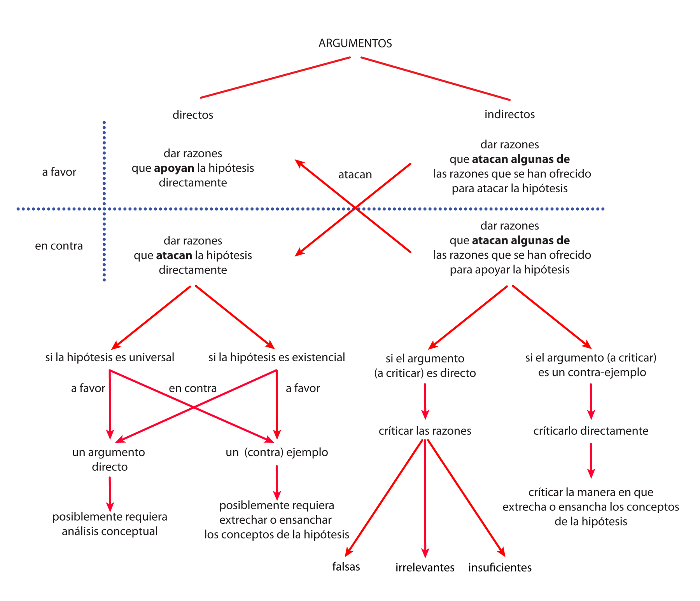
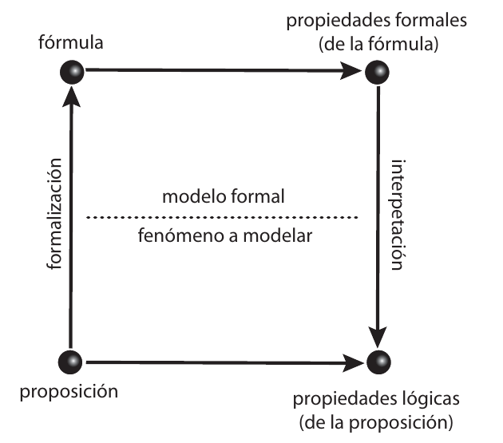
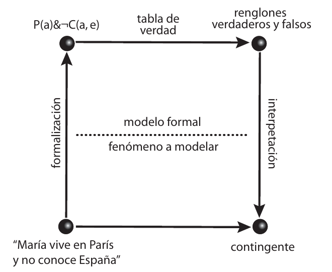

# 16 · B. Tipos de Argumentos Filosóficos (pp. 117–139)

Fuente: Barceló, *Introducción a la Investigación Filosófica*, borrador sep-2026, pp. 117–139. Transcripción literal; erratas del original conservadas.
Métodos clave: tipos de argumentos: negativos (contraejemplos, reducción al absurdo) y positivos I-V (117); I. por análisis: 4 elementos del análisis de una certeza (1-4) y 4 de una hipótesis (5-8), objetivo del análisis exploratorio A (a-e) y B (a-e), reducción al absurdo (117-121); esquema de argumentos directos/indirectos, a favor/en contra (120); un mal argumento a favor no es argumento en contra (121); II. por analogía: caso A entre B y C con ejemplos claros, ejemplo del error médico (121-123); III. modelos filosóficos: túnel de viento, modelos formales, dilema de Benacerraff nominalismo/pluralismo (123-128); ejemplo: modelos formales en lógica: sistema formal vs. teoría lógica, propiedades locales/globales, formalización e interpretación, esquema del modelo (128-133); 2. lo que se formaliza son proposiciones, formalización como traducción y como modelar (133-135); 3. cómo saber si se formalizó bien: uso, cartografía, bootstrapping (135-137); IV. de plausibilidad empírica (137-138); V. a la mejor explicación (138); Referencias (138).

---

[p.117]

fundamentales es el objetivo de un tipo de investigación filosófica llamada fundacionismo. Sin embargo, este tipo de investigación ha caído muy en desuso en los últimos años.

## B. Tipos de Argumentos Filosóficos

Una vez que hemos definido una hipótesis, es decir, una vez que hemos identificado la posición que queremos defender y la hemos sintetizado en un enunciado, es necesario producir un argumento para defenderla. El argumento, por supuesto, deberá depender de la tesis misma que se quiere defender. Si la tesis es negativa, es decir, si lo que queremos mostrar es que algo es falso o no es caso, usamos un contraejemplo o una reducción al absurdo. En contraste, si la tesis es positiva, debemos dar un argumento por análisis, por analogía, de plausibilidad empírica o a la mejor explicación. Ahora veremos cada uno de estos tipos de argumentos en más detalle.

Negativos:

Contraejemplos

Reducción al absurdo.

Positivos:

### I. Por Análisis (también conocidos como argumentos por definición o analíticos)

Gracias al análisis de conceptos que vimos en sesiones anteriores, podemos construir argumentos positivos, es decir, a favor de alguna tesis filosófica. El objetivo de este tipo de argumentos es fundar en el análisis o definición de los conceptos (a veces se usan como sinónimos) la conexión establecida en la hipótesis a probar. Este tipo de argumentos, por

[p.118]

ser deductivos, son los más fuertes posibles en filosofía. Sin embargo, son también los más difíciles y, muchas veces, también son muy controversiales ya que pueden caer fácilmente en peticiones de principio.

Como su nombre lo indica, este tipo de argumentos están basados en el análisis (de conceptos e hipótesis, juicios y argumentos), así que vale la pena recordar algunos elementos del análisis que ya hemos visto sobre los que se basan este tipo de argumentos:

Como recordaran, habíamos visto que el análisis asociado a las preguntas por qué estaba basado en determinar, dada una certeza, cuales eran:

1. Las razones que tenemos o podríamos tener para creerla
2. Las consecuencias que tiene o podría tener que fuera verdadera
3. Sus causas (en el caso de que las tenga) y
4. Sus efectos (en el caso de que las tenga)

Además, el análisis de una certeza se complementaba con el análisis simultáneo de su negación.

Ahora bien, algo similar podemos hacer con las hipótesis, es decir, con aquello que queremos demostrar o refutar, es decir, aquello que no sabemos si es cierto o falso, pero queremos demostrarlo. Es decir, demos explorar:

5. Las razones que tenemos o podríamos tener para creer que la hipótesis es verdadera
6. Las consecuencias que tiene o podría tener que fuera verdadera
7. Sus causas (en el caso de que las tenga) y
8. Sus efectos (en el caso de que las tenga)

[p.119]

Además, el análisis de una hipótesis se complementaba con el análisis simultáneo de su negación o de sus hipótesis en competencia (las cuales, pueden ser más de una y pueden no ser directamente su negación).

El objetivo de este análisis exploratorio es:

A. Buscar, entre las causas o las razones algo
    a. Tautológico o Necesario
    b. Obvio
    c. Verdadero
    d. Sencillo o
    e. Intuitivo
B. Buscar, entre las consecuencias o efectos algo
    a. Contradictorio o imposible
    b. Absurdo (o obviamente falso)
    c. Falso
    d. Demasiado complicado o
    e. Contra-intuitivo

Una vez que hemos encontrado alguna de estas opciones (entre mas alta en la lista sea el punto de llegada, mas fuerte es el argumento), tenemos el material suficiente para construir un argumento analítico. Si encontramos lo que nos pide (A), tenemos un argumento a favor de la hipótesis. Si encontramos lo que nos pide (B), tenemos un argumento en contra.

Efectivamente, si nuestra hipótesis se sigue de algo verdadero, intuitivo, etc., entonces este algo nos da buenas razones para creerlo. De ahí que podamos construir un argumento que

[p.120]

tenga aquello verdadero, intuitivo, etc. a lo que llegamos como premisas y la hipótesis como conclusión.

Si, por el contrario, de nuestra hipótesis se sigue algo falso, contra-intuitivo o absurdo, entonces tenemos buenas razones para creer que es falso. De ahí que podamos construir un argumento en contra de la hipótesis que tenga a la hipótesis como premisa y al absurdo o la

> Descripción de la figura: árbol con raíz "ARGUMENTOS" dividido en "directos" e "indirectos", cruzado por dos filas, "a favor" y "en contra". Directos a favor: "dar razones que apoyan la hipótesis directamente". Directos en contra: "dar razones que atacan la hipótesis directamente", que se ramifica en "si la hipótesis es universal" y "si la hipótesis es existencial"; cruzando a favor / en contra, se llega a "un argumento directo (posiblemente requiera análisis conceptual)" o a "un (contra) ejemplo (posiblemente requiera estrechar o ensanchar los conceptos de la hipótesis)". Indirectos a favor: "dar razones que atacan algunas de las razones que se han ofrecido para atacar la hipótesis". Indirectos en contra: "dar razones que atacan algunas de las razones que se han ofrecido para apoyar la hipótesis", que se ramifica en "si el argumento (a criticar) es directo → criticar las razones → falsas / irrelevantes / insuficientes" y "si el argumento (a criticar) es un contra-ejemplo → criticarlo directamente → criticar la manera en que estrecha o ensancha los conceptos de la hipótesis". Flechas cruzadas rotuladas "atacan" unen los directos con los indirectos del signo contrario.

[p.121]

falsedad a la que se llega como conclusión. Este tipo de argumentos se llaman de reducción al absurdo y demuestran que la hipótesis es falsa.

Nótese que si bien es cierto e importante que encontrar buenas razones a favor de una hipótesis nos permite construir un buen argumento a su favor, no es igualmente verdadero que encontrar malas razones a favor de una hipótesis nos permita construir un buen argumento en su contra – nos permitiría construir un mal argumento a su favor, por supuesto, pero un buena rgumento a favor de algo no es automáticamente un buen argumento en su contra. ¡Un mal argumento es un mal argumento y punto! No nos dice nada sobre si la hipótesis que sostiene es verdadera, ni si es falsa. Supongamos que queremos determinar si es cierta la hipótesis de que “el verdadero amor perdona” y alguien ofreciera como razón a su favor el que Maná lo haya dicho en la letra de uno de sus éxitos mas importantes. Claramente, ésta no sería una buena razón para sostener la hipótesis. Pero no por eso deberíamos automáticamente rechazar dicha hipótesis, es decir, así como no podemos defender que el verdadero amor perdona con base en la existencia y éxito de la canción de Maná, tampoco podemos usar dicha canción como razón para rechazar el que el verdadero amor perdona. El que exista la canción y que haya tenido éxito no nos dice nada sobre si lo que dice sea verdadero ni falso.

### II. Por Analogía

Los argumentos por analogía se basan en comparar casos problemáticos con casos claros para explotar sus similitudes y diferencias. Supongamos que queremos responder a la pregunta si un caso A es del tipo B o su contrario C (la analogía también funciona, pero es

[p.122]

más rara, con tres o más opciones). Entonces necesitamos encontrar un ejemplo claro de un B lo más parecido a A, y otro ejemplo claro de un B lo más parecido a A. Cuando hablo de ejemplos claros, me refiero a casos no controversiales, que no dependan de ninguna concepción o definición debatible (de B o C). Entonces es necesario comparar las diferencias y similitudes entre A y los ejemplos de B y C. El objetivo de esta comparación es buscar alguna diferencia o similitud relevante que decida la cuestión de si A es B o C. No es suficiente determinar si A es más parecido al ejemplo de B que al de C o viceversa. Es necesario que las diferencias o similitudes que se encuentren sean suficientes para decidir si A es B o C.

Por ejemplo, imagínese que se quiere dar un argumento por analogía a la pregunta de si un error médico que causa la muerte de un paciente (este será el A de nuestro ejemplo) es un asesinato (B) o no (C). Entonces es necesario buscar un ejemplo claro de asesinato (B) que sea lo más parecido al caso en cuestión. Por ejemplo, el caso en que un médico intencionalmente administra una medicina fatal a un paciente causándole la muerte. Luego, es también necesario encontrar un caso claro de (C) un no-asesinato similar. Por ejemplo, el caso en que un error médico no tiene mayores consecuencias en la salud del paciente. Entonces, deberán de analizarse las similitudes y diferencias entre el caso problemático (el error médico que causa la muerte de un paciente) y los nuevos ejemplos. Después puede argumentarse a partir de estas diferencias a favor de una u otra opción. Podría decirse que dado que el caso (C) se parece a (A) en que ambos casos fueron errores médicos y la única diferencia es que en un caso muere el paciente y el otro no. Dado que no se puede juzgar de manera diferente casos similares que difieren solo en sus

[p.123]

consecuencias, deberá aceptarse la conclusión de que si uno no es un asesinato (lo cual es claro en el caso C), el otro tampoco debe serlo. De ahí que el error médico no pueda calificarse de asesinato. Además, dado que la diferencia fundamental entre el caso problemático (A) y el caso claro de asesinato (B) es la intención del causante de la muerte, entonces debemos determinar si la intención criminal es necesaria para declarar algo como asesinato o no.

Dado que estos argumentos no son deductivos, sino inductivos, son menos decisivos que los del primer tipo, pero son más comunes y, muchas veces, intuitivos.

### III. Modelos Filosóficos

En la filosofía, al igual que en muchas otras ciencias, solemos también usar modelos para argumentar o explicar fenómenos. Al igual que en el caso de las analogías, usamos modelos cuando nos es difícil demostrar algo de manera directa (a decir verdad, se puede decir que los argumentos que usan modelos son un tipo de argumentos por analogía, ya que explotan la analogía entre el fenómeno a estudiar y el modelo). La idea detrás del uso de un modelo es muy sencilla. Un modelo es un objeto, concepto o sistema que representa el fenómeno que nos interesa de manera tal que podemos estudiar ciertos aspectos de él a través de aspectos análogos del modelo. Piensen en el uso de túneles de viento en la ingeniería aeronáutica.

Si queremos estudiar el los efectos del movimiento del aire alrededor de un tipo de avión, no usamos un verdadero avión para nuestra prueba, sino un modelo, y no lo ponemos a volar en el aire, sino que lo observamos al interior de una cámara dentro de la cual hacemos pase aire a alta velocidad. Aunque no sea un avión propiamente dicho, dicho modelo compartirá ciertas características con el tipo de avión que representa, dependiendo de qué nos interese estudiar sobre

[p.124]

él. Si nos interesa saber cómo afecta la forma de las alas la estabilidad de la nave, por ejemplo, es de suponer que reproduciremos dicha forma en el modelo. Es decir, es muy sensato que el modelo tenga alas de la misma forma. Igualmente, el aire que corre por el túnel no es un viento propiamente dicho, pero comparte las suficientes características para que le sirva como modelo. En general, queremos que el modelo sea lo suficientemente similar a aquello que representa cómo para poder sacar conclusiones sustanciales de su comportamiento; pero también queremos que sea diferente, en el sentido de que sea más manejable, para que tenga sentido usarlo.

Lo mismo sucede en filosofía, al estudiar la relación entre objetos (o, lo que es más común en el caso de la filosofía, conceptos) también solemos echar mano de modelos. Los modelos más comunes en filosofía suelen ser modelos formales, ya sean matemáticos o computacionales. El área que más ha explotado este tipo de modelos es la lógica, dónde no solemos estudiar los argumentos o proposiciones de manera directa, sino a través de modelos formales. Estos modelos funcionan, tan sólo en cuanto representan los aspectos relevantes del fenómeno a estudiar, pero de una manera más manejable.

> Descripción de la figura: fotografía de una maqueta de ala suspendida por cables dentro de un túnel de viento, ilustración de lo que es un modelo.

[p.125]

Una de las razones más obvias por las cuales un modelo o representación puede ser más manejable que aquello que representa no está presente, y el caso más extremo es cuando aquello que representa no está presente porque no existe – ya sea porque ya no existe (por ejemplo, sucesos históricos u otros sucesos en el pasado como el orígen del universo), porque aún no existe (cómo sucesos hipotéticos futuros) o porqué simplemente podría existir pero de hecho no lo hace (como maneras distintas en que las cosas podrían ser pero no son). Algunas veces, aun cuando el objeto no esté presente, el modelo pudo haber sido creado usando al objeto presente como original. En ese caso, el conocimiento se generó observando directamente al objeto y el modelo sirve como via de comunicación de este conocimiento, el cual lo contiene. Por ejemplo, nuestros modelos anatómicos fueron construidos a partir de conocimiento directo que se tuvo con el cuerpo humano a través de la disección de cadáveres. Sin embargo, en otros casos, nuestra relación con los objetos y fenómenos que nos interesa estudiar no está fundada en un encuentro presente con ellos, sino que está siempre mediada por modelos y otro tipo de representaciones. Por ejemplo, nuestra relación con el big bang, los dinosaurios, como serían las cosas si se legaliza la esclavitud, el centro de la tierra, etc. nunca ha sido directa, y sin embargo, tenemos conocimiento fidedigno de ellos, el cual está fundado en nuestro conocimiento de sus modelos. A través del estudio de modelos de la tierra, por ejemplo, podemos saber cosas sobre el centro de la tierra, sin que nunca haya nadie estado en su presencia ni la haya experimentado directamente.

Los modelos son especialmente importantes en filosofía porque, por lo menos prima facie, a la filosofía le interesan muchas cosas y fenómenos con las cuales no podemos tener contacto directo, como las esencias, el ser mismo, la nada, la justicia, etc. Ya Platón decía que era muy triste que, por ejemplo, si nos interesaba la virtud y queríamos entenderla, lo único que podíamos investigar directamente eran casos particulares y presentes de cosas virtuosas. Tal parece que la

[p.126]

virtud, lo que le interesa al filósofo, es otra cosa y no podemos experimentarla directamente, sino que es una en tidad abstracta de la que no podemos pensar sino a través de modelos y otro tipo de representaciones. Como no podemos estudiarla de manera presente, tenemos que representarla. Wittgenstein también pensaba que la forma lógica era algo que, como no podíamos experimentar directamente, parte del trabajo del filósofo era hacerla manifesta en nuestras representaciones y modelos.

Digo que ‘prima facie’ porque no faltan filósofos que piensan que sólo lo presente, material, concreto y sensible existe y que, por lo tanto, si la filosofía – o cualquier otra disicplina – quiere presumir ocuparse con la realidad y no con objetos ilegítimos como los de la astrología, debe de aceptar que sus objetos no son otros sino los objetos presentes, materiales, concretos y sensibles de nuestra cotidianidad. No existe, por ejemplo, esta virtud separada de las cosas concretas virtuosas y que, por lo tanto, la virtud – si existe – debe estar presente en estas cosas virtuosas que sí podemos experimentar de forma directa.

Este tipo de filósofos, a veces llamados nominalistas, están motivados por el problema de tratar de explicar como es posible que tengamos conocimiento genuino sobre cosas de las que no hemos tenido contacto directo. Para un nominalista, sería difícil explicar de qué trata, por ejemplo, la filosofía política, si no es de acciones concretas de personas concretas con manifestaciones tangibles en el aquí y ahora, en vez de entidades extrañas como la justicia, la democracia, el estado, etc. en abstracto. ¿Cómo podemos saber algo sobre la justicia en asbtracto, si nosotros somos seres concretos que sólo podemos tener contacto con seres concretos como nosotros? O bien, encontramos una buena respuesta a esta pregunta, o abandonamos la pretención de estudiar a la justicia en abstracto. No sirve decir que tenemos modelos que las representan y a través de ellas obtenemos conocimiento objetivo sobre ellas. Ningún nominalista que no crea que existen las

[p.127]

formas lógicas, separadas de los enunciados y pensamientos concretos de los seres humanos presentes aquí y ahora cambiará de opinión por el mero hecho de que podemos hacer (éxitosamente) lógica con fórmulas (que se supone representan formas lógicas) y que, en clases de lógica, nos la pasamos hablando de la forma lógica de este enunciado o aquel, este pensamiento o aquel otro. Para el nominalista, en tanto las formas lógicas en asbtracto no existen, la lógica no trata de ellas – aunque en clase de lógica hablemos como si así fuera – sino sobre argumentos, enunciados, pensamientos, etc. concretos. En este sentido, el lenguaje que usamos en filosofía es una guía poco confiable para determinar qué fenómenos y objetos estamos estudiando. El lenguaje filosófico parece tratar sobre entidades abstractas, pero en realidad, el conocimiento que contiene siempre es sobre entidades concretas.

En contraste con el nominalista, existen otros filósofos pluralistas que creen que, además de las cosas presentes, actuales, sensibles y concretas que existen, la realidad también contiene otro tipo de cosas, incluyendo cosas que no existen o cosas que existen pero con las que no podemos tener contacto directo. Para un pluralista, no hay problema en decir que la lógica, por ejemplo, trata sobre formas lógicas aunque las formas lógicas no sean entidades concretas con las que podamos tener contacto directo. No hay problema en decir que a la filosofía política le interesa la justicia o el estado en abstracto y no este o aquel estado en particular, este o aquel caso presente de justicia o injusticia, pese a que sólo podamos tener contacto directo con estas últimas. El problema que enfrenta el pluralista, ya lo había mencionado, es que enfrenta el reto de explicar cómo podemos saber algo sobre la justicia en asbtracto, sobre el ser, sobre las formas lógicas, etc. si nosotros somos seres concretos que sólo podemos entrar en contacto directo con otros seres concretos como nosotros? A este dilema entre nominalismo y pluralismo se le conoce comúnmente con el dilema de Benacerraff, aun cuando Benacerraff lo formuló originalmente sólo para el caso

[p.128]

de las matemáticas; sin embargo, el problema es más general y ya lo habían identificado otros filósofos.

#### Un ejemplo: ¿Cómo se usan modelos formales en lógica?

La formalización es una herramienta. La lógica es una ciencia filosófica. Sus teorías son teorías filosóficas, pero sus modelos son matemáticos. De esta manera, la lógica matemática es matemática en el mismo sentido que lo es, digamos, la mecánica newtoniana. En ambos casos, se usan modelos matemáticos, pero ellas mismas no son matemáticas. Por principio de cuenta, las teorías de ambas ciencias cargan un peso verificativo. Sus resultados no dependen de manera exclusiva de los principios postulados por ellas mismas, sino en su capacidad de explicar, de manera científica, fenómenos que le son externos e independientes. En la lógica, al igual que en la mayoría de las ciencias, no sólo existe la teoría, sino también la evidencia. Las teorías lógicas, como teorías científicas de la lógica, no son teorías matemáticas. Otra distinción importante que debe hacerse respecto al método matemático – de la ciencia en general, y de la lógica en particular – es entre los sistemas lógicos formales, también llamados teorías formales, y las teorías lógicas (filosóficas) propiamente dichas. Un sistema lógico formal es una entidad matemática compleja. Tradicionalmente, consiste de un alfabeto, un conjunto de formulas bien formadas, un conjunto de reglas de inferencia y, en algunos casos, un conjunto de axiomas. En tanto objeto matemático, todo sistema lógico formal tiene propiedades matemáticas. Algunas de ellas (las así–llamadas propiedades sintácticas) son internas, mientras que otras (las así–llamadas propiedades semánticas) son externas, es decir, se predican tan sólo en relación a otro sistema matemático (a

[p.129]

veces meramente posible) comúnmente llamado su modelo.[^6] Algunas de las propiedades matemáticas de los sistemas formales pueden expresarse como propiedades, relativas-al-sistema, de alguno de sus elementos. Por ejemplo, cuando uno dice que ∀x (Px ⊃ (Qx ⊃ Px)) es un axioma del sistema L de la lógica de primer orden, esto puede entenderse tanto como una propiedad del sistema formal L – que tiene a esa formula como una de sus premisas –, como una propiedad de la mentada formula – que es una axioma – relativa a L. Es en este sentido que uno puede decir que los sistema lógicos formales “afirman, o preferentemente prueban, resultados a cerca de sus expresiones simbólicas (en jerga moderna, las ‘formulas’ de su ‘lenguaje’).” (Kirwan, 1995) Llamemos locales a este tipo de propiedades, y globales a aquellas que no pueden expresarse mas que como propiedades del sistema lógico formal en su conjunto. Ser un teorema o un axioma son ejemplos paradigmáticos de propiedades locales, mientras que la consistencia, la compacidad, etc. son ejemplo típicos de propiedades globales de los sistemas lógico formales.

Es muy importante no confundir estas propiedades matemáticas de los sistemas formales con propiedades lógicas propiamente dichas. Las propiedades y relaciones que son el objeto central de estudio de la lógica – la consecuencia lógica, la verdad lógica, etc. – no son propiedades matemáticas definidas dentro de un sistema formal, sino relaciones y propiedades lógicas reales que se dan de hecho entre entidades lógicas (conceptos, proposiciones o argumentos).

Estos sistemas formales son matemáticos, por supuesto, pero no son lógicos sino hasta ser interpretados como describiendo relaciones y propiedades lógicas reales. Esta interpretación es

[p.130]

externa al sistema formal. No es meramente matemática, ya que involucra, entre otras cosas, la formalización de entidades lingüísticas externas al propio sistema formal. Esta formalización – también llamada ‘simbolización’ – no es parte del sistema formal, ni lo puede ser. Aún mas, es poco probable que pueda ser formalizada o matematizada. Es extremamente dudoso que sea posible construir un modelo matemático que contenga las condiciones necesarias y suficientes a satisfacer por todas las posible aplicaciones de un sistema lógico formal (o de cualquier teoría matemática, a decir verdad). Pero, una vez más, éste es un problema filosófico, no uno matemático. Si la matematización es imposible, esto tendría como consecuencia la imposibilidad de reducir las teorías lógicas a sistemas formales, o a sistemas matemáticos en general.

En este respecto, el objeto de los sistemas lógicos formales es construir una correspondencia entre propiedades lógicas y matemáticas. Esta correspondencia se establece a través del establecimiento de un mecanismo sencillo de representación de las entidades lógicas cuyas propiedades serán modeladas por algún tipo de entidades matemáticas constituyentes del sistema formal. Tradicionalmente, esto implica representar proposiciones por fórmulas, argumentos por secuencias de fórmulas, y teorías por conjunto de fórmulas. Este mecanismo es comúnmente llamado ‘formalización’ o ‘simbolización’, y se dice que las entidades matemáticas ‘formalizan’ o ‘simbolizan’ las entidades lógicas que representan.

También es necesaria establecer una correspondencia análoga al nivel de propiedades. Es necesario representar las propiedades lógicas bajo propiedades matemáticas. Comúnmente esto se logra estableciendo una correspondencia uno-a-uno entre la propiedad matemática de ser un teorema y la propiedad matemática de ser lógicamente verdadera, entre la propiedad matemática de deducibilidad y la propiedad lógica de validez, etc. Para hablar de esta correspondencia también se usan los términos, ‘formalización’ y ‘simbolización.’ Lo que estas dos correspondencias establecen

[p.131]

es una interpretación lógica del sistema formal. Solo una vez que estas correspondencias han sido establecidas es que podemos hablar de una verdadera teoría lógica (matematizada). Una teoría lógica matematizada, en este sentido, involucra tanto al sistema formal como a su interpretación lógica.[^7] En consecuencia, una teoría de lógica Matemática no es mas que un sistema formal, lógicamente interpretado.

Idealmente, la correspondencia entre lógica y sistema formal debe ser tal que una entidad matemática a tenga la propiedad matemática P, en caso y solo en caso de que la entidad lógica simbolizada por a tenga la propiedad lógica simbolizada por P. Por ejemplo, en la interpretación tradicional de sistemas lógicos formales correctos (i.e. consistentes y completos), una fórmula es teorema del sistema si y solo si la proposición que ella simboliza es una verdad lógica en ese mismo lenguaje. Lo que no queremos es que existan relaciones matemáticas donde no haya relaciones lógicas del tipo correspondiente, o que alguna propiedad lógica (simbolizable) escape de nuestro modelo matemático. Es importante que estos deseos no se confundan con las así-llamadas propiedades meta-lógicas de corrección y completud. Estas últimas son propiedades matemáticas de los sistemas lógicos formales, mientras que los primeros son virtudes de los sistemas formales como partes de nuestras teorías lógicas.

La presente distinción entre el sistema formal meramente matemático, sus propiedades meta-lógicas y su interpretación lógica es análoga a la distinción que Raymundo Morado hace en “La Rivalidad en lógica” (1984) entre ‘sístema lógico’, ‘metalógica’ y ‘filosofía de la lógica.’ Para Morado,

> Entenderé por la expresión “una lógica X” algún conjunto en particular que comprehenda un sistema lógico (entiendo que éste incluye tanto una sintaxis como una semántica), una metalógica en la que se ubican los metateoremas sobre el sistema, y una filosofía de la lógica que trate de esclarecer la trama de relaciones entre el sistema lógico, el pensamiento

[p.132]

> y la realidad. (Morado 1984, p. 238)[^8],

Resumiendo, el mecanismo básico de todo modelo es muy sencillo:

> Descripción de la figura: cuadrado con cuatro nodos. Abajo a la izquierda, "proposición"; arriba a la izquierda, "fórmula"; arriba a la derecha, "propiedades formales (de la fórmula)"; abajo a la derecha, "propiedades lógicas (de la proposición)". Una flecha vertical rotulada "formalización" sube de proposición a fórmula; una flecha horizontal va de fórmula a propiedades formales; una flecha vertical rotulada "interpetación" [sic en el original] baja de propiedades formales a propiedades lógicas; una flecha horizontal va de proposición a propiedades lógicas. Una línea punteada horizontal divide el cuadrado: arriba "modelo formal", abajo "fenómeno a modelar".

A través de la formalización se le asigna a la proposición que se busca modelar (es decir, que se busca analizar lógicamente) una fórmula que le sirva de modelo. Una vez que tenemos la fórmula, podemos usar el método formal que nos guste – tablas de verdad, deducción natural, árboles semánticos, etc. – para determinar las propiedades formales que, si hicimos bien la formalización, deben corresponder a las propiedades lógicas de la proposición que nos interesan. Por ejemplo, supongamos que queremos saber si la proposición expresada por el enunciado “María vive en París y no conoce España” es lógicamente verdadera o no. El primer paso es formalizarla. Si usamos

[p.133]

lógica de primer orden, le podemos asignar la fórmula P(a)&¬C(a, e). Usando nuestras herramientas de teoría de modelos, podemos ver fácilmente que la fórmula no es tautológica. Sabemos que si a no cae bajo la extensión de P, la fórmula es falsa y, por lo tanto, que hay por lo menos una interpretación de la formula que la hace falsa. Si hicimos bien la formalización, podemos inferir que la proposición original, la que convencionalmente expresamos con el enunciado “María vive en París y no conoce España”, no es una verdad lógica. En particular, sabemos que si María no vive en parís, es falso que María vive en París y no conoce España.

> Descripción de la figura: el mismo cuadrado de la p. 132 aplicado al ejemplo. Abajo a la izquierda, el enunciado "María vive en París y no conoce España"; arriba a la izquierda, la fórmula P(a)&¬C(a, e); arriba a la derecha, "renglones verdaderos y falsos", a los que se llega por la flecha "tabla de verdad"; abajo a la derecha, "contingente". Flecha "formalización" del enunciado a la fórmula; flecha "interpetación" de los renglones a "contingente"; línea punteada que separa "modelo formal" (arriba) de "fenómeno a modelar" (abajo).

La ventaja de usar el modelo formal, es decir, la ventaja de usar fórmulas en vez de estudiar las proposiciones directamente de los enunciados, es que tenemos mecanismos bien definidos para analizar éstas que son mucho más sencillos y patentemente confiable que cualquier tipo de análisis directo que se nos haya ocurrido. Esa es la razón por la cual formalizamos.

##### 2. Lo que se formaliza NO son enunciados, sino proposiciones.

[p.134]

Una segunda analogía que nos puede ayudar a entender mejor la formalización en lógica es ya vieja y conocida: la formalización como traducción. Recordemos que un buen traductor no pasa directamente del enunciado en un lenguaje a su traducción en otro. El buen traductor no es quién sabe cómo pasar palabra por palabra de un lenguaje a otro. Mas bien, el buen traductor aprovecha su conocimiento del primer lenguaje (y del contexto en el cual se usa el enunciado a traducir) para identificar la proposición expresada y luego explota su conocimiento del otro lenguaje, el lenguaje al cual se busca traducir el enunciado, para expresar la misma proposición de la manera más natural, dado el contexto. El buen traductor, por lo tanto, es uno que conoce muy bien ambos lenguajes y no subordina su conocimiento de uno al otro. El buen traductor, no pasa directamente de uno al otro, sino a través de la proposición expresada; y en este sentido, lo que traduce no es, en sentido estricto, el enunciado, sino la proposición expresada. Lo que le interesa no son las palabras o los enunciados, sino lo que éstas expresan.

Lo mismo sucede con la formalización: un buen formalizador no pasa directamente y palabra-por-palabra del enunciado del lenguaje natural a la fórmula, sino que primero se detiene a identificar la proposición expresada por el enunciado original en su contexto, y sólo una vez que ha identificado la proposición, aprovecha su conocimiento del sistema formal en el que hará la simbolización para buscar la mejor manera de representar en él la forma lógica de la proposición en cuestión. En este sentido, bien podemos decir que lo que se formaliza NO son enunciados, sino proposiciones (y lo que se representa directamente es su forma lógica). Las propiedades y relaciones lógicas que nos interesan, de las que tratamos de dar cuenta a través de la formalización son propiedades (y relaciones) de las proposiciones expresadas por los enunciados (en sus contextos), no de los enunciados mismos; y el lenguaje formal no es parasítico del natural.

Formalizar es, en este sentido, como traducir, pero no es realmente traducir. El buen

[p.135]

traductor no pasa directamente de un lenguaje al otro, sino que trata de entender lo que se quiere decir en un lenguaje y luego lo trata de expresarlo en el otro. Comúnmente, lo que se trata de preservar en la traducción es el contenido, de tal manera que ambos enunciados, en cada lenguaje, tengan el mismo contenido, o contenidos lo más parecidos posibles. En la formalización, en contraste, queremos eliminar mucho del contenido expresado en el lenguaje natural, pues lo único que nos interesa es aquello que es lógicamente relevante. No nos interesa todo el contenido, sino sólo su así-llamada “forma lógica”. Es por eso que formalizar no es traducir sino modelar.

##### 3. ¿Cómo sabemos si hemos formalizado bien?

Cómo he mencionado, cuando hemos formalizado bien, podemos inferir de ciertas propiedades formales de fórmulas, a análogas propiedades lógicas de proposiciones (argumentos, teorías, lenguajes, o lo que sea que nos interese estudiar). Esto ha llevado a muchos a preguntarse, por supuesto, ¿cómo sabemos si hemos formalizado bien algo? La respuesta no es obvia ni sencilla y ya se la hacían lógicos como Ramsey y Russell a principios del siglo pasado. ¿No sería increíble que, así como tenemos mecanismos sencillos de prueba como las tablas de verdad, etc., tuviéramos también un mecanismo sencillo de formalización o, de perdida, uno que nos diga si formalizamos bien o mal?

Por un lado, hay quienes piensan que es posible lograrlo y se han dedicado a diseñar métodos y programas computacionales que formalizan mecánicamente enunciados de lenguaje natural, y si bien hay avances significativos en esta dirección, aún no contamos con el santo grial de la formalización automatizada. Muchos filósofos piensan que es imposible. Después de todo, piensan, para saber si la formalización de la proposición expresada en un enunciado es correcta, uno debe poder identificar dicha proposición. Sin embargo, en la mayoría de los casos, identificar

[p.136]

la proposición expresada en un enunciado requiere tomar en cuenta el contexto en el que éste se usa, y no hay manera en que podamos incluir toda la información necesaria para saber cómo explotar el contexto para determinar la proposición expresada por cualquier enunciado en cualquier contexto o circunstancia.

Sin embargo, aún si no contamos con un método mecánico de formalización o verificación de formalizaciones, esto no significa el mayor problema para el lógico formal. Recordemos lo que hemos dicho desde el principio de esta sección: la formalización es una herramienta para el análisis lógico de proposiciones. Como tal, no tiene mucho sentido preguntarse si es la herramienta adecuada para el trabajo, antes de aplicarse a la tarea en cuestión. Ya decía Wittgenstein, que si queremos saber si una herramienta sirva para algo, lo mejor es simplemente tratar de usarla para eso. Si funciona, bien; si no, pues ya sabemos que no sirve para eso. Lo mismo se aplica a las formalizaciones. La mejor manera de saber si una formalización es correcta es aplicarla y ver si los resultados que ofrece son los deseados.

En este respecto, vale la pena hacer una analogía más. Pensemos ahora en la cartografía, es decir, en la elaboración de mapas. Un mapa es también un modelo, una representación (a escala) de un objeto (un territorio) que incluye de manera perspicua y fácilmente manejable la información sobre dicho objeto que nos interesa y excluye otra información que es relativamente irrelevante. Si el mapa es orográfico, por ejemplo, el mapa representa de manera clara y explícita información sobre los mapas y cordilleras que pueblan la región en cuestión, y probablemente excluya toda información sobre el clima o la distribución de ecosistemas en la misma (información esencial para otro tipo de mapas). Ahora bien ¿cómo se hace un mapa de este tipo? Presumiblemente, explorando el territorio, tomando fotografías aéreas, etc. Al principio, los primeros mapas de un territorio son bastante escuetos, pero conforme nuestro conocimiento del territorio progresa, los

[p.137]

mapas se van refinando, depurando tanto la calidad de la información que contienen (haciéndolos más fieles al territorio) como las técnicas de representación de dicha información. Y no es sólo a través de una mayor exploración del territorio que podemos mejorar nuestros mapas, sino también a través de la experiencia directa de usar los mapas. ¿Cómo sabemos que un mapa contiene un error (o, en general, que no sirve bien para el propósito para el que fue diseñado)? Probablemente, una de las maneras más comunes sería directamente en el uso. Si al seguirlo nos perdemos, si no encontramos las cosas donde el mapa dice que deberían estar, podemos inferir que algo salió mal. Esto significa que hay un ir y venir entre la exploración del territorio y la elaboración de mapas. La exploración nos da información directa sobre el territorio que podemos usar para crear un mapa, y luego podemos usar dicho mapa para hacer nuevas exploraciones, las cuales a su vez pueden darnos más y mejor información para nuestros mapas y así . . . Este proceso de mutua retroalimentación entre uso y herramienta es un caso de lo que comúnmente se llama bootstrapping, y lo mismo sucede en el campo de las formalizaciones lógicas. Debemos empezar explotando la poca o mucha información pre-teórica que tenemos sobre el comportamiento lógico de la proposición para identificar su forma lógica. pero no debemos pensar que la formalización debe salir a la primera. Es muy probable que nuestra primera propuesta de formalización sea muy rudimentaria, y que necesitemos ver que tan bien salen os resultados de la formalización para ver si efectivamente fue la buena, o es necesario corregirla. Es necesario un ir y venir entre nuestras intuiciones lógicas sobre la forma lógica de la proposición y las propiedades formales de la fórmula que le asignamos. Las formalizaciones se verifican en su uso y, en ese sentido, la mejor (y tal vez única) manera de aprender a formalizar es formalizando.

### IV. De plausibilidad empírica

[p.138]

El objetivo de los argumentos de plausibilidad empírica no es la de demostrar la verdad (o falsedad) de hipótesis filosóficas, sino de generar dichas hipótesis. El punto de partida de un argumento de este tipo, como su nombre lo indica, son datos empíricos. Lo que se busca son hipótesis posibles (es decir, que no contradigan los datos empíricos), probables (por lo menos, más probables que su negación) y, preferiblemente, que den cuenta o expliquen los datos empíricos en cuestión.

### V. Argumentos a la mejor explicación

Probablemente el tipo más común de argumentos positivos en filosofía contemporánea son los argumentos abductivos o a la mejor explicación. Se distinguen de los argumentos de plausibilidad empírica en que, además de tratar de explicar ciertos datos, tratan de dar una explicación superior a la de sus alternativas. De ahí que se les llame argumentos a la mejor explicación. Los argumentos llamados trascendentales son de este tipo.

### Referencias

Barceló, Axel (2011) “Subsentential Logical Form”, Crítica, Vol. 43, No. 129 (Diciembre 2011), pp. 53-63

Cummins, Robert (1975) “Functional Analysis”. The Journal of Philosophy, Vol. 72, No. 20. (Nov. 20, 1975), pp. 741-765

Frege, Gottlob (1972) Conceptografía / Los fundamentos de la aritmética / Otros estudios filosóficos, traducidos por Hugo Padilla, Instituto de Investigaciones Filosóficas, UNAM, México.

Russell, Bertrand (2005) “Sobre el denotar”, Teorema: Revista Internacional de Filosofía Vol. 24, No. 3, Centenario de la publicación de "On Denoting" (2005), pp. 153-169.

[p.139]

Calvino, Italo (1998) “Exactitud”, en Seis propuestas para el próximo milenio, traducida por Aurora Bernárdez, Siruela.

Stein, Lorin (2010) “Freedom and the Future of Literary Fiction”, The Atlantic Monthly, August 23, https://www.theatlantic.com/entertainment/archive/2010/08/freedom-and-thefuture-of-literary-fiction/61905/ Consultado el 30 de Julio, 2018.

Rorty, Richard (1991) Contingencia, Ironía y Solidaridad, Paidós.

Wittgenstein, Ludwig (2017) Investigaciones filosóficas, traducida por C. Ulises Moulines según la cuarta edición inglesa preparada por P.M.S. Hacker y J. Schulte, Instituto de Investigaciones Filosóficas, UNAM y Secretaría de Cultura, CENART.

## Notas

[^6]: A este ultimo tipo de sistemas matemáticos también puede llamársele ‘sistemas formales’, pues su papel en la lógica matemática es completamente análogo al de los sistemas lógicos formales tradicionalmente concebidos. Sin embargo, pese a que, en sentido estricto, sería correcto llamarlos así, no lo son. (Por qué es esto es otra pregunta importante que debe de tomarse en cuenta al definir el carácter lógico de la lógica Matemática). Así que en este artículo, me uno a la ortodoxia y tomo a los sistemas lógico formales en su acepción tradicional, esto es, contemplando sólo su así-llamada sintaxis.

[^7]: Nótese que esta última es esencial.

[^8]: Pese a lo que podría sugerir esta cita aislada, Morado no cree que toda ‘lógica’ sea de este tipo, es decir, que toda lógica sea matematizada en mi sentido. La afirmación de Morado debe entenderse en el contexto de su discusión de la rivalidad en lógica. Las lógicas cuya rivalidad Morado estudia en este artículo son, de hecho, matematizadas. Sin embargo, de ello no se sigue que toda lógica sea matematizada.

    Morado encuentra antecedentes de esta distinción en el trabajo de Lungarzo (1984). Mi distinción, en cambio, encuentra inspiración en el trabajo de Kirwan (1995) sobre los diferentes tipos de verdades lógicas.
