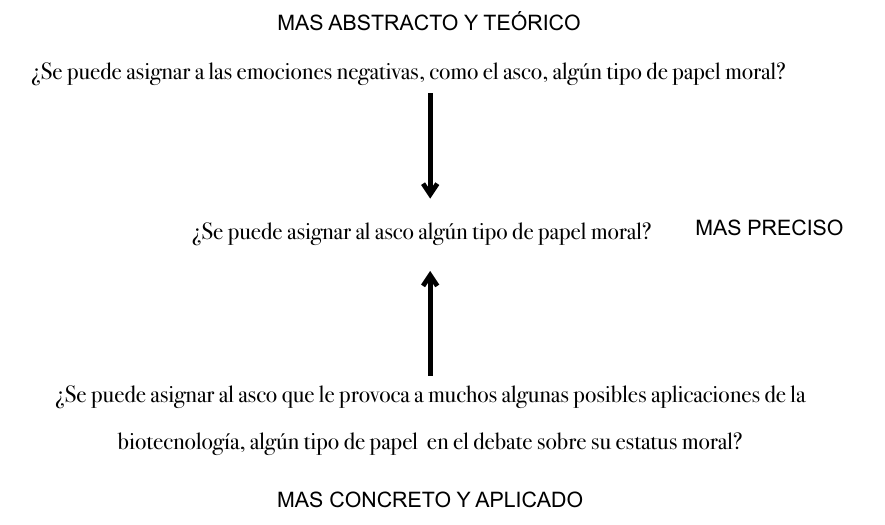

# 20 · 2. Estructura — el artículo de investigación (pp. 184–212)

Fuente: Barceló, *Introducción a la Investigación Filosófica*, borrador sep-2026, pp. 184–212. Transcripción literal; erratas del original conservadas.
Métodos clave: 6 reglas para estructurar un texto (184-185); estructura básica del artículo — Introducción, Cuerpo, Final — con esqueleto de 15 elementos i–xv (185-188); lista de 8 puntos de lo que debe mostrar la investigación (188-189); cinco ejemplos de inicios de textos de investigación: Salles, Danón, Rudy-Hiller, García Aguilar 1997 y 2005 (189-196); el título: informativo y atractivo, consejos de Eassom, Grant, Fox & Burns (197-200); el texto como croquis: entender (a-c) y aceptar (a-c), citas y referencias, mini-introducciones y mini-conclusiones (200-205); ejemplos de nombrar tesis (VE*, V), resúmenes parciales, argumentos sugeridos: Fernández, García, Valero, Harding (205-208); marco teórico: qué se sabe, no qué se dice (208-209); ejemplo de estructura del cuerpo con argumento a la mejor explicación (210-212); un buen final: Maddy (212)

---

[p.184 · cont.]

### 2. Estructura

Una vez que sabes qué decir, es necesario determinar dónde o cuándo decirlo, dentro del texto, es decir, hay que determinar en qué lugar del texto hay que escribirlo: qué hay que escribir antes y qué después.

Hay varias reglas (que admiten excepciones) para estructurar bien un texto, por ejemplo:

1. Presentar los objetos (entendiendo ‘objeto’ en un sentido muy amplio que cubre también teorías, conceptos, propiedades, hechos, etc.) antes de decir cosas de ellos y solo presentar objetos de los que diremos algo.
2. Presentar ejemplos antes de caracterizaciones.

[p.185]

3. Si vamos a presentar una pregunta con su respuesta, la pregunta va antes de la respuesta.
4. Presentar los sucesos en orden cronológico. Presentar las causas antes de los efectos.
5. Presentar las premisas antes de mostrar que de ellas se sigue la conclusión.
6. Partir de lo mas simple a lo mas complejo.

#### A. Estructura Básica de un Artículo de Investigación

En primer lugar, una buena guía es conocer la estructura básica de un artículo de investigación:

1. Introducción
2. Cuerpo
3. Final

La primera parte es la Introducción. Aunque es la primera del texto, comúnmente es la última que se termina de escribir. También comúnmente incluye los siguientes elementos:

- i. Título
- ii. Resumen
- iii. Motivación
  - i. Qué debate o conflicto planea resolver, o contribuir a resolver
  - ii. Qué está en juego: Cuales on las consecuencias de resolver o no resolver este debate
  - iii. Porqué no es obvia la solución
- iv. Marco / Antecedentes

[p.186]

- v. Cuestión (a responder) o Hipótesis (a prueba)
- vi. Tesis o Respuesta
- vii. Clarificación de Términos
- viii. Plan del Trabajo

Después de la introducción, aparece el Cuerpo del artículo, parte medular del texto y comúnmente la más larga. En ella aparecen los Argumentos. Digo “argumentos” en plural, porque comúnmente no basta un argumento a favor de nuestra posición (lo que llamaremos el argumento central), sino que también es necesario considerar posibles contra-argumentos contra nuestro argumento o tesis y darles respuesta con otros argumentos.

- ix. Argumento Central
- x. Posibles contra-argumentos
  - i. Contra nuestra tesis
  - ii. Contra nuestro argumento
- xi. Respuestas a los contra-argumentos

Finalmente, la parte Final del texto se dedica, principalmente, a dar las conclusiones y señalar las limitaciones de nuestro trabajo de investigación. Cuando digo “limitaciones”, no me refiero solamente a errores u omisiones. Después de todo, uno no debe publicar un trabajo si sabe que tiene errores u omisiones (aunque debe reconocer que, dada nuestra propia falibilidad, puede tenerlos). Más bien, quiero decir que, no importa que tan bien hagamos nuestra investigación, ésta difícilmente será perfecta.

- xii. Resumen de Resultados

  La parte fundamental de esta parte del texto es dejar súper claro cuál es la conclusión final de todo el trabajo, pero eso no basta, También es

[p.187]

  necesario reiterar los resultados alcanzados en cada parte del mismo, (sección o capítulo, dependiendo de la longitud del trabajo) y explicar una vez más cómo cada uno de ellos nos fue acercando a la conclusión, como cada uno de ellos contribuyó al argumento central a favor de la tesis central del trabajo. Esto debe hacerse no cómo una mera lista, sino de manera estructural, poniendo el acento en las relaciones lógicas entre las conclusiones parciales de cada parte del trabajo.

- xiii. Limitaciones Negativas:
  - a. Posibles objeciones que no se consideraron
  - b. Presupuestos que no se justificaron
  - c. etc.
- xiv. Limitaciones Positivas:

  Esta parte es fundamental para reiterar la relevancia del trabajo, es decir, para dejar clara su importancia mas allá de los límites de la obra de la que son conclusiones. La función central de estas últimas secciones es dejar claro que, aunque el trabajo contiene los resultados de una investigación completa en sí misma (sección xii) también debe de verse como parte de una investigación colectiva mas amplia que todavía está en curso – con un pasado y un futuro, es decir, que los resultados obtenidos tienen antecedentes que deben reconocerse en el trabajo de otros y consecuencias que aun faltan por desarrollarse.

  - a. Posibles desarrollos futuros
  - b. Posibles aplicaciones

[p.188]

  - c. Etc.

  Especulación y conjeturas no están fuera de lugar de las conclusiones de un trabajo de investigación, si están explícitamente marcadas como tales.

- xv. Agradecimientos (en nota a pie de página)

Mostrar que nuestra investigación:

1. Está bien motivada
2. Está actualizada [marco teórico], es decir, estoy diciendo algo nuevo y valioso basado en lo que ya se asume :

   Decir sobre lo que ya se ha dicho solamente lo necesario para realzar lo original y novedoso de tu contribución.

   Por lo común, entre mas general sea una premisa de tu argumento, mas justificada estás en simplemente asumirla como parte de tu marco teórico. Entre mas específica es la premisa para tu conclusión, más obligada estás de defenderla.
3. Delimitar qué problema, fenómeno, debate, etc. nos dedicaremos según los recursos que le planeamos dedicar
4. Identificar las hipótesis que vamos a evaluar
5. Evaluarlas Comparativamente – Pros y Contras
6. Mostrar cómo nuestra conclusión se sigue de esa evaluación comparativa Conciliadora (Hay empate) o No Conciliadora (Una opción vencedora)
7. Si es conciliadora, detallar qué tipo de conciliación proponemos: analeteista, dialeteista, gradualista, pluralista, relativista

[p.189]

8. Dejar claras las limitaciones de la investigación Qué no se hizo y qué se puede seguir haciendo

El lector ideal de un trabajo de investigación es alguien que está genuinamente interesado y curioso (y relativamente bien informado) en el tema de tu investigación.

#### B. ¿Cómo empezar un texto de investigación? Algunos ejemplos

##### 1. Sobre el asco en la moralidad

Analicemos con detalle el excelente ejemplo de primer párrafo del artículo “Sobre el asco en la moralidad” de Arleen L.F. Salles (Diánoia, volumen LV, número 64, mayo 2010, páginas 27 a 45.):

> Los avances de la tecnología biomédica —desde la clonación de mamíferos y la investigación con células madre embrionarias hasta la creación de quimeras— han desatado una serie de controversias que giran en torno a la relevancia científica de estas prácticas y sus implicaciones morales, políticas y sociales. Estos avances también han revitalizado indirectamente una polémica dentro de la filosofía moral sobre el papel sociomoral que pueden desempeñar emociones negativas como el asco. En la discusión moral sobre la clonación, por ejemplo, o sobre la creación de quimeras, sus críticos frecuentemente invocan el carácter repulsivo de la práctica en cuestión (Cohen 2007, pp. 120–123). La clonación, nos dicen algunos, nos “enerva, nos da asco, nos horroriza, nos irrita” (Miller 1998, p. 81), y tal repulsión, según otros, constituye una especie de “alarma moral [. . .], expresión emocional de una sabiduría profunda, mas allá del poder de la razón de articularla” (Kass 1997, p. 20). Por ello consideran importante que los científicos continúen sintiendo repugnancia ante la idea de seguir adelante con sus investigaciones, “aun si no pueden articular sus razones” (Callahan 1997, p. 19). ¿Se puede asignar al asco algún tipo de papel moral? En la primera parte de este trabajo haré un bosquejo de esta emoción; en la segunda identificaré y analizaré los tres argumentos principales presentados contra su papel moral. Mi objetivo principal es crítico, pues trato de mostrar que las objeciones más destacadas al asco moralizado no son lo suficientemente persuasivas porque o bien tienden a basarse en casos en los que es evidente que el asco es indefendible, o bien parten de concepciones controvertidas sobre esa emoción y lo que representa…

Me encanta este párrafo porque muestra muy bien el tipo de cosas que esperaríamos de las primeras líneas de un buen artículo de investigación. En primer lugar, hace un excelente papel

[p.190]

MOTIVANDO su investigación. Por un lado, muestra que el tema que le interesa – el asco en la moralidad, tal y como lo indica el título – tiene una importancia práctica actual mas allá de lo teórico y académico. Al mencionar las controversias morales, políticas y sociales desatadas por avances de la tecnología biomédica como la clonación de mamíferos y la investigación con células madre embrionarias, la autora víacula su trabajo teórico a discusiones concretas, reales que suceden en la actualidad. Luego, con el enunciado “Estos avances también han revitalizado indirectamente una polémica dentro de la filosofía moral sobre el papel sociomoral que pueden desempeñar emociones negativas como el asco” logra comunicar que tampoco es un tema puramente práctico, sino que también teórico. Recordemos que otra buena manera de motivar una investigación es mostrando que contribuye a un debate teórico que ya existe, y eso es lo que comunica la autora con este enunciado.

> Descripción de la figura: tres formulaciones de la misma pregunta dispuestas en vertical. Arriba, bajo el rótulo "MAS ABSTRACTO Y TEÓRICO": "¿Se puede asignar a las emociones negativas, como el asco, algún tipo de papel moral?". Una flecha baja a la formulación central, rotulada a la derecha "MAS PRECISO": "¿Se puede asignar al asco algún tipo de papel moral?". Desde abajo, otra flecha sube hacia esa formulación central desde la tercera, bajo el rótulo "MAS CONCRETO Y APLICADO": "¿Se puede asignar al asco que le provoca a muchos algunas posibles aplicaciones de la biotecnología, algún tipo de papel en el debate sobre su estatus moral?". La formulación elegida por la autora es la central.

MAS ABSTRACTO Y TEÓRICO

¿Se puede asignar a las emociones negativas, como el asco, algún tipo de papel moral?

¿Se puede asignar al asco algún tipo de papel moral?

MAS PRECISO

¿Se puede asignar al asco que le provoca a muchos algunas posibles aplicaciones de la biotecnología, algún tipo de papel en el debate sobre su estatus moral?

MAS CONCRETO Y APLICADO

Una vez que ha dejado evidencia de la importancia teórica y práctica de su tema, la autora pasa a mencionar una serie de ejemplos de cómo se apela, de hecho, al asco en la deliberación moral y política, dando referencias y citando literalmente cuando es efectivos. Por ejemplo, escribe “La clonación, nos dicen algunos, nos “enerva, nos da asco, nos horroriza, nos irrita” (Miller 1998, p. 81)” La clonación es un

[p.191]

fenómeno controvertido, pero bien conocido y al citar textualmente a Miller muestra que no solo “algunos” dicen que la clonación es asquerosa, sino que nos da un ejemplo concreta y nos da sus exactas palabras.

Una vez que ha motivado adecuadamente su tema, la autora pasa a formular la pregunta a cuya respuesta tratará de contribuir. Su pregunta – ¿Se puede asignar al asco algún tipo de papel moral? – por supuesto, no aborda todo el tema del asco en la moralidad, pero sí logra capturar mucho de lo que es interesante del tema, tal y como éste estuvo motivado con los primeros enunciados del artículo, al mismo tiempo que acota su investigación. Nótese que esta no es la primera vez que nos dice de qué trata su artículo. En sentido estricto, es la tercera vez: la primera vez fue en el título: el asco en la moralidad. El elemento clave aquí es la preposición “en”. No nos dice solamente que tratará sobre el asco y la moralidad, sino sobre el asco en la moralidad. Esto significa que el área general es la moralidad y que dentro de ese amplio espacio de reflexión filosófica, la Dra. Salles se concentrará en el tema del asco. En otras palabras, el tema central es la dimensión moral del asco, y que el resto de las dimensiones estéticas, biológicas, cognitivas, etc. del asco se tocarán tan sólo en tanto son relevantes para entender el aspecto moral que le importa. La segunda vez es en el segundo enunciado cuando nos habla de la controversia sobre “el papel socio-moral que pueden desempeñar emociones negativas como el asco”. Este enunciado es menos vago y general que el título pero sigue siendo menos específico que la pregunta que aparece a la mitad del párrafo. En otras palabras, cada vez que se vuelve a formular el problema se hace de manera mas y mas específica.

En el resto del párrafo, la autora presenta su plan de trabajo. Nos dice que, antes de pasar a la parte eminentemente argumentativa, le dedicará la primera sección de su artículo a sentar las bases y el marco teórico dentro del cual trabajará. Luego, pasa a presentar el objetivo central de su investigación: “mostrar que las objeciones más destacadas al asco moralizado no son lo suficientemente persuasivas”, y en el mismo enunciado también presenta su estrategia argumentativa. En primer lugar, al señalar que su “objetivo principal es crítico”, en vez de propositiva. Esto nos dice mucho, como hemos visto, acerca del tipo de argumentación que dará. Nos dice que criticará una tesis que otros han sostenido, en vez de defender una

[p.192]

tesis. Luego, detalla un poco mas exactamente cuales son sus razones para sostener su tesis principal diciéndo que las objeciones no son persuasivas “… porque o bien tienden a basarse en casos en los que es evidente que el asco es indefendible, o bien parten de concepciones controvertidas sobre esa emoción y lo que representa.” Es sumamente interesante que su estrategia de argumentación sea de este tipo, a luz de lo que hemos visto a lo largo del libro sobre estrategias de argumentación en filosofía. Como recordarán, hemos visto que una gran parte de la argumentación filosófica descansa precisamente en el análisis de ejemplos – ya sea que sirvan como contra-ejemplos de hipótesis universales y/o los usemos de base para generalizar nuevas hipótesis – o en el análisis de conceptos. Es interesante, por lo tanto, que la Dra. Salles señale que lo que falla en los argumentos que critica es precisamente que algunos parten de malos ejemplos y otros se basan en malos análisis conceptuales.

##### 2. El pensamiento animal y su expresión lingüística

Tomemos ahora un ejemplo de un muy buen y sencillo resumen. El artículo es “El pensamiento animal y su expresión lingüística” de Laura Danón:

> Nuestros intentos por hallar palabras que capturen de modo preciso los contenidos de los pensamientos de los animales suelen tropezar con dificultades persistentes. En este trabajo evaluaré dos explicaciones de este fenómeno discutidas por Beck (2013): la explicación basada en el carácter poco familiar de los contenidos animales –que él rechaza– y la basada en diferencias de formato –que resulta su favorita–. En primer lugar, objetaré las razones por las cuales Beck descarta la explicación basada en el carácter poco familiar de los contenidos. En segundo lugar argumentaré que, aunque algunas dificultades para expresar lingüísticamente los pensamientos animales pueden surgir por diferencias de formato, hay otras que no parecen deberse a este factor. Luego sugeriré que, a fin de comprender adecuadamente el problema que nos ocupa, deberíamos elaborar una explicación dual que apele, en algunos casos, a las diferencias de contenido y, en otros, a las diferencias de formato.

Una vez más, el título nos dice, en general, el tema que abordará el artículo: el pensamiento animal y su expresión lingüística. Como pueden ver, el título no es un enunciado completo, sino la conjunción de dos

[p.193]

sustantivos. En este sentido, aunque el título nos dé una idea general sobre el tema del artículo, aun incluye algunas ambigüedades. Cuando se habla del “pensamiento animal”, por ejemplo, ¿hablamos de cómo piensan los animales o de qué es lo que piensan, o de si siquiera piensan, o qué? El segundo sustantivo nos da una pista: dado que habla de “su expresión lingüística”, sabemos que lo que le interesa al artículo del pensamiento animal es aquello que se puede expresar lingüísticamente, lo que apunta mas hacia el contenido, que al modo, tipo, etc. De esta manera, podemos inferir por el título que el artículo debe tratar sobre lo qué piensan los animales y si se puede expresar lingüísticamente o no y cómo. Esto ya nos da una buena idea general de qué esperar del artículo. La idea sigue siendo hasta cierto punto vaga, pero irá adquiriendo mayor nitidez conforme avance el texto.

Luego, el resumen empieza motivando este mismo tema apelando a algo que, aunque no es un problema práctico social o político, sigue siendo concreto, pues corresponde a una experiencia que muchos hemos tenido – en especial aquellos que hemos convivido de manera cotidiana con un animal: el que es difícil encontrar las palabras que “capturen de modo preciso los contenidos de los pensamientos de los animales”. Este ejemplo ilustra muy bien cómo, motivar nuestro tema de investigación apelando a algo concreto no significa necesariamente buscar algún profundo problema social o moral, sino que puede ser una simple curiosidad generalizada, como aquella con la que Laura Danón motiva su investigación en este artículo. Danón confía en que a muchos de nosotros nos ha asaltado la duda de cómo y si sería posible expresar con palabras humanas lo que los animales piensan con absoluta precisión. En los dos primeros enunciados de su abstract, nos comunica que no solo es esta una pregunta que la filosofía también ha abordado, sino que es una pregunta de difícil solución, pues ha sido difícil encontrar las palabras precisas para tal tarea. En el segundo enunciado, la autora ya nos ha dicho que hay (por lo menos una) controversia al respecto: la controversia de cómo explicar esta dificultad.

Una vez motivado el tema y comunicado el problema, la autora pasa a decir que es lo que ella hará. La primera formulación es poco explícita – literalmente, dice que evaluará dos explicaciones discutidas por Beck (2013), pero si no conocemos la obra de Beck lo suficiente, este enunciado nos dice poco – pero sirve

[p.194]

para conectar su trabajo con una discusión que ya existe en la literatura especializada. Al usar una referencia, nos está diciendo implícitamente que ya hay gente discutiendo estas cosas. Esta es una de las funciones que juegan las referencias bibliográficas. Luego, formular las dos alternativas en discusión, señala cuál es la que prefiere Beck y cómo argumentará a favor de la otra alternativa para concluir que la respuesta probablemente involucre una combinación entre ambas opciones. De esta manera, y en unos cuantos enunciados logra señalar no sólo cuál es el problema, como se ha tratado de resolver, porque no le convence la manera en que se ha tratado de resolver y, en consecuencia, cómo piensa se debe resolver y porqué.

#### Ejercicio:

Considera los siguientes dos secciones introductorias de otros artículos recientes. Haz un análisis similar al que he hecho estos dos ejemplo anteriores, señalando cómo se motiva la pregunta: si usa una aplicación práctica concreta y/o mas bien apunta a un debate académico al interior de la filosofía, cual es la pregunta principal, qué lugar ocupa la contribución que trata de hacer el texto dentro de la dialéctica mas amplia que gira alrededor de la pregunta, y cómo planea lograrlo.

##### 3. Testimony and inferential justification

El siguiente resumen contiene algunos términos técnicos pero aun así puede entenderse la dialéctica:

> Los reduccionistas acerca del testimonio piensan que éste nunca es una fuente básica de justificación. Por el contrario, los antirreduccionistas afirman que, al menos en algunos casos paradigmáticos, el testimonio es una fuente básica e independiente de justificación. En apoyo de su posición, los antirreduccionistas suelen afirmar que las creencias basadas en testimonios no son inferenciales, en el sentido de que los oyentes normalmente no razonan desde el hecho de que se les dijo que p hasta la creencia de que p. En este artículo exploro

[p.195]

> en detalle la idea de que las creencias basadas en testimonios están justificadas de manera no inferencial y concluyo que se basa en una caracterización demasiado simplista de las relaciones inferenciales. Siguiendo el ejemplo de la propuesta de Malmgren (2018) sobre las variedades de relaciones inferenciales, defiendo la opinión de que, después de todo, las creencias basadas en testimonios sí están justificadas inferencialmente. (Fernando Rudy-Hiller 2024)

##### 4. El atomismo y las sustancias en Descartes

Otro ejemplo de cómo suele presentarse el plan de un artículo en la introducción:

> [Descartes] rechaza el atomismo por varias razones entre las cuales la mas importante se centra en su convicción de que cualquier partícula de materia, por pequeña que sea, es infinitamente --o, como el prefiere expresarlo, indefinidamente-- divisible. Pero, ¿que es lo que significa esta afirmación para Descartes? ¿Acaso un atomista podría aceptar esta tesis? Aquí explorare una respuesta a la primera pregunta y defenderé --en contra de ciertos autores-- una respuesta negativa a la segunda. En particular, en la sección 1 de este articulo, intentare mostrar que Descartes tiene una tesis muy fuerte relativa a la divisibilidad indefinida de la materia, una tesis que ningún atomista de la época podría aceptar; a saber, que todo cuerpo finito esta actualmente compuesto por un numero indefinidamente grande de substancias corpóreas finitas, realmente distintas entre si. En las subsecuentes secciones 2 y 3, examinare con cuidado los conceptos cartesianos de substancia y de la distinción real entre substancias, y concluiré que Descartes carece de los recursos teóricos para poder defender su tesis fuerte relativa a la divisibilidad indefinida de la materia; de hecho, concluiré que Descartes no puede afirmar que los cuerpos finitos que constan de partes son substancias. (García Aguilar 1997 “El atomismo y las sustancias en Descartes” , Crítica, Vol. 29, Nº. 85, 1997, págs. 65-94)

[p.196]

##### 5. El Concepto De Lo Innato En La Psicología Evolucionista

Y aquí hay una sección de la introducción, también de Claudia Lorena García Aguilar, que resume brevemente su argumento:

> Procederé de la siguiente manera: primero analizaré la manera en que algunos etólogos cognitivos, psicólogos evolucionistas y psicólogos del desarrollo con inclinaciones evolucionistas, usan el termino ‘innato’, y mostraré que la connotación evolucionistaadaptacionista está presente en su uso. Mostraré también que, en esos textos, existe una segunda connotación de lo innato—a saber, la de lo innato como lo no-aprendido—que no tiene conexión conceptual alguna con la connotación evolucionista-adaptacionista y que no cumple con el requisito—antes mencionado—de que un concepto aceptable de lo innato sea aplicable en principio a todos los rasgos fenotípicos, cognitivos o no, de los organismos biológicos relevantes y no únicamente a sus rasgos cognitivos.
>
> Después examinaré tres propuestas recientes que pretenden caracterizar de manera precisa una noción de lo innato usando algunos conceptos de diferentes ramas de la biología—principalmente la biología evolucionista y la biología del desarrollo. Mostraré que la primera propuesta—que caracteriza lo innato usando el concepto biológico de canalización—sí parece recoger la connotación evolucionista-adaptacionista, pero tiene serios problemas conceptuales de coherencia interna y que no existe una manera adecuada de resolver estos problemas y salvar la propuesta. Adicionalmente, mostraré que, aun cuando las otras dos propuestas—la que caracteriza lo innato en términos de la noción de atrincheramiento generativo y la mía que caracteriza esa noción usando un concepto de factor causal típico de una población—recogen de alguna manera la connotación evolucionista-adaptacionista—la tercera (es decir, mi propuesta) es preferible puesto que recoge de manera más directa y precisa la connotación en cuestión, amén de ser mucho más adecuada a otras connotaciones importantes asociadas al concepto de lo innato en las disciplinas cognitivas evolucionistas que aquí considero. (García Aguilar 2005)

[p.197]

#### C. El Título

Seleccionar un buen título para tu artículo, libro, plática, etc. es fundamental porque el título es tu primera interfase con tu público, es decir, es lo primero – y muchas veces lo único – que tus lectores sabrán de tu trabajo. Un buen título, por lo tanto, debe ser al mismo tiempo informativo y atractivo. En otras palabras, debe darle información útil y específica al lector sobre el contenido de la plática, libro, etc. No olvides que hoy en día, mucha de la investigación bibliográfica se hace a través de buscadores computacionales, así que es ventajoso ser muy concreto y explícito para llegar a mas posibles lectores. Recuerda que es muy poco probable que un investigador busque un artículo sobre, digamos, “Epistemología”, sino que buscará temas mas específicos, como “epistemología del testimonio” o “epistemología naturalizada”.

Helen Eassom (2017) sugiere también evitar frases como “estudios sobre ”, “investigación sobre” o similares que son al mismo tiempo vagas y triviales. En vez de“Estudios sobre la Ilustración Latinoaméricana” podrías haber sido mas conciso titulando tu trabajo simplemente “La Ilustración Latinoaméricana”. Es obvio que si tu trabajo es académico va a incluir estudios e investigaciones, no es necesario decirlo. Aun peor son frases como “observaciones” o “reflexiones” que denotan que su autor no llegó a nada en concreto y apenas ha explorado ciertas ideas generales. En su lugar busca destilar desde el título lo mas valioso de tu trabajo, tal vez estás presentando por primera vez los resultados de un estudio extensivo, proponiendo un cambio de paradigma sobre cómo pensar un problema, o has demostrado algo sorprendente que nadie esperaba (Eassom 2017).

Es preferible usar una frase o enunciado (aunque no sea declarativo) que una mera lista de sustantivos como “Lógica y Lenguaje” (como yo lo hice en 2005) o “Suerte Moral y Semántica” (como lo hice en el 2012). María J. Grant escribe:

> “…se conciso La mayoría de las revistas tendrán un límite de caracteres o palabras para los títulos y pueden usar una versión abreviada del título como encabezado en todas las páginas, por lo que es imperativo [buscar un título que] claramente transmita de manera breve pero completa las ideas principales discutidas [en tu trabajo].” (Grant 2013, 259. Mi traducción)

Debe ser obvio que no debes engañar al lector anunciando en el título mas de lo que efectivamente contiene tu texto, pero desafortunadamente hay títulos que hacen eso y hay que evitarlos. (Aleixandre-Benavent et al. 2014 citado por Fox & Burns 2015)

[p.198]

Es importante que el título no solo incluya los temas discutidos en el texto, sino que también diga algo acerca del método, marco o tratamiento que se les dará.

#### Ejemplos:

Si bien me parece un texto sobrevalorado en la filosofía contemporánea, no puedo sino reconocer que “Dos dogmas del empirismo” de W.v.O. Quine es un excelente título: es original y provocador, además de muy informativo. Con sólo cuatro palabras te dice mucho sobre el contenido del artículo: te dice cuál es su objetivo – criticar al empirismo – y cómo lo perseguirá – argumentando que en su centro hay dos afirmaciones que no están propiamente justificadas, sino que son aceptadas de manera dogmática. Otro legendario título es “¿Cómo se siente ser un murciélago?” de Thomas Nagel. Lo interesante de este título es que el objetivo del artículo no es dar respuesta a dicha pregunta, sino sacar consecuencias (especialmente sobre la manera en que estudiamos la conciencia) sobre lo difícil que es siquiera tratar de dar respuesta a una pregunta así.

Más recientemente, en el año 2000, G.A. Cohen publicó “Si eres un igualitarista, ¿por qué eres tan rico?” Cohen acertadamente escogió esta pregunta para darle título a su trabajo, porque el fin que persigue su trabajo no es sólo determinar teóricamente si es posible (o deseable política o moralmente) ser rico e igualitarista, sino también y principalmente poner de realce que esto es algo que nos interpela personalmente, y eso es lo que refleja la pregunta en segunda persona. Cohen buscaba presentar al igualitarismo como una actitud y compromiso personal, no solamente de las instituciones, sino de los ciudadanos y esto parece claramente reflejado en la manera en que se formula la pregunta que le da título a su trabajo.

Hace unos días, unos amigos y colegas me pidieron opinión sobre su proyecto y empezamos con el título: “Pensamiento Crítico, Hermeneútica y Comunicación”. A mí me parecía un título muy vago y, en consecuencia, poco informativo. Es decir, nos dice en términos muy generales que el proyecto tendrá algo que ver con las tres cosas mencionadas en el título, pero no nos dice nada sobre cómo se integran en un proyecto unificado. Recomendé cambiarlo a algo como “Pensamiento Crítico y Hermeneútica aplicados a la Comunicación”. Con sólo añadir esas tres palabras, los tres conceptos se engranan en una sola idea. El nuevo título no dice solamente qué elementos están contenidos en el proyecto, sino también cómo se relacionan. Nos dice que el pensamiento crítico y la hermeneútica juegan un papel distinto al de la comunicación: los primeros son las herramientas que se aplicaran al tercero.

[p.199]

A muchos filósofos les gustan los títulos ingeniosos, llenos de juegos de palabras, los cuales corren el riesgo de ser poco informativos y requerir mucho conocimiento previo para ser descifrados (además de mostrar sesgos culturales preocupantes). Tomemos por ejemplo el artículo “Sexo en la Posición Original” de Mark Hager. Si uno no sabe qué es la “posición original”, no puede entender de qué trata el artículo. Si, en contraste, el lector sabe que este término refiere a la situación hipotética desde la cual, según el liberalismo de John Rawls, debemos juzgar lo que es justo y que dicha situación se caracteriza, en parte, por ser una en la que ignoramos circunstancias como nuestra situación económica, social, sexo, inteligencia, estado de salud, etc. tiene ya suficiente información para inferir que el texto tratará sobre los efectos que tiene ignorar al sexo en la formulación de los principios generales de justicia dentro de un marco liberal a la Rawls. Algo similar ocurre en el caso de “¿Puede firmarse un contrato social con una mano invisible?”, donde Hillel Steiner trata de defender que “… importantes instituciones del orden social, como el dinero y el gobierno, necesitan algún tipo de respaldo consciente por parte de los individuos para surgir y para mantenerse.” [Mi traducción] Si uno sabe a qué solemos referirnos en filosofía política con expresiones como “mano invisible” y “contrato social” el título es muy informativo sobre el contenido del artículo, pero si no, el título es simplemente oscuro.

Este tipo de títulos son, para parafrasear a uno de mis profesores de diseño, pequeños acertijos que no develan su contenido de manera sencillos y, como tales, son armas de dos filos. Por un lado, al involucrar al lector en su desciframiento, dejan una impresión más profunda que títulos más explícitos; pero por el otro, también excluyen a posibles lectores a los que les podría interesar y servir su lectura. (Fox & Burns 2015)

Para evitar este tipo de exclusión, muchos autores añaden un subtítulo a sus obras. A decir, verdad el texto de Hager del que hablé tiene como subtítulo “Una re-formulación del feminismo liberal” por si alguien no había descifrado que éste era su objetivo. Sin embargo, hay evidencia empírica de que los títulos largos son menos efectivos (Paiva et.al. 2012, citado por Grant 2013), por lo que yo también recomendaría evitar los subtítulos y los títulos que los requieren.

Una de nuestras estudiantes, Azul Pérez, presentó recientemente su proyecto de doctorado con el título, muy general, “Identidad Personal y Memoria”. Pese a que dicho título es muy general, puede ser adecuado si el tema central es precisamente la relación entre identidad personal y memoria, pero no tanto si sólo se va a estudiar una relación o un tipo de relación en particular entre identidad personal y memoria. Si es así, entonces será mas útil poner esa relación o tipo de relación en el título. Una buena guía heurística para evaluar la pertinencia de un título es si tu trabaja le interesara cualquier persona que le interesara, por ejemplo en este caso, la identidad personal y la memoria (aunque no necesariamente cualquier persona que

[p.200]

le interese la identidad personal o cualquier persona que le interese la memoria por separadas). Si la respuesta es positiva, tienes un buen título.

#### Referencias:

- Maria J. Grant (2013) “What makes a good title?” Health Information and Libraries Journal 30(4): 259-260.
- Helen Eassom (2017) “What Makes a Good Research Article Title?” en el foro electrónico “Discover the Future of Research” de The Wiley Network publicado el 16 de Noviembre 2017 12:11:20 AM en https://hub.wiley.com/community/exchanges/discover/blog/2017/11/15/whatmakes-a-good-research-article-title
- Charles W. Fox & C. Sean Burns (2015) “The relationship between manuscript title structure and success: editorial decisions and citation performance for an ecological journal” Ecology and Evolution 5(10): 1970-1980
- Paiva, C. E., Lima, J. P. & Paiva, B. S. (2012) “Articles with short titles describing the results are cited more often”, Clinics 67, 509–13.
- Aleixandre-Benavent, R., V. Montalt-Resureccio, and J. C.Valderrama-Zurian. (2014) “A descriptive study of inaccuracy in article titles on bibliometrics published in biomedical journals”, Scientometrics 101:781–791
- Hillel Steiner, (1978) “Can a Social Contract be Signed by an Invisible Hand?” en Democracy, Consensus and Social Contract, Sage.
- Mark Hager, (1999) “Sex in the Original Position: A Restatement of Liberal Feminism,” Wisconsin Women’s Law Journal

#### D. Cómo no perderse en un Texto de Investigación

Cada parte del texto debe cumplir alguna función. Sin embargo, no es suficiente que cada parte cumpla su función (es decir, que sea relevante), sino que también es necesario que sea claro cual es su función y que, de hecho, la cumplen. Cuando uno lee un texto de investigación, es necesario que, en cada momento de la lectura sepa uno dónde se encuentra. En cada momento de la lectura,

[p.201]

es necesario que el lector pueda decir fácilmente, no sólo qué es lo que el autor está diciéndole exactamente, sino también para qué se lo está diciendo.

Piensen en su tema de discusión como un complejo terreno lleno de ideas, preguntas, tesis, argumentos y contra-argumentos, etc. Y piensen a sus textos como un mapa-croquis (como esos que les dibujan a sus amigos para que lleguen a sus casas) que le dan a sus lectores para que emprendan el camino que los lleve, dentro de ese terreno conceptual, a

1. Entender
   - a. Cuál es la pregunta que quieren responder
   - b. Cuál es la respuesta que dan a dicha pregunta / cuál es la tesis que sostienen
   - c. Qué razones tienen para sostener dicha respuesta o tesis
2. Y Aceptar
   - a. Que la pregunta está filosóficamente bien motivada / es importante
   - b. Que la respuesta que le dan a la pregunta es la correcta / que la tesis que sostienen es verdadera o, por lo menos, plausible
   - c. Que sus argumentos son válidos y correctos, es decir, que dan razones suficientes para sostener su respuesta o tesis

Un buen croquis – es decir, un croquis bien estructurado – es aquel que sirve para llegar fácilmente y por el mejor camino al destino buscado. Un mal croquis puede hacer que sus usuarios se pierdan y/o no lleguen nunca a su destino. Igualmente, un buen texto de investigación debe servir para llevar al lector de manera fácil al destino de entendimiento y conocimiento que les ofrecemos y un mal texto es aquel en el que sus lectores se pierden y/o nunca terminan por aceptar o entender nuestra posición.

[p.202]

Los creadores de mapas usan varias técnicas para optimizar su uso, y técnicas similares existen para elaborar buenos textos de investigación. En primer lugar, los mapas no representan todos los aspectos del terreno, sino solo los que son relevantes. En un croquis, igualmente, solo incluimos aquellos aspectos del terreno necesarios para que el usuario llegue a su destino y no se pierda. Incluimos, por ejemplo, que caminos tomar, algunos lugares fácil de reconocer como puntos de referencia (por ejemplo, “dar la vuelta a la izquierda en el Ángel de la Independencia”) e instrucciones sobre como reconocer el lugar de destino (por ejemplo, “casa naranja con portón negro”), etc.

Lo mismo debemos hacer en nuestro texto de investigación. Debemos decir explícitamente cómo llegar a las conclusiones que queremos. En vez de monumentos, edificios famosos o cosas por el estilo, los puntos de referencia que usamos son tesis o argumentos famosos, conocidos por su nombre. En vez de decir “si llegas a El Arroyo, ya te pasaste”, escribimos cosas como “Si aceptamos esta tesis, podemos caer en un solipsismo inaceptable”. En vez de “das vuelta en El Parque de los Venados”, escribimos cosas como “Del argumento de indispensabilidad de Quine se sigue…”. Es decir, usamos elementos del tema que son ampliamente reconocidos como puntos de referencia para guiar al lector.

Algunas, veces, sin embargo, será necesario tomar como puntos de referencia teorías, argumentos, tesis que no son tan ampliamente conocidos. En esos casos, será necesario darle información al lector de dónde puede encontrar el argumento, teoría, etc. al que nos estamos refiriendo. Para eso es que existen las citas y referencias bibliográficas. En este sentido, la función central de las citas es permitirnos ahorrarnos tener que repetir por completo partes de nuestro argumento centrales que ya han sido desarrolladas en otros textos por otros autores (o nosotros mismos). En vez de tener que defender cada uno de los pasos de nuestro argumento, si no

[p.203]

tenemos nada nuevo que añadir a cómo se ha defendido ya cierta hipótesis en la literatura, podemos simplemente señalarle a nuestro lector dónde puede encontrar esa parte de nuestro argumento. De la misma manera, en vez de tener que presentar todos los argumentos y posiciones antagónicos al nuestro, también basta hacer un breve resumen de los aspectos mas relevantes en nuestro texto e indicar en las citas y bibliografía dónde pueden encontrar las versiones mas desarrolladas y detalladas de los mismos. Dado que, como he insistido desde el principio en este texto, la investigación es una labor colectiva, no debe sorprender a nadie que para presentar nuestra contribución al estudio de un fenómeno, resolución de un problema, etc., debemos indicar como se complementa u opone a las contribuciones del resto de nuestras colegas.

De aquí surge una segunda función central a las citas bibliográficas: la de dar crédito. Si lo que he dicho hasta ahora es correcto, y la investigación efectivamente es un quehacer colectivo, entonces, es a través de las citas, que agradecemos y reconocemos a nuestros colaboradores. En este sentido, el citar es un acto de justicia y gratitud a nuestros colegas, gracias a los cuales podemos hacer nuestra propia contribución. Es por ello que nuestras citas deben ser generosas y no cubrir solamente los textos mas canónicos, sino representar de manera fiel y justa la diversidad de voces que, de manera colectiva, contribuyen a la investigación filosófica. Idealmente, nuestras citas y referencias deben cubrir por completo todos los elementos en los que nuestra investigación se monta sobre trabajo ya existente.

Así como debemos incluir en un buen croquis una descripción suficientemente clara del lugar al que se quiere llegar, así también en un texto de investigación debemos presentar de manera suficientemente clara la conclusión de nuestros argumentos para que el lector reconozca que efectivamente se llega a ella por el camino de argumentación que le hemos dibujado. Además, cuando dibujamos un croquis para varias personas, no lo empezamos en la casa de cada uno, sino

[p.204]

de un punto de referencia al cual, presumiblemente, pueden llegar fácilmente y sin desviarse demasiado. Igualmente, los argumentos filosóficos no pueden empezar de las creencias o supuestos de cada quien, sino que deben de partir de tesis o supuestos suficientemente compartidos o a los cuales presumimos pueden llegar a asentir nuestros posibles lectores, por lo menos en mor del argumento, es decir, para entender nuestros argumentos.

Además, un buen croquis debe ser sinóptico, es decir, debe servir para que, de una simple ojeada, uno pueda saber en cualquier momento del viaje, en dónde se encuentra con respecto al itinerario. Debe darse un buena idea de cuánto falta, porque esta pasando por ahí, qué viene a continuación, etc. Igualmente, un texto de investigación bien estructurado debe permitir al lector, en cualquier momento de lectura, saber cuan cerca está del resultado prometido, porque se incluye esa sección, qué sigue, etc. Para ello, la técnica más sencilla es dividir el texto en secciones (por ejemplo, capítulos si el texto es muy largo, como una tesis), cada una con una función particular al interior del texto, darles subtítulos y – lo más importante – incluir, al principio de cada una, una mini-introducción y, al final, una mini-conclusión. En dicha mini-introducción se puede hacer un resumen de lo que se ha hecho hasta entonces, poniendo énfasis en lo que será relevante para dicha sección, y de lo que se va a hacer en ella, dejando claro cómo se liga dicha sección con el resto del texto. De manera similar, en las mini-conclusiones al final de cada sección se pueden dar un resumen de lo dicho en la sección, poniendo énfasis en lo que será relevante para las siguientes secciones, y un avance de lo que se hará a continuación.

Cuando damos direcciones para llegar a algún lado, a veces también decimos cosas como “desde ahí ya se ve…” o “ahí pregunta”. Al escribir un texto de investigación hay recursos análogos. Así como al dar direcciones no somos completamente explícitos sobre cada paso y vuelta que se debe dar si no que obviamos algunos que son obvios, también al escribir un artículo o dar

[p.205]

una plática no incluimos todos los pasos de un argumento, sino que obviamos los mas obvios. En otras palabras, a veces la conclusión ya se ve desde antes de que lleguemos a ella en el texto y, en esos casos, podemos dejar que el lector encuentre el camino a ella por sí mismo. En ocasiones similares, podemos pedirle al lector que busque lo que no hacemos explícito en nuestro texto (siempre que no se algo demasiado fundamental para nuestros planteamientos) en otros textos que sí lo hacen y así evitamos repetir lo que otros han ya dicho.

Finalmente, lo peor que puede suceder con un mapa o croquis es que sea incorrecto, es decir, que no describa el terreno bien, es decir, que lo que represente no corresponda fielmente al terreno. Un croquis que te pida tomar una calle que no exista, dar vuelta donde esta prohibido o seguir derecho cuando la calle no continua, etc. es completamente inservible. Igualmente, un texto de investigación donde lo que dice que debe seguirse no se sigue, lo que se afirma como obvio no lo es, etc. es basura!

#### Ejemplos

1. Como hemos mencionado, es una costumbre común dar nombre o abreviaciones a tesis o argumentos a los que se va a apelar varias veces a lo largo del texto. Por ejemplo, en la primera sección de su artículo de (2011), Miguel Ángel Fernández escribe:

> “[podemos formular ] la concepción del valor epistémico … que sí presupongo en el trabajo… de la siguiente manera:
>
> (VE)∗ Dícese o bien de la creencia verdadera, o bien de alguna característica de una creencia (o conjunto de creencias) que es valiosa por ejemplificar algún tipo de relación adecuada con la verdad.” (Fernández 2011, 158)

De esta manera, Fernández no sólo formula de manera precisa y explícita la tesis que defenderá en su trabajo, sino que la bautiza – con la abreviación VE*– para poder referirse a ella a lo largo del

[p.206]

artículo y no tener que repetir una y otra vez que, para él, el valor epistémico de una creencia verdadera, o bien alguna característica (o conjunto de creencias) que es valiosa, bla, bla, bla. Así por ejemplo, en vez de tener que escribir algo como:

> … el veritista tiene que reconocer que decir o bien de la creencia verdadera, o bien de alguna característica de una creencia (o conjunto de creencias) que es valiosa por ejemplificar algún tipo de relación adecuada con la verdad es una hipótesis para estructurar una teoría acerca del valor epistémico de nuestros intentos por entrar en contacto cognitivo con el mundo, y como tal se encuentra permanentemente a prueba.

Puede escribir simplemente:

> … el veritista tiene que reconocer que (VE*) es una hipótesis para estructurar una teoría acerca del valor epistémico de nuestros intentos por entrar en contacto cognitivo con el mundo, y como tal se encuentra permanentemente a prueba. (Fernández 2011, 166)

Es interesante notar que Fernández habla constantemente del veritismo, y este no es un término que él se inventa sino que ya es moneda corriente en la epistemología contemporánea para referirse a una doctrina epistemológica muy concreta. Aun así, Fernández reconoce que vale la pena ser explícito sobre cual es la tesis central que define a esta doctrina y escribe:

> [La siguiente es] una formulación específica de la que, pienso, es la tesis central, definitoria, de una teoría veritista de la evaluación epistémica:
>
> (V) El valor de la creencia verdadera está esencialmente involucrado en la explicación de todo valor epistémico. (Fernández 2011, 156)

2. Al terminar la segunda sección de su artículo, Eduardo García (2017) resume los resultados obtenidos en dicha sección así:

> No pretendo haber mostrado que la postura tradicional y su hipótesis de cierre bajo composición fracasan irreparablemente. Espero meramente haber presentado un nuevo reto teórico: dar cuenta de la naturaleza composicional del lenguaje tomando en cuenta

[p.207]

> una gran variedad de aspectos relevantes: usos ordinarios, usos de ficción, adquisición, desarrollo y cambio histórico, y no sólo los que tradicionalmente han sido del interés filosófico (i.e., usos que exhiben fallas de sustitución). (García 2017, 65)

Esto se debe a que, aunque su artículo es sobre el lenguaje humano y, en particular, sobre cómo lo usamos, este párrafo no es directamente sobre eso, sino sobre el texto mismo del que es parte. Es interesante notar que los dos enunciados que lo componen están en la primera persona del singular y, en consecuencia, tratan sobre su autor, es decir, Eduardo García. Son un mensaje del autor a sus lectores para ayudarlos a interpretarlo. Les dice explícitamente qué pretende haber logrado y qué no. Además, logra comunicar también qué considera es parte de lo original que ha logrado: que sus contra-ejemplos a la hipótesis composicionalista no son los tradicionales. (Si quieren, vayan a revisar el artículo. Se darán cuenta de que la hipótesis composicionalista es un universal – sostiene algo sobre la interpretación de todas las emisiones lingüísticas – y por lo tanto, responderle con contra-ejemplos es apropiado).

3. En la sección anterior vimos que al escribir un artículo o dar una plática no incluimos todos los pasos de un argumento, sino que obviamos algunos o le pedimos al lector que los busque en otros textos para no repetir lo que otros han ya dicho. Por ejemplo, Paola Valero echa mano de ambos recursos en el siguiente pasaje de su artículo “Consideraciones sobre el contexto y la educación matemática para la democracia” (2002), dejando un argumento meramente sugerido y dando, a pie de página, la referencia de dónde puede el lector encontrar el argumento en más detalle:

> …Partir del supuesto de que lo interesante de nuestros estudiantes son sus procesos de pensamiento nos lleva a dejar a un lado la naturaleza social de los seres que nos encontramos en el aula. Nuestros estudiantes no son solamente “cabezas”—léase sujetos cognitivos—sino que son seres con una existencia física y temporal, con sentimientos, con múltiples razones para involucrarse (o no) en el aprendizaje de las matemáticas, y con una vida que trasciende los límites del aula y de la escuela… Aquí no me extenderé en los

[p.208]

> detalles de este argumento [El lector puede remitirse a Valero (2002b) para detalles sobre este punto]. Sólo me permitiré recordarnos que nuestros estudiantes en el aula son bastante distintos de lo que los estudiantes de las investigaciones en educación matemática muestran. Nuestros estudiantes se comportan mal. Nos dan dolor de cabeza…” (Valero 2002, 55 y n. 3, 58. Mi énfasis)

En el siguiente pasaje de Sandra Harding, ella también deja un argumento implícito porque le parece ya obvio:

> "Es posible", argumentan los relativistas, "que los puntos de vista masculinos no sean los únicos legítimos. Las mujeres tienen sus opiniones al respecto y los hombres las suyas. ¿Quién puede afirmar objetivamente que una sea mejor que la otra?" Las epistemologías feministas repudian de manera intransigente esta manera de conceptualizar las perspectivas feministas. Espero que el lector pueda ya vislumbrar las razones por las que deberíamos considerar con escepticismo las demandas de que la investigación social feminista se fundamente en bases relativistas. (Harding 1987. Traducción de Gloria Elena Bernal y énfasis mío)

#### Referencias:

- Sandra Harding (1987) “Is There a Feminist Method?" en Sandra Harding (Ed.). Feminism and Methodology, Bloomington/ Indianapolis. Indiana University Press.
- Paola Valero (2002) “Consideraciones sobre el contexto y la educación matemática para la democracia”, Quadrante, Vol. 11, Nº 1, 49–59.

#### E. El Marco Teórico

Como he insistido a todo lo largo dle libro, ningún trabajo de investigación puede partir de cero y es por ello necesario incluir un marco teórico donde se exponga qué cosas daremos por sentado de lo que ya se ha hecho. Es por ello que la sección de marco teórico tiene como función fundamental resumir qué, de lo que se sabe sobre el tema, es relevante para nuestra investigación. Y nótese que

[p.209]

ambas condiciones son fundamentales, es decir, para que algo valga la pena incluirse en esta sección no basta que esté relacionado de alguna manera con la cuestión o problema central del trabajo de investigación, sino que deben ser relevantes para su argumento central. Este es un error muy común de muchas tesis: que tratan de incluir en sus primeros capítulos todos los argumentos centrales del tema al que se dedican, independientemente de si despues sea útiles o no. El resultado son unos primeros capítulos desbordándose de ideas que después no vuelven a ser siquiera mencionadas en el resto del trabajo. En el caso de las tesis, tal vez uno puede pensar que tal inclusión está justificada porque parte del objetivo de este tipo de textos, piensan algunos, es que la estudiante demuestre su conocimiento de por lo menos los aspectos fundamentales de su área; pero como trabajo de investigación, esas inclusiones no están en lo absoluto justificadas.

De la misma manera, el objetivo de la revisión de la literatura no es decir qué es lo que se dice sobre el tema, sino lo que se sabe de él. Easto implica adoptar una actitud crítica frente a la literatura, en vez de resumir pasivamente la ortodoxía. El marco teórico no es un ejercicio sociológico sobre lo que los especialistas piensan debe decirse sobre un tema, sino una selección crítica de qué argumentos precedentes nos servirán de punto de partida a nuestra propia investigación. Si un argumento es malo, no importa qué tan conocido sea y vice versa, si un argumento es bueno, no importa qué tan oscuro sea. Evita usar expresiones como “se considera” o “los mas importantes”, etc. Si los usas, lo mas probable es que terminarás diciendo algo para lo que no tienes suficiente evidencia –– a menos que efectivamente hayas realizado un trabajo estadístico serio que te diga qué es lo que la mayoría de los especialistas efectivamente piensan – o simplemente expresando un prejuicio que reflejará mas bien tu contexto: lo que has leído y lo que te han enseñado. Y si no quieres cometer una falacia ad bacculum, es decir, una apelación falaz a la autoridad, es mejor no hacer afirmaciones sociológicas en tu trabajo de investigación.

[p.210]

#### F. Un ejemplo de cómo estructurar el cuerpo de tu trabajo escrito

El día de ayer, Eduardo García, Alessandro Torza y su servidor fuimos jurado de un examen de candidatura de doctorado y le sugerimos al candidato que estructurará de la siguiente manera el cuerpo de su tesis. El estudiante se había planteado le objetivo de mostrar que una hipótesis gradualista podría dar mejor cuenta de la relación entre ciencia y filosofía que la hipótesis dualista que propone el así-llamado Plan de Canberra (recordemos que unas páginas atrás hemos definido y comparado el relativismo con el pluralismo). Esto no significa automáticamente que el plan de Canberra está equivocado y que la diferencia entre ciencia y filosofía es gradual, es decir, que hay casos intermedios que son tanto científicos (en cierto grado) como filosóficos (en cierto grado), sino que esta segunda hipótesis tiene, por lo menos, esta ventaja teórica sobre la primera. Este tipo de argumentos son conocidos como argumentos a la mejor explicación y dada su naturaleza comparativa, le recomendamos al estudiante empezar presentando el fenómeno a explicar. Si es apropiado enfrentar al Plan de Canberra y la propuesta del estudiante a través de un argumento a la mejor explicación entonces debe ser porque ambos tratan de dar cuenta del mismo fenómeno. Es una buena idea, por lo tanto, empezar presentando dicho fenómeno de la manera mas neutral posible– es decir, neutral respecto a la manera que lo interpretan y dan cuenta de él las posiciones en pugna – usando ejemplos claros y poniendo énfasis en esos aspectos que serán problemáticos a la hora de comparar dichas posiciones, y no en los que o bien ya se han explicado adecuadamente por otras perspectivas o en los que no hay desacuerdo sustancial entre las posiciones. Luego le recomendamos presentar la posición ya establecida, en este caso, el Plan de Canberra, señalando tanto sus ventajas como limitaciones y problemas, ilustrándolas en los caos introducidos como ejemplos en la sección anterior. En este momento es fundamental que quede

[p.211]

claro, por un lado, que los problemas que enfrenta esta posición son los suficientemente sustanciales como para justificar que se busque una alternativa, pero por el otro, también es esencial que la perspectiva con la que contrastaremos nuestra propuesta también aparezca como un contrincante meritorio, es decir, no puede aparecer como una propuesta con tantos problemas que no valga la pena tomar en serio. Si no se logran ambas cosas, nuestra propuesta y comparación no aparecerán lo suficientemente motivadas.

Una vez que se ha expuesto el fenómeno y la manera tradicional de abordarlo con la que compararemos la nuestra ha llegado ya el momento de presentar nuestra propia propuesta. En otras palabras, es necesario pasar de la parte positiva a la propósitiva, y esto debe quedar claramente expresado en la manera en la que lo presentamos. Por lo demás, es importante que nuestra exposición de nuestra propuesta sea tan clara y completa como la de nuestro contrincante y que se ilustre aplicándola a los mismos ejemplos que la propuesta tradicional (en este caso, el Plan de Canberra). Esto significa que debemos ser honestos respecto de sus limitaciones, pero aun mas claros sobre sus ventajas. Por ello es que es fundamental dedicar suficiente espacio a comparara las fortalezas y retos que enfrentan cada una. Lo más recomendable es señalar explícitamente qué limitaciones de la propuesta tradicional supera nuestra propuesta, qué aspectos del fenómeno que no puede dar cuenta la propuesta tradicional sí puede dar cuenta nuestra propuesta, qué maneras de explicar otros aspectos del fenómeno por parte de nuestra propuesta son mas simples o elegantes que los de nuestro contrincante, etc. Sólo así podremos presumir que nuestra propuesta efectivamente representa una explicación superior a la tradicional.

[p.212]

Dado que en esta última sección recuperaremos cosas que se presentaron de manera mas detallada en las secciones previas del texto es muy importante que (1) estos elementos sean los que mas sobresalgan de nuestra presentación del fenómeno, la propuesta tradicional y la nuestra y (2) que quienes lean esta última sección sepan fácilmente donde encontrar en las secciones anteriores la presentación mas desarrollada de dichos elementos. En otras palabras, no hay que repetir otra vez qué dice cada propuesta y cuales son sus limitaciones y ventajas para poder compararlas, sino que debe se posible poder referirnos a ellas para hacer la comparación.

#### G. Un Buen Final

Ayer, durante una sesión de asesoria con uno de mis estudiantes graduados estábamos revisando las páginas finales de su – muy buena, a decir verdad – disertación, y le sugerí que mejorara sus oraciones finales. Después de todo, estas serían las últimas palabras que ella y sus lectores compartirían después de un largo viaje juntos, por lo que pensé que deberían dejar a su lector la impresión de que algo importante se había logrado, sobre lo que valdría la pena seguir pensando. Para ilustrar lo que quise decir, tomé algunos libros de mi estante en la oficina para buscar ejemplos. Estaba buscando algo como estas excelentes últimas líneas de Penelope Maddy:

> Espero que las consideraciones preliminares que aquí he bosquejado sean lo suficientemente convincentes como para inspirar a aquellos más inteligentes y con más conocimientos que yo a corregir mis errores, para completar lo que se me haya pasado al defender que V = L, y para extender los métodos naturalistas a la evaluación de hipótesis más complejas y controvertidas.
>
> Penelope Maddy (1997) 234. Mi traducción
